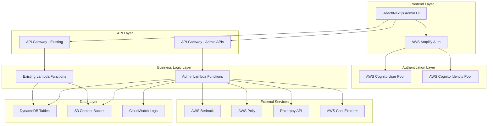

# Design Document: Admin Backend Application

## Overview

The Admin Backend Application is a comprehensive web-based administrative interface for the Sanaathana Aalaya Charithra (Hindu Temple Heritage Platform). This application provides administrators with centralized control over temple data, artifacts, content generation, user accounts, system configuration, and platform operations monitoring.

The application follows a modern serverless architecture, integrating with existing AWS infrastructure including Lambda functions, DynamoDB tables, S3 storage, API Gateway, AWS Bedrock, AWS Polly, and Razorpay payment services. The frontend is built with React/Next.js (TypeScript) and communicates with backend services through REST APIs and direct AWS SDK calls where appropriate.

### Key Design Principles

1. **Leverage Existing Infrastructure**: Reuse existing DynamoDB tables, S3 buckets, Lambda functions, and API Gateway endpoints
2. **Security First**: Implement AWS Cognito authentication with MFA, role-based access control, and audit logging
3. **Responsive Design**: Support desktop (1920x1080+) and tablet (1024x768+) devices
4. **Performance Optimization**: Implement caching, pagination, lazy loading, and skeleton screens
5. **Real-time Monitoring**: Auto-refresh dashboards and provide live status updates
6. **Data Integrity**: Implement soft deletes (archiving) instead of hard deletes for critical data
7. **Comprehensive Logging**: Log all administrative actions for audit trail and troubleshooting

## Architecture

### High-Level Architecture



### Technology Stack

**Frontend:**
- Framework: Next.js 14+ with React 18+
- Language: TypeScript 5+
- State Management: React Context API + React Query for server state
- UI Components: Material-UI (MUI) or Ant Design
- Authentication: AWS Amplify Auth
- Charts/Visualization: Recharts or Chart.js
- Form Handling: React Hook Form with Zod validation
- HTTP Client: Axios with interceptors

**Backend:**
- Runtime: Python 3.11+ on AWS Lambda
- Language: Python
- Framework: FastAPI or Flask (for local development/testing)
- API: REST via API Gateway
- Authentication: AWS Cognito
- Authorization: IAM policies + custom middleware
- Testing: pytest + Hypothesis (property-based testing)

**Infrastructure:**
- IaC: AWS CDK with Python
- Hosting: AWS Amplify or S3 + CloudFront
- Database: DynamoDB (existing tables)
- Storage: S3 (existing buckets)
- Monitoring: CloudWatch
- Cost Tracking: AWS Cost Explorer API

**External Services:**
- Payment Gateway: Razorpay
- AI Content: AWS Bedrock
- Text-to-Speech: AWS Polly

### Deployment Architecture

The admin application will be deployed as a static Next.js export hosted on AWS Amplify or S3 + CloudFront for global distribution. The application communicates with backend services through:

1. **API Gateway REST APIs**: For CRUD operations on temples, artifacts, and content
2. **Direct AWS SDK Calls**: For CloudWatch logs, Cost Explorer, and S3 operations (using temporary credentials from Cognito Identity Pool)
3. **Lambda Function URLs**: For admin-specific operations like bulk operations and system configuration

## Components and Interfaces

### Frontend Components

#### 1. Authentication Module

**Components:**
- `LoginPage`: Login form with email/password and MFA
- `AuthProvider`: Context provider for authentication state
- `ProtectedRoute`: HOC for route protection
- `SessionManager`: Handles session timeout and renewal

**Interfaces:**
```typescript
interface AuthState {
  user: AdminUser | null;
  isAuthenticated: boolean;
  permissions: Permission[];
  login: (email: string, password: string, mfaCode?: string) => Promise<void>;
  logout: () => Promise<void>;
  refreshSession: () => Promise<void>;
}

interface AdminUser {
  userId: string;
  email: string;
  name: string;
  role: AdminRole;
  lastLogin: string;
  mfaEnabled: boolean;
}

enum AdminRole {
  SUPER_ADMIN = 'SUPER_ADMIN',
  CONTENT_ADMIN = 'CONTENT_ADMIN',
  ANALYTICS_VIEWER = 'ANALYTICS_VIEWER',
  SUPPORT_ADMIN = 'SUPPORT_ADMIN'
}

enum Permission {
  MANAGE_TEMPLES = 'MANAGE_TEMPLES',
  MANAGE_ARTIFACTS = 'MANAGE_ARTIFACTS',
  MANAGE_USERS = 'MANAGE_USERS',
  VIEW_ANALYTICS = 'VIEW_ANALYTICS',
  MANAGE_PAYMENTS = 'MANAGE_PAYMENTS',
  MANAGE_SYSTEM_CONFIG = 'MANAGE_SYSTEM_CONFIG',
  VIEW_LOGS = 'VIEW_LOGS',
  MODERATE_CONTENT = 'MODERATE_CONTENT'
}
```

#### 2. Temple Manager Component

**Components:**
- `TempleList`: Paginated table with search/filter
- `TempleForm`: Create/edit temple form
- `TempleDetail`: View temple details with artifacts
- `TempleImageUploader`: Multi-image upload with preview

**Interfaces:**
```typescript
interface Temple {
  siteId: string;
  name: string;
  location: {
    state: string;
    district: string;
    address: string;
    coordinates: {
      latitude: number;
      longitude: number;
    };
  };
  description: string;
  images: string[]; // S3 URLs
  metadata: {
    deity: string;
    architecture: string;
    period: string;
    significance: string;
  };
  status: 'ACTIVE' | 'ARCHIVED' | 'DRAFT';
  createdAt: string;
  updatedAt: string;
  createdBy: string;
  updatedBy: string;
}

interface TempleListFilters {
  searchQuery?: string;
  state?: string;
  status?: 'ACTIVE' | 'ARCHIVED' | 'DRAFT';
  sortBy?: 'name' | 'createdAt' | 'updatedAt';
  sortOrder?: 'asc' | 'desc';
}
```

#### 3. Artifact Manager Component

**Components:**
- `ArtifactList`: Grouped by temple with search
- `ArtifactForm`: Create/edit artifact form
- `QRCodeGenerator`: Generate and download QR codes
- `ArtifactMediaUploader`: Upload images/videos

**Interfaces:**
```typescript
interface Artifact {
  artifactId: string;
  siteId: string;
  name: string;
  description: string;
  qrCode: string; // Unique QR code identifier
  qrCodeUrl: string; // S3 URL for QR code image
  media: {
    images: string[];
    videos: string[];
  };
  content: {
    hasTextContent: boolean;
    hasAudioGuide: boolean;
    hasQA: boolean;
    hasInfographic: boolean;
    languages: string[];
  };
  status: 'ACTIVE' | 'ARCHIVED' | 'DRAFT';
  createdAt: string;
  updatedAt: string;
  createdBy: string;
  updatedBy: string;
}

interface QRCodeConfig {
  size: number;
  format: 'PNG' | 'SVG' | 'PDF';
  errorCorrectionLevel: 'L' | 'M' | 'Q' | 'H';
}
```

#### 4. Content Monitor Component

**Components:**
- `JobList`: Table of content generation jobs
- `JobDetail`: Detailed view of job with logs
- `JobActions`: Retry/cancel job actions
- `JobFilters`: Filter by status, date, temple, artifact

**Interfaces:**
```typescript
interface ContentGenerationJob {
  jobId: string;
  artifactId: string;
  siteId: string;
  artifactName: string;
  templeName: string;
  contentType: 'TEXT' | 'AUDIO' | 'QA' | 'INFOGRAPHIC' | 'VIDEO';
  language: string;
  status: 'PENDING' | 'IN_PROGRESS' | 'COMPLETED' | 'FAILED';
  startTime: string;
  completionTime?: string;
  duration?: number; // milliseconds
  error?: {
    message: string;
    stackTrace: string;
    code: string;
  };
  progress?: number; // 0-100
  outputUrl?: string; // S3 URL of generated content
  metadata: {
    modelUsed?: string;
    tokensUsed?: number;
    retryCount: number;
  };
}

interface JobFilters {
  status?: ContentGenerationJob['status'][];
  dateRange?: {
    start: string;
    end: string;
  };
  siteId?: string;
  artifactId?: string;
  contentType?: ContentGenerationJob['contentType'][];
}
```

#### 5. Analytics Dashboard Component

**Components:**
- `AnalyticsSummary`: Key metrics cards
- `UsageCharts`: Line/bar charts for trends
- `GeographicMap`: Map visualization of temple visits
- `LanguageDistribution`: Pie chart of language usage
- `ExportButton`: Export analytics data

**Interfaces:**
```typescript
interface AnalyticsData {
  summary: {
    totalTemples: number;
    totalArtifacts: number;
    totalUsers: number;
    activeUsers: {
      daily: number;
      weekly: number;
      monthly: number;
    };
  };
  qrScans: {
    total: number;
    byTemple: Record<string, number>;
    byArtifact: Record<string, number>;
    trend: TimeSeriesData[];
  };
  contentGeneration: {
    totalJobs: number;
    successRate: number;
    averageDuration: number;
    byType: Record<string, number>;
  };
  languageUsage: Record<string, number>;
  geographicDistribution: {
    state: string;
    visits: number;
  }[];
  audioPlayback: {
    totalPlays: number;
    averageDuration: number;
    completionRate: number;
  };
  qaInteractions: {
    totalQuestions: number;
    averageResponseTime: number;
    satisfactionScore: number;
  };
}

interface TimeSeriesData {
  timestamp: string;
  value: number;
}
```

#### 6. User Manager Component

**Components:**
- `UserList`: Table of admin users
- `UserForm`: Create/edit user form
- `RoleSelector`: Role and permission selector
- `UserActivityLog`: User action history

**Interfaces:**
```typescript
interface AdminUserAccount {
  userId: string;
  email: string;
  name: string;
  role: AdminRole;
  permissions: Permission[];
  status: 'ACTIVE' | 'DEACTIVATED' | 'PENDING_ACTIVATION';
  lastLogin?: string;
  createdAt: string;
  createdBy: string;
  mfaEnabled: boolean;
}

interface UserActivity {
  activityId: string;
  userId: string;
  action: string;
  resource: string;
  resourceId: string;
  timestamp: string;
  ipAddress: string;
  userAgent: string;
  details: Record<string, any>;
}
```

#### 7. System Configurator Component

**Components:**
- `ConfigurationPanel`: Tabbed interface for different configs
- `LanguageConfig`: Manage supported languages
- `BedrockConfig`: Configure Bedrock parameters
- `PollyConfig`: Configure Polly voices
- `PaymentConfig`: Configure Razorpay settings
- `ConfigHistory`: View configuration change history

**Interfaces:**
```typescript
interface SystemConfiguration {
  configId: string;
  category: 'LANGUAGES' | 'BEDROCK' | 'POLLY' | 'PAYMENT' | 'SESSION' | 'QR';
  settings: Record<string, any>;
  updatedAt: string;
  updatedBy: string;
  version: number;
}

interface LanguageConfiguration {
  supportedLanguages: {
    code: string;
    name: string;
    enabled: boolean;
  }[];
}

interface BedrockConfiguration {
  modelId: string;
  temperature: number;
  maxTokens: number;
  topP: number;
  stopSequences: string[];
}

interface PollyConfiguration {
  voicesByLanguage: Record<string, {
    voiceId: string;
    engine: 'standard' | 'neural';
  }>;
  outputFormat: 'mp3' | 'ogg_vorbis' | 'pcm';
  sampleRate: string;
}

interface PaymentConfiguration {
  razorpayKeyId: string;
  webhookSecret: string;
  currency: string;
  subscriptionPlans: {
    planId: string;
    name: string;
    price: number;
    duration: number; // days
  }[];
}
```

#### 8. Content Moderator Component

**Components:**
- `PendingContentList`: List of content awaiting review
- `ContentReviewPanel`: Side-by-side view of all languages
- `ContentEditor`: Rich text editor for content modification
- `ApprovalActions`: Approve/reject/edit actions

**Interfaces:**
```typescript
interface PendingContent {
  contentId: string;
  artifactId: string;
  siteId: string;
  artifactName: string;
  templeName: string;
  contentType: 'TEXT' | 'AUDIO' | 'QA' | 'INFOGRAPHIC';
  languages: {
    code: string;
    content: string;
    audioUrl?: string;
    status: 'PENDING' | 'APPROVED' | 'REJECTED';
  }[];
  generatedAt: string;
  qualityScore?: number;
  autoApprovalEligible: boolean;
  reviewedBy?: string;
  reviewedAt?: string;
  feedback?: string;
}

interface ContentModerationAction {
  contentId: string;
  action: 'APPROVE' | 'REJECT' | 'EDIT';
  feedback?: string;
  editedContent?: Record<string, string>; // language -> edited content
}
```

#### 9. Cost Monitor Component

**Components:**
- `CostSummary`: Current month costs by service
- `CostTrendChart`: 12-month cost trend
- `ServiceBreakdown`: Detailed breakdown by service
- `AlertConfiguration`: Set cost alert thresholds
- `ResourceUsageMetrics`: Lambda, DynamoDB, S3 metrics

**Interfaces:**
```typescript
interface CostData {
  currentMonth: {
    total: number;
    byService: {
      lambda: number;
      dynamodb: number;
      s3: number;
      bedrock: number;
      polly: number;
      apiGateway: number;
      cloudfront: number;
      other: number;
    };
  };
  trend: {
    month: string;
    total: number;
    byService: Record<string, number>;
  }[];
  alerts: {
    alertId: string;
    service: string;
    threshold: number;
    currentValue: number;
    triggered: boolean;
  }[];
}

interface ResourceUsage {
  lambda: {
    invocations: number;
    duration: number; // total milliseconds
    errors: number;
    throttles: number;
  };
  dynamodb: {
    readCapacityUnits: number;
    writeCapacityUnits: number;
    storageGB: number;
  };
  s3: {
    storageGB: number;
    requests: number;
    dataTransferGB: number;
  };
  bedrock: {
    apiCalls: number;
    tokensProcessed: number;
  };
  polly: {
    charactersConverted: number;
  };
}
```

#### 10. Payment Manager Component

**Components:**
- `TransactionList`: Paginated transaction table
- `TransactionDetail`: Detailed transaction view
- `RefundDialog`: Issue refund dialog
- `SubscriptionManager`: Manage user subscriptions
- `RevenueChart`: Revenue trends

**Interfaces:**
```typescript
interface Transaction {
  transactionId: string;
  razorpayPaymentId: string;
  razorpayOrderId: string;
  userId: string;
  userName: string;
  templeId: string;
  templeName: string;
  amount: number;
  currency: string;
  status: 'CREATED' | 'AUTHORIZED' | 'CAPTURED' | 'REFUNDED' | 'FAILED';
  paymentMethod: string;
  createdAt: string;
  capturedAt?: string;
  refundedAt?: string;
  refundAmount?: number;
  refundReason?: string;
  metadata: Record<string, any>;
}

interface Subscription {
  subscriptionId: string;
  userId: string;
  planId: string;
  planName: string;
  status: 'ACTIVE' | 'CANCELLED' | 'EXPIRED';
  startDate: string;
  endDate: string;
  autoRenew: boolean;
  amount: number;
}

interface RevenueData {
  daily: TimeSeriesData[];
  weekly: TimeSeriesData[];
  monthly: TimeSeriesData[];
  byTemple: Record<string, number>;
  byPlan: Record<string, number>;
}
```

#### 11. Log Viewer Component

**Components:**
- `LogStream`: Real-time log stream
- `LogFilters`: Filter by severity, function, date
- `LogDetail`: Expanded log entry with context
- `LogExport`: Export logs for offline analysis

**Interfaces:**
```typescript
interface LogEntry {
  logId: string;
  timestamp: string;
  level: 'ERROR' | 'WARN' | 'INFO' | 'DEBUG';
  source: string; // Lambda function name
  message: string;
  context: {
    requestId: string;
    userId?: string;
    artifactId?: string;
    siteId?: string;
  };
  stackTrace?: string;
  metadata: Record<string, any>;
}

interface LogFilters {
  level?: LogEntry['level'][];
  source?: string[];
  dateRange?: {
    start: string;
    end: string;
  };
  searchQuery?: string;
}

interface APIGatewayLog {
  requestId: string;
  timestamp: string;
  method: string;
  path: string;
  statusCode: number;
  latency: number; // milliseconds
  ip: string;
  userAgent: string;
  error?: string;
}
```

#### 12. Audit Trail Component

**Components:**
- `AuditLogList`: Chronological audit log table
- `AuditLogFilters`: Filter by user, action, date
- `AuditLogDetail`: Detailed view with before/after values
- `AuditLogExport`: Export audit logs

**Interfaces:**
```typescript
interface AuditLogEntry {
  auditId: string;
  timestamp: string;
  userId: string;
  userName: string;
  action: string;
  resource: string;
  resourceId: string;
  before?: Record<string, any>;
  after?: Record<string, any>;
  ipAddress: string;
  userAgent: string;
  success: boolean;
  errorMessage?: string;
}
```

#### 13. Notification System Component

**Components:**
- `NotificationBell`: Notification icon with count
- `NotificationPanel`: Dropdown panel with notifications
- `NotificationSettings`: Configure notification preferences

**Interfaces:**
```typescript
interface Notification {
  notificationId: string;
  type: 'JOB_FAILED' | 'COST_ALERT' | 'PAYMENT_FAILED' | 'CRITICAL_ERROR';
  title: string;
  message: string;
  severity: 'INFO' | 'WARNING' | 'ERROR' | 'CRITICAL';
  timestamp: string;
  read: boolean;
  actionUrl?: string;
  metadata: Record<string, any>;
}

interface NotificationPreferences {
  userId: string;
  enableJobFailures: boolean;
  enableCostAlerts: boolean;
  enablePaymentAlerts: boolean;
  enableCriticalErrors: boolean;
  emailNotifications: boolean;
}
```

## Data Models

### DynamoDB Table Schemas

#### Existing Tables (Reused)

**1. HeritageSites Table**
```typescript
{
  siteId: string; // Partition Key
  name: string;
  location: {
    state: string;
    district: string;
    address: string;
    coordinates: { latitude: number; longitude: number; }
  };
  description: string;
  images: string[];
  metadata: Record<string, any>;
  status: 'ACTIVE' | 'ARCHIVED' | 'DRAFT';
  createdAt: string;
  updatedAt: string;
  createdBy: string;
  updatedBy: string;
}
```

**2. Artifacts Table**
```typescript
{
  artifactId: string; // Partition Key
  siteId: string; // Sort Key
  name: string;
  description: string;
  qrCode: string;
  qrCodeUrl: string;
  media: { images: string[]; videos: string[]; };
  content: {
    hasTextContent: boolean;
    hasAudioGuide: boolean;
    hasQA: boolean;
    hasInfographic: boolean;
    languages: string[];
  };
  status: 'ACTIVE' | 'ARCHIVED' | 'DRAFT';
  createdAt: string;
  updatedAt: string;
  createdBy: string;
  updatedBy: string;
}
// GSI: SiteIdIndex (siteId, artifactId)
```

**3. ContentCache Table**
```typescript
{
  cacheKey: string; // Partition Key (format: artifactId#language#contentType)
  content: string | object;
  s3Url?: string;
  ttl: number; // Unix timestamp for auto-deletion
  createdAt: string;
  metadata: Record<string, any>;
}
```

**4. Analytics Table**
```typescript
{
  eventId: string; // Partition Key
  timestamp: string; // Sort Key
  eventType: 'QR_SCAN' | 'AUDIO_PLAY' | 'QA_INTERACTION' | 'CONTENT_VIEW';
  userId?: string;
  siteId: string;
  artifactId?: string;
  language?: string;
  date: string; // YYYY-MM-DD for GSI
  metadata: Record<string, any>;
}
// GSI: SiteDateIndex (siteId, date)
```

**5. Purchases Table**
```typescript
{
  userId: string; // Partition Key
  purchaseId: string; // Sort Key
  razorpayPaymentId: string;
  razorpayOrderId: string;
  templeId: string;
  amount: number;
  currency: string;
  status: string;
  paymentMethod: string;
  purchaseDate: string; // ISO timestamp
  metadata: Record<string, any>;
}
// GSI: TempleIdIndex (templeId, purchaseDate)
```

**6. PreGenerationProgress Table**
```typescript
{
  jobId: string; // Partition Key
  itemKey: string; // Sort Key (format: artifactId#language#contentType)
  status: 'PENDING' | 'IN_PROGRESS' | 'COMPLETED' | 'FAILED';
  startTime?: string;
  completionTime?: string;
  error?: { message: string; stackTrace: string; };
  outputUrl?: string;
  ttl: number;
  metadata: Record<string, any>;
}
// GSI: StatusIndex (jobId, status)
```

#### New Tables (To Be Created)

**7. AdminUsers Table**
```typescript
{
  userId: string; // Partition Key (Cognito sub)
  email: string;
  name: string;
  role: AdminRole;
  permissions: Permission[];
  status: 'ACTIVE' | 'DEACTIVATED' | 'PENDING_ACTIVATION';
  lastLogin?: string;
  createdAt: string;
  createdBy: string;
  mfaEnabled: boolean;
  metadata: Record<string, any>;
}
// GSI: EmailIndex (email)
```

**8. SystemConfiguration Table**
```typescript
{
  configId: string; // Partition Key (format: category#key)
  category: string;
  settings: Record<string, any>;
  updatedAt: string;
  updatedBy: string;
  version: number;
}
```

**9. AuditLog Table**
```typescript
{
  auditId: string; // Partition Key (ULID)
  timestamp: string; // Sort Key
  userId: string;
  userName: string;
  action: string;
  resource: string;
  resourceId: string;
  before?: Record<string, any>;
  after?: Record<string, any>;
  ipAddress: string;
  userAgent: string;
  success: boolean;
  errorMessage?: string;
  ttl: number; // 365 days retention
}
// GSI: UserIdIndex (userId, timestamp)
// GSI: ResourceIndex (resource, timestamp)
```

**10. Notifications Table**
```typescript
{
  userId: string; // Partition Key
  notificationId: string; // Sort Key (ULID)
  type: string;
  title: string;
  message: string;
  severity: string;
  timestamp: string;
  read: boolean;
  actionUrl?: string;
  metadata: Record<string, any>;
  ttl: number; // 30 days retention
}
```

**11. ContentModeration Table**
```typescript
{
  contentId: string; // Partition Key
  artifactId: string;
  siteId: string;
  contentType: string;
  languages: {
    code: string;
    content: string;
    audioUrl?: string;
    status: 'PENDING' | 'APPROVED' | 'REJECTED';
  }[];
  generatedAt: string;
  qualityScore?: number;
  autoApprovalEligible: boolean;
  reviewedBy?: string;
  reviewedAt?: string;
  feedback?: string;
  status: 'PENDING' | 'APPROVED' | 'REJECTED';
}
// GSI: StatusIndex (status, generatedAt)
```

### S3 Bucket Structure

```
sanaathana-aalaya-charithra-content-{account}-{region}/
├── temples/
│   └── {siteId}/
│       ├── images/
│       │   └── {imageId}.jpg
│       └── metadata.json
├── artifacts/
│   └── {artifactId}/
│       ├── images/
│       │   └── {imageId}.jpg
│       ├── videos/
│       │   └── {videoId}.mp4
│       ├── qr-codes/
│       │   ├── {qrCode}.png
│       │   ├── {qrCode}.svg
│       │   └── {qrCode}.pdf
│       └── content/
│           └── {language}/
│               ├── text.json
│               ├── audio.mp3
│               ├── qa.json
│               └── infographic.png
└── exports/
    └── {exportId}/
        └── {filename}.csv
```

## API Design

### Admin API Endpoints

All admin endpoints require authentication via AWS Cognito and appropriate permissions.

#### Authentication Endpoints

```
POST /admin/auth/login
Request: { email: string, password: string }
Response: { accessToken: string, refreshToken: string, user: AdminUser }

POST /admin/auth/mfa/verify
Request: { email: string, mfaCode: string }
Response: { accessToken: string, refreshToken: string, user: AdminUser }

POST /admin/auth/logout
Request: { refreshToken: string }
Response: { success: boolean }

POST /admin/auth/refresh
Request: { refreshToken: string }
Response: { accessToken: string }
```

#### Temple Management Endpoints

```
GET /admin/temples
Query: { page?, limit?, search?, state?, status?, sortBy?, sortOrder? }
Response: { temples: Temple[], total: number, page: number, limit: number }

GET /admin/temples/{siteId}
Response: { temple: Temple }

POST /admin/temples
Request: { temple: Partial<Temple> }
Response: { temple: Temple }

PUT /admin/temples/{siteId}
Request: { temple: Partial<Temple> }
Response: { temple: Temple }

DELETE /admin/temples/{siteId}
Response: { success: boolean, archivedTemple: Temple }

POST /admin/temples/{siteId}/images
Request: FormData with image files
Response: { imageUrls: string[] }

POST /admin/temples/bulk-delete
Request: { siteIds: string[] }
Response: { success: number, failed: number, errors: any[] }

POST /admin/temples/bulk-update
Request: { siteIds: string[], updates: Partial<Temple> }
Response: { success: number, failed: number, errors: any[] }
```

#### Artifact Management Endpoints

```
GET /admin/artifacts
Query: { page?, limit?, search?, siteId?, status?, sortBy?, sortOrder? }
Response: { artifacts: Artifact[], total: number, page: number, limit: number }

GET /admin/artifacts/{artifactId}
Response: { artifact: Artifact }

POST /admin/artifacts
Request: { artifact: Partial<Artifact> }
Response: { artifact: Artifact, qrCodeUrl: string }

PUT /admin/artifacts/{artifactId}
Request: { artifact: Partial<Artifact> }
Response: { artifact: Artifact }

DELETE /admin/artifacts/{artifactId}
Response: { success: boolean, archivedArtifact: Artifact }

POST /admin/artifacts/{artifactId}/media
Request: FormData with media files
Response: { mediaUrls: string[] }

GET /admin/artifacts/{artifactId}/qr-code
Query: { format: 'PNG' | 'SVG' | 'PDF', size?: number }
Response: Binary file download

POST /admin/artifacts/bulk-delete
Request: { artifactIds: string[] }
Response: { success: number, failed: number, errors: any[] }
```

#### Content Generation Monitoring Endpoints

```
GET /admin/content-jobs
Query: { page?, limit?, status?, dateRange?, siteId?, artifactId?, contentType? }
Response: { jobs: ContentGenerationJob[], total: number, page: number, limit: number }

GET /admin/content-jobs/{jobId}
Response: { job: ContentGenerationJob, logs: LogEntry[] }

POST /admin/content-jobs/{jobId}/retry
Response: { newJobId: string, job: ContentGenerationJob }

POST /admin/content-jobs/{jobId}/cancel
Response: { success: boolean }

GET /admin/content-jobs/stats
Response: { 
  total: number, 
  byStatus: Record<string, number>,
  successRate: number,
  averageDuration: number
}
```

#### Analytics Endpoints

```
GET /admin/analytics/summary
Response: { summary: AnalyticsData['summary'] }

GET /admin/analytics/qr-scans
Query: { dateRange?, siteId?, artifactId? }
Response: { qrScans: AnalyticsData['qrScans'] }

GET /admin/analytics/content-generation
Query: { dateRange? }
Response: { contentGeneration: AnalyticsData['contentGeneration'] }

GET /admin/analytics/language-usage
Response: { languageUsage: AnalyticsData['languageUsage'] }

GET /admin/analytics/geographic
Response: { geographicDistribution: AnalyticsData['geographicDistribution'] }

GET /admin/analytics/audio-playback
Query: { dateRange? }
Response: { audioPlayback: AnalyticsData['audioPlayback'] }

GET /admin/analytics/qa-interactions
Query: { dateRange? }
Response: { qaInteractions: AnalyticsData['qaInteractions'] }

POST /admin/analytics/export
Request: { format: 'CSV' | 'JSON', dataType: string, filters: any }
Response: { exportUrl: string, expiresAt: string }
```

#### User Management Endpoints

```
GET /admin/users
Query: { page?, limit?, search?, role?, status? }
Response: { users: AdminUserAccount[], total: number, page: number, limit: number }

GET /admin/users/{userId}
Response: { user: AdminUserAccount, activity: UserActivity[] }

POST /admin/users
Request: { user: Partial<AdminUserAccount> }
Response: { user: AdminUserAccount, activationEmail: boolean }

PUT /admin/users/{userId}
Request: { user: Partial<AdminUserAccount> }
Response: { user: AdminUserAccount }

POST /admin/users/{userId}/deactivate
Response: { success: boolean, terminatedSessions: number }

POST /admin/users/{userId}/activate
Response: { success: boolean }

GET /admin/users/{userId}/activity
Query: { page?, limit?, dateRange? }
Response: { activity: UserActivity[], total: number }
```

#### System Configuration Endpoints

```
GET /admin/config
Query: { category? }
Response: { configurations: SystemConfiguration[] }

GET /admin/config/{configId}
Response: { configuration: SystemConfiguration }

PUT /admin/config/{configId}
Request: { settings: Record<string, any> }
Response: { configuration: SystemConfiguration }

GET /admin/config/{configId}/history
Query: { page?, limit? }
Response: { history: SystemConfiguration[], total: number }

POST /admin/config/validate
Request: { category: string, settings: Record<string, any> }
Response: { valid: boolean, errors?: string[] }
```

#### Content Moderation Endpoints

```
GET /admin/moderation/pending
Query: { page?, limit?, siteId?, artifactId?, contentType?, language? }
Response: { content: PendingContent[], total: number }

GET /admin/moderation/{contentId}
Response: { content: PendingContent }

POST /admin/moderation/{contentId}/approve
Request: { feedback?: string }
Response: { success: boolean, publishedContent: any }

POST /admin/moderation/{contentId}/reject
Request: { feedback: string }
Response: { success: boolean }

POST /admin/moderation/{contentId}/edit
Request: { editedContent: Record<string, string>, feedback?: string }
Response: { success: boolean, updatedContent: PendingContent }

GET /admin/moderation/stats
Response: { 
  pending: number, 
  approved: number, 
  rejected: number,
  autoApprovalRate: number
}
```

#### Cost Monitoring Endpoints

```
GET /admin/costs/current
Response: { currentMonth: CostData['currentMonth'] }

GET /admin/costs/trend
Query: { months?: number }
Response: { trend: CostData['trend'] }

GET /admin/costs/alerts
Response: { alerts: CostData['alerts'] }

POST /admin/costs/alerts
Request: { service: string, threshold: number }
Response: { alert: CostData['alerts'][0] }

PUT /admin/costs/alerts/{alertId}
Request: { threshold: number }
Response: { alert: CostData['alerts'][0] }

DELETE /admin/costs/alerts/{alertId}
Response: { success: boolean }

GET /admin/costs/resources
Response: { usage: ResourceUsage }
```

#### Payment Management Endpoints

```
GET /admin/payments/transactions
Query: { page?, limit?, status?, dateRange?, amountRange?, userId? }
Response: { transactions: Transaction[], total: number }

GET /admin/payments/transactions/{transactionId}
Response: { transaction: Transaction }

POST /admin/payments/transactions/{transactionId}/refund
Request: { amount?: number, reason: string }
Response: { success: boolean, refund: any }

GET /admin/payments/subscriptions
Query: { page?, limit?, status?, userId? }
Response: { subscriptions: Subscription[], total: number }

POST /admin/payments/subscriptions/{subscriptionId}/cancel
Request: { reason?: string }
Response: { success: boolean }

GET /admin/payments/revenue
Query: { period: 'daily' | 'weekly' | 'monthly', dateRange? }
Response: { revenue: RevenueData }

POST /admin/payments/export
Request: { format: 'CSV', dateRange: any }
Response: { exportUrl: string, expiresAt: string }
```

#### Logging Endpoints

```
GET /admin/logs
Query: { 
  page?, 
  limit?, 
  level?, 
  source?, 
  dateRange?, 
  searchQuery? 
}
Response: { logs: LogEntry[], total: number }

GET /admin/logs/{logId}
Response: { log: LogEntry }

GET /admin/logs/api-gateway
Query: { page?, limit?, dateRange?, statusCode?, path? }
Response: { logs: APIGatewayLog[], total: number }

POST /admin/logs/export
Request: { filters: LogFilters, format: 'TXT' | 'JSON' }
Response: { exportUrl: string, expiresAt: string }

GET /admin/logs/stream
WebSocket endpoint for real-time log streaming
```

#### Audit Trail Endpoints

```
GET /admin/audit
Query: { 
  page?, 
  limit?, 
  userId?, 
  action?, 
  resource?, 
  dateRange? 
}
Response: { logs: AuditLogEntry[], total: number }

GET /admin/audit/{auditId}
Response: { log: AuditLogEntry }

POST /admin/audit/export
Request: { filters: any, format: 'CSV' }
Response: { exportUrl: string, expiresAt: string }
```

#### Notification Endpoints

```
GET /admin/notifications
Query: { page?, limit?, read?, type? }
Response: { notifications: Notification[], total: number, unreadCount: number }

PUT /admin/notifications/{notificationId}/read
Response: { success: boolean }

PUT /admin/notifications/mark-all-read
Response: { success: boolean, count: number }

GET /admin/notifications/preferences
Response: { preferences: NotificationPreferences }

PUT /admin/notifications/preferences
Request: { preferences: Partial<NotificationPreferences> }
Response: { preferences: NotificationPreferences }
```

#### Bulk Operations Endpoints

```
POST /admin/bulk/delete
Request: { 
  resource: 'temples' | 'artifacts', 
  ids: string[] 
}
Response: { 
  jobId: string, 
  status: 'IN_PROGRESS',
  total: number 
}

POST /admin/bulk/update
Request: { 
  resource: 'temples' | 'artifacts', 
  ids: string[],
  updates: Record<string, any>
}
Response: { 
  jobId: string, 
  status: 'IN_PROGRESS',
  total: number 
}

GET /admin/bulk/{jobId}
Response: { 
  jobId: string,
  status: 'IN_PROGRESS' | 'COMPLETED' | 'FAILED',
  progress: number,
  total: number,
  successful: number,
  failed: number,
  errors: any[]
}

POST /admin/bulk/{jobId}/cancel
Response: { success: boolean }
```

### Lambda Function Design

#### New Admin Lambda Functions

**1. AdminAPIHandler Lambda**
- **Purpose**: Handle all admin-specific API operations
- **Trigger**: API Gateway
- **Timeout**: 30 seconds
- **Memory**: 512 MB
- **Environment Variables**:
  - ADMIN_USERS_TABLE
  - SYSTEM_CONFIG_TABLE
  - AUDIT_LOG_TABLE
  - NOTIFICATIONS_TABLE
  - CONTENT_MODERATION_TABLE
  - All existing table names

**2. CostMonitoringLambda**
- **Purpose**: Fetch AWS cost data from Cost Explorer API
- **Trigger**: API Gateway + EventBridge (daily)
- **Timeout**: 60 seconds
- **Memory**: 256 MB
- **IAM Permissions**: ce:GetCostAndUsage, ce:GetCostForecast

**3. LogAggregatorLambda**
- **Purpose**: Aggregate and query CloudWatch logs
- **Trigger**: API Gateway
- **Timeout**: 30 seconds
- **Memory**: 512 MB
- **IAM Permissions**: logs:FilterLogEvents, logs:DescribeLogStreams

**4. BulkOperationsLambda**
- **Purpose**: Handle bulk operations with progress tracking
- **Trigger**: API Gateway + SQS
- **Timeout**: 15 minutes
- **Memory**: 1024 MB
- **Concurrency**: Reserved concurrency of 5

**5. NotificationProcessorLambda**
- **Purpose**: Process and send notifications
- **Trigger**: EventBridge + DynamoDB Streams
- **Timeout**: 30 seconds
- **Memory**: 256 MB

## Security Design

### Authentication and Authorization

#### AWS Cognito Configuration

**User Pool Settings:**
- MFA: Required for all admin users (TOTP or SMS)
- Password Policy:
  - Minimum length: 12 characters
  - Require uppercase, lowercase, numbers, and special characters
  - Password expiration: 90 days
- Account Recovery: Email verification
- Email Verification: Required
- Advanced Security: Enabled (adaptive authentication)

**User Pool Groups:**
- `SuperAdmins`: Full access to all features
- `ContentAdmins`: Access to temple, artifact, and content management
- `AnalyticsViewers`: Read-only access to analytics and reports
- `SupportAdmins`: Access to logs, user management, and support features

**Identity Pool Configuration:**
- Authenticated Role: Grants access to S3 (read/write), CloudWatch Logs (read), Cost Explorer (read)
- Unauthenticated Role: Denied

#### Permission Model

```typescript
const PERMISSIONS_BY_ROLE: Record<AdminRole, Permission[]> = {
  SUPER_ADMIN: [
    Permission.MANAGE_TEMPLES,
    Permission.MANAGE_ARTIFACTS,
    Permission.MANAGE_USERS,
    Permission.VIEW_ANALYTICS,
    Permission.MANAGE_PAYMENTS,
    Permission.MANAGE_SYSTEM_CONFIG,
    Permission.VIEW_LOGS,
    Permission.MODERATE_CONTENT,
  ],
  CONTENT_ADMIN: [
    Permission.MANAGE_TEMPLES,
    Permission.MANAGE_ARTIFACTS,
    Permission.VIEW_ANALYTICS,
    Permission.MODERATE_CONTENT,
  ],
  ANALYTICS_VIEWER: [
    Permission.VIEW_ANALYTICS,
  ],
  SUPPORT_ADMIN: [
    Permission.VIEW_ANALYTICS,
    Permission.VIEW_LOGS,
    Permission.MANAGE_USERS,
  ],
};
```

#### API Authorization

All admin API endpoints implement the following authorization flow:

1. **Token Validation**: Verify JWT token from Cognito
2. **Session Check**: Verify session is active and not expired
3. **Permission Check**: Verify user has required permission for the operation
4. **Rate Limiting**: Apply rate limits per user (100 requests/minute)
5. **Audit Logging**: Log all API calls to AuditLog table

**Authorization Middleware:**
```typescript
interface AuthContext {
  userId: string;
  email: string;
  role: AdminRole;
  permissions: Permission[];
  sessionId: string;
}

function requirePermission(permission: Permission) {
  return async (event: APIGatewayEvent): Promise<AuthContext> => {
    // 1. Extract and validate JWT token
    const token = extractToken(event.headers);
    const decoded = await verifyToken(token);
    
    // 2. Check session validity
    const session = await getSession(decoded.sessionId);
    if (!session || session.expiresAt < Date.now()) {
      throw new UnauthorizedError('Session expired');
    }
    
    // 3. Get user permissions
    const user = await getAdminUser(decoded.sub);
    if (!user.permissions.includes(permission)) {
      throw new ForbiddenError('Insufficient permissions');
    }
    
    // 4. Check rate limit
    await checkRateLimit(user.userId);
    
    return {
      userId: user.userId,
      email: user.email,
      role: user.role,
      permissions: user.permissions,
      sessionId: session.sessionId,
    };
  };
}
```

### Data Security

#### Encryption

**At Rest:**
- DynamoDB: AWS-managed encryption (AES-256)
- S3: Server-side encryption with AWS-managed keys (SSE-S3)
- Sensitive configuration: AWS Secrets Manager

**In Transit:**
- All API calls: HTTPS/TLS 1.2+
- CloudFront: HTTPS only (redirect HTTP to HTTPS)
- Internal AWS service calls: AWS PrivateLink where available

#### Data Access Controls

**S3 Bucket Policies:**
```json
{
  "Version": "2012-10-17",
  "Statement": [
    {
      "Effect": "Allow",
      "Principal": {
        "AWS": "arn:aws:iam::{account}:role/AdminAuthenticatedRole"
      },
      "Action": [
        "s3:GetObject",
        "s3:PutObject",
        "s3:DeleteObject"
      ],
      "Resource": "arn:aws:s3:::content-bucket/*",
      "Condition": {
        "StringEquals": {
          "aws:SecureTransport": "true"
        }
      }
    }
  ]
}
```

**DynamoDB IAM Policies:**
- Admin Lambda functions: Full access to admin tables, read/write to existing tables
- Read-only operations: Separate IAM role with GetItem, Query, Scan only
- Fine-grained access control: Use condition expressions for row-level security

#### Secrets Management

**AWS Secrets Manager:**
- Razorpay API keys
- Third-party API credentials
- Database connection strings (if applicable)
- Encryption keys for sensitive data

**Rotation Policy:**
- API keys: Rotate every 90 days
- Access tokens: Rotate every 24 hours
- Refresh tokens: Rotate every 30 days

### Input Validation and Sanitization

**Frontend Validation:**
- Zod schemas for all form inputs
- Client-side validation before API calls
- XSS prevention: Sanitize all user inputs

**Backend Validation:**
- Joi schemas for all API request bodies
- SQL injection prevention: Use parameterized queries (DynamoDB SDK)
- Path traversal prevention: Validate S3 keys
- File upload validation: Check MIME types, file sizes, and scan for malware

**Example Validation Schema:**
```typescript
const TempleSchema = z.object({
  name: z.string().min(3).max(200),
  location: z.object({
    state: z.string().min(2).max(100),
    district: z.string().min(2).max(100),
    address: z.string().min(10).max(500),
    coordinates: z.object({
      latitude: z.number().min(-90).max(90),
      longitude: z.number().min(-180).max(180),
    }),
  }),
  description: z.string().min(50).max(5000),
  images: z.array(z.string().url()).max(20),
  metadata: z.record(z.any()),
});
```

### Audit Logging

All administrative actions are logged to the AuditLog table with:
- User identification (userId, email)
- Action performed (CREATE, UPDATE, DELETE, etc.)
- Resource affected (temple, artifact, user, etc.)
- Before and after values (for updates)
- Timestamp (ISO 8601)
- IP address and user agent
- Success/failure status

**Audit Log Retention:**
- Minimum: 365 days
- Maximum: 7 years (configurable)
- Automatic archival to S3 Glacier after 1 year

### Security Monitoring

**CloudWatch Alarms:**
- Failed login attempts (> 5 in 5 minutes)
- Unauthorized API access attempts
- Unusual data access patterns
- High-value operations (bulk deletes, config changes)

**AWS GuardDuty:**
- Enable for threat detection
- Monitor for compromised credentials
- Detect unusual API activity

**AWS WAF:**
- Rate limiting rules
- IP blacklisting
- SQL injection protection
- XSS protection

## UI/UX Design Considerations

### Design System

**Component Library:** Material-UI (MUI) or Ant Design
- Consistent design language
- Accessible components (WCAG 2.1 AA)
- Responsive grid system
- Dark mode support (optional)

**Color Palette:**
- Primary: Temple-inspired colors (saffron, gold)
- Secondary: Neutral grays
- Success: Green
- Warning: Orange
- Error: Red
- Info: Blue

**Typography:**
- Headings: Roboto or Inter (sans-serif)
- Body: Roboto or Inter
- Monospace: Fira Code (for logs and code)

### Layout Structure

**Navigation:**
- Sidebar navigation (collapsible on tablet)
- Top bar with user profile, notifications, and logout
- Breadcrumb navigation for deep pages
- Quick search (global search across all resources)

**Dashboard Layout:**
- Grid-based layout with draggable widgets (optional)
- Key metrics cards at the top
- Charts and tables below
- Responsive breakpoints: 1920px, 1440px, 1024px

### User Experience Patterns

**Loading States:**
- Skeleton screens for tables and cards
- Progress bars for file uploads
- Spinners for button actions
- Optimistic UI updates where appropriate

**Error Handling:**
- Toast notifications for success/error messages
- Inline validation errors on forms
- Error boundaries for component failures
- Retry mechanisms for failed operations

**Data Tables:**
- Pagination (50 records per page)
- Column sorting
- Column filtering
- Row selection for bulk operations
- Export to CSV/JSON
- Responsive: Horizontal scroll on smaller screens

**Forms:**
- Multi-step forms for complex operations
- Auto-save drafts (optional)
- Validation on blur and submit
- Clear error messages
- Confirmation dialogs for destructive actions

**Search and Filters:**
- Debounced search input (300ms)
- Filter chips for active filters
- Clear all filters button
- Save filter presets (optional)

### Accessibility

**WCAG 2.1 AA Compliance:**
- Keyboard navigation support
- Screen reader compatibility
- Sufficient color contrast (4.5:1 for text)
- Focus indicators
- ARIA labels and roles
- Alt text for images

**Responsive Design:**
- Desktop: 1920x1080+ (primary)
- Laptop: 1440x900
- Tablet: 1024x768 (secondary)
- Mobile: Not supported (admin app)

### Performance Optimization

**Frontend:**
- Code splitting by route
- Lazy loading of components
- Image optimization (WebP, lazy loading)
- Memoization of expensive computations
- Virtual scrolling for large lists

**Backend:**
- API response caching (Redis or DynamoDB)
- Database query optimization (GSI usage)
- Pagination for large datasets
- Batch operations for bulk updates
- CloudFront caching for static assets

**Metrics:**
- Initial page load: < 3 seconds
- API response time: < 500ms (p95)
- Time to interactive: < 5 seconds
- Lighthouse score: > 90

## Integration with Existing Infrastructure

### DynamoDB Integration

**Existing Tables:**
- HeritageSites: Read/write for temple management
- Artifacts: Read/write for artifact management
- ContentCache: Read for content display, write for cache invalidation
- Analytics: Read for analytics dashboard
- Purchases: Read for payment management
- PreGenerationProgress: Read for content job monitoring

**New Tables:**
- AdminUsers: User management
- SystemConfiguration: System settings
- AuditLog: Audit trail
- Notifications: Notification system
- ContentModeration: Content review workflow

**Access Pattern:**
- Use existing GSIs where available
- Create new GSIs for admin-specific queries
- Implement pagination for all list operations
- Use BatchGetItem for bulk reads
- Use BatchWriteItem for bulk writes (with error handling)

### S3 Integration

**Existing Bucket:** `sanaathana-aalaya-charithra-content-{account}-{region}`

**Admin Operations:**
- Upload temple images: `temples/{siteId}/images/`
- Upload artifact media: `artifacts/{artifactId}/images/` and `/videos/`
- Generate QR codes: `artifacts/{artifactId}/qr-codes/`
- Export data: `exports/{exportId}/`
- View content: Read from `artifacts/{artifactId}/content/{language}/`

**S3 SDK Usage:**
```typescript
// Upload with progress tracking
const uploadFile = async (file: File, key: string) => {
  const upload = new Upload({
    client: s3Client,
    params: {
      Bucket: CONTENT_BUCKET,
      Key: key,
      Body: file,
      ContentType: file.type,
    },
  });

  upload.on('httpUploadProgress', (progress) => {
    const percentage = (progress.loaded / progress.total) * 100;
    updateProgress(percentage);
  });

  await upload.done();
  return getSignedUrl(key);
};
```

### Lambda Integration

**Existing Lambda Functions:**
- QRProcessingLambda: Invoke for QR code generation
- ContentGenerationLambda: Monitor job status
- QAProcessingLambda: View Q&A interactions
- AnalyticsLambda: Fetch analytics data
- PaymentHandlerLambda: Process refunds
- PreGenerationLambda: Trigger bulk content generation

**Invocation Pattern:**
```typescript
// Invoke Lambda function
const invokeLambda = async (functionName: string, payload: any) => {
  const command = new InvokeCommand({
    FunctionName: functionName,
    InvocationType: 'RequestResponse',
    Payload: JSON.stringify(payload),
  });

  const response = await lambdaClient.send(command);
  return JSON.parse(new TextDecoder().decode(response.Payload));
};
```

### API Gateway Integration

**Existing API:** `https://{api-id}.execute-api.{region}.amazonaws.com/prod`

**Admin API Extension:**
- Create new API Gateway REST API for admin endpoints
- Use custom authorizer for Cognito token validation
- Enable CORS for admin frontend domain
- Configure request/response validation
- Enable CloudWatch logging

**API Gateway Custom Authorizer:**
```typescript
export const handler = async (event: CustomAuthorizerEvent) => {
  try {
    // Verify Cognito JWT token
    const token = event.authorizationToken.replace('Bearer ', '');
    const decoded = await verifyToken(token);
    
    // Get user permissions
    const user = await getAdminUser(decoded.sub);
    
    // Generate IAM policy
    return generatePolicy(user.userId, 'Allow', event.methodArn, {
      userId: user.userId,
      role: user.role,
      permissions: user.permissions.join(','),
    });
  } catch (error) {
    return generatePolicy('user', 'Deny', event.methodArn);
  }
};
```

### CloudWatch Integration

**Log Groups:**
- `/aws/lambda/SanaathanaAalayaCharithra-*`: All Lambda function logs
- `/aws/apigateway/SanaathanaAalayaCharithra-API`: API Gateway logs

**Metrics:**
- Lambda invocations, duration, errors, throttles
- API Gateway requests, latency, 4xx/5xx errors
- DynamoDB consumed capacity, throttled requests
- S3 requests, data transfer

**CloudWatch Insights Queries:**
```
# Failed Lambda invocations
fields @timestamp, @message, @logStream
| filter @message like /ERROR/
| sort @timestamp desc
| limit 100

# API Gateway errors
fields @timestamp, status, path, latency
| filter status >= 400
| sort @timestamp desc
| limit 100

# DynamoDB throttled requests
fields @timestamp, tableName, operation
| filter errorType = "ProvisionedThroughputExceededException"
| stats count() by tableName
```

### AWS Cost Explorer Integration

**Cost Explorer API:**
- GetCostAndUsage: Fetch cost data by service
- GetCostForecast: Predict future costs
- GetDimensionValues: Get available dimensions (services, regions)

**Implementation:**
```typescript
const getCostData = async (startDate: string, endDate: string) => {
  const command = new GetCostAndUsageCommand({
    TimePeriod: {
      Start: startDate,
      End: endDate,
    },
    Granularity: 'DAILY',
    Metrics: ['UnblendedCost'],
    GroupBy: [
      {
        Type: 'DIMENSION',
        Key: 'SERVICE',
      },
    ],
  });

  const response = await costExplorerClient.send(command);
  return parseCostData(response.ResultsByTime);
};
```

### Razorpay Integration

**Razorpay SDK:**
- Create orders
- Verify payments
- Issue refunds
- Fetch transactions
- Manage subscriptions

**Implementation:**
```typescript
import Razorpay from 'razorpay';

const razorpay = new Razorpay({
  key_id: process.env.RAZORPAY_KEY_ID,
  key_secret: process.env.RAZORPAY_KEY_SECRET,
});

// Issue refund
const issueRefund = async (paymentId: string, amount?: number) => {
  const refund = await razorpay.payments.refund(paymentId, {
    amount: amount ? amount * 100 : undefined, // Convert to paise
    speed: 'normal',
  });

  // Update transaction in DynamoDB
  await updateTransaction(paymentId, {
    status: 'REFUNDED',
    refundId: refund.id,
    refundAmount: refund.amount / 100,
    refundedAt: new Date().toISOString(),
  });

  return refund;
};
```

### AWS Bedrock Integration

**Monitoring Content Generation:**
- Track Bedrock API calls via CloudWatch
- Monitor token usage and costs
- View generated content before publication

**No Direct Invocation:**
- Admin app does not directly invoke Bedrock
- Content generation is handled by existing Lambda functions
- Admin app monitors job status and views results

### AWS Polly Integration

**Monitoring Audio Generation:**
- Track Polly character conversions via CloudWatch
- Monitor audio generation costs
- Preview generated audio files

**No Direct Invocation:**
- Admin app does not directly invoke Polly
- Audio generation is handled by existing Lambda functions
- Admin app monitors job status and plays audio files

## Error Handling

### Frontend Error Handling

**Error Boundary:**
```typescript
class ErrorBoundary extends React.Component<Props, State> {
  componentDidCatch(error: Error, errorInfo: ErrorInfo) {
    // Log error to CloudWatch
    logError(error, errorInfo);
    
    // Show user-friendly error message
    this.setState({ hasError: true, error });
  }

  render() {
    if (this.state.hasError) {
      return <ErrorFallback error={this.state.error} />;
    }
    return this.props.children;
  }
}
```

**API Error Handling:**
```typescript
const handleApiError = (error: AxiosError) => {
  if (error.response) {
    // Server responded with error status
    switch (error.response.status) {
      case 401:
        // Unauthorized - redirect to login
        redirectToLogin();
        break;
      case 403:
        // Forbidden - show permission error
        showError('You do not have permission to perform this action');
        break;
      case 404:
        // Not found
        showError('Resource not found');
        break;
      case 429:
        // Rate limit exceeded
        showError('Too many requests. Please try again later.');
        break;
      case 500:
        // Server error
        showError('An unexpected error occurred. Please try again.');
        break;
      default:
        showError(error.response.data.message || 'An error occurred');
    }
  } else if (error.request) {
    // Request made but no response
    showError('Network error. Please check your connection.');
  } else {
    // Error setting up request
    showError('An unexpected error occurred');
  }
  
  // Log error for debugging
  console.error('API Error:', error);
};
```

**Retry Logic:**
```typescript
const retryWithBackoff = async <T>(
  fn: () => Promise<T>,
  maxRetries = 3,
  baseDelay = 1000
): Promise<T> => {
  for (let i = 0; i < maxRetries; i++) {
    try {
      return await fn();
    } catch (error) {
      if (i === maxRetries - 1) throw error;
      
      // Exponential backoff
      const delay = baseDelay * Math.pow(2, i);
      await new Promise(resolve => setTimeout(resolve, delay));
    }
  }
  throw new Error('Max retries exceeded');
};
```

### Backend Error Handling

**Lambda Error Handler:**
```typescript
export const handler = async (event: APIGatewayEvent) => {
  try {
    // Validate request
    const body = validateRequest(event.body);
    
    // Process request
    const result = await processRequest(body);
    
    // Return success response
    return {
      statusCode: 200,
      headers: corsHeaders,
      body: JSON.stringify(result),
    };
  } catch (error) {
    // Log error
    console.error('Error:', error);
    
    // Return error response
    if (error instanceof ValidationError) {
      return {
        statusCode: 400,
        headers: corsHeaders,
        body: JSON.stringify({
          error: 'Validation Error',
          message: error.message,
          details: error.details,
        }),
      };
    }
    
    if (error instanceof UnauthorizedError) {
      return {
        statusCode: 401,
        headers: corsHeaders,
        body: JSON.stringify({
          error: 'Unauthorized',
          message: error.message,
        }),
      };
    }
    
    if (error instanceof ForbiddenError) {
      return {
        statusCode: 403,
        headers: corsHeaders,
        body: JSON.stringify({
          error: 'Forbidden',
          message: error.message,
        }),
      };
    }
    
    if (error instanceof NotFoundError) {
      return {
        statusCode: 404,
        headers: corsHeaders,
        body: JSON.stringify({
          error: 'Not Found',
          message: error.message,
        }),
      };
    }
    
    // Generic server error
    return {
      statusCode: 500,
      headers: corsHeaders,
      body: JSON.stringify({
        error: 'Internal Server Error',
        message: 'An unexpected error occurred',
        requestId: event.requestContext.requestId,
      }),
    };
  }
};
```

**DynamoDB Error Handling:**
```typescript
const handleDynamoDBError = (error: any) => {
  if (error.name === 'ConditionalCheckFailedException') {
    throw new ConflictError('Resource has been modified by another user');
  }
  
  if (error.name === 'ProvisionedThroughputExceededException') {
    throw new ServiceUnavailableError('Service is temporarily unavailable');
  }
  
  if (error.name === 'ResourceNotFoundException') {
    throw new NotFoundError('Resource not found');
  }
  
  throw new InternalServerError('Database error occurred');
};
```

## Testing Strategy

### Dual Testing Approach

The admin backend application will employ a comprehensive testing strategy combining unit tests and property-based tests:

**Unit Tests:**
- Specific examples and edge cases
- Integration points between components
- Error conditions and boundary cases
- UI component rendering (React Testing Library)
- API endpoint responses
- Database operations

**Property-Based Tests:**
- Universal properties across all inputs
- Data validation rules
- Business logic invariants
- CRUD operation correctness
- Authentication and authorization rules
- Comprehensive input coverage through randomization

Both testing approaches are complementary and necessary for comprehensive coverage. Unit tests catch concrete bugs and verify specific behaviors, while property-based tests verify general correctness across a wide range of inputs.

### Property-Based Testing Configuration

**Library:** fast-check (JavaScript/TypeScript property-based testing library)

**Configuration:**
- Minimum 100 iterations per property test
- Each property test references its design document property
- Tag format: `Feature: admin-backend-application, Property {number}: {property_text}`

**Example Property Test:**
```typescript
import fc from 'fast-check';

// Feature: admin-backend-application, Property 1: Authentication with valid credentials creates session
describe('Authentication Properties', () => {
  it('should create session with valid credentials', () => {
    fc.assert(
      fc.property(
        fc.record({
          email: fc.emailAddress(),
          password: fc.string({ minLength: 12 }),
          role: fc.constantFrom('SUPER_ADMIN', 'CONTENT_ADMIN', 'ANALYTICS_VIEWER'),
        }),
        async (credentials) => {
          const session = await authenticate(credentials);
          expect(session).toBeDefined();
          expect(session.userId).toBeDefined();
          expect(session.permissions).toContain(PERMISSIONS_BY_ROLE[credentials.role][0]);
        }
      ),
      { numRuns: 100 }
    );
  });
});
```

### Test Coverage Goals

- Unit test coverage: > 80%
- Property test coverage: All critical business logic
- Integration test coverage: All API endpoints
- E2E test coverage: Critical user workflows

## Correctness Properties

*A property is a characteristic or behavior that should hold true across all valid executions of a system—essentially, a formal statement about what the system should do. Properties serve as the bridge between human-readable specifications and machine-verifiable correctness guarantees.*

After analyzing all acceptance criteria, I've identified the following testable properties. Properties marked as redundant have been consolidated to avoid duplication.

### Property 1: Authentication with valid credentials creates session

*For any* valid administrator credentials (email, password, role), authenticating with those credentials should create a session with permissions matching the administrator's role.

**Validates: Requirements 1.1, 1.2**

### Property 2: Authentication with invalid credentials is rejected

*For any* invalid credentials (wrong password, non-existent email, malformed input), authentication attempts should be rejected and the failure should be logged.

**Validates: Requirements 1.3**

### Property 3: Expired sessions are rejected

*For any* administrative action, if the session is invalid or expired, the action should be rejected before processing.

**Validates: Requirements 1.6**

### Property 4: Temple creation includes all required fields

*For any* temple creation request, the created temple record should contain name, location, description, images, metadata, status, timestamps, and creator identifier.

**Validates: Requirements 2.1**

### Property 5: Temple updates are persisted correctly

*For any* temple and any valid update, applying the update should result in the temple record reflecting the changes with updated timestamp and modifier identifier.

**Validates: Requirements 2.2, 2.8**

### Property 6: Temple deletion is soft delete

*For any* temple, deleting it should mark the temple as archived rather than removing it from the database, and the archived temple should still be retrievable.

**Validates: Requirements 2.4**

### Property 7: Temple names are unique

*For any* two temples, if they have the same name, the system should reject the creation or update of the second temple.

**Validates: Requirements 2.5**

### Property 8: Temple image uploads result in S3 URLs

*For any* valid image file uploaded for a temple, the upload should succeed and return a valid S3 URL that can be accessed.

**Validates: Requirements 2.6**

### Property 9: Temple filtering returns matching results

*For any* filter criteria (search query, state, status), the filtered temple list should only contain temples that match all specified criteria.

**Validates: Requirements 2.7**

### Property 10: Artifact creation includes all required fields

*For any* artifact creation request, the created artifact should contain name, description, temple association, unique QR code, media, content metadata, status, timestamps, and creator identifier.

**Validates: Requirements 3.1, 3.2**

### Property 11: QR codes are globally unique

*For any* two artifacts, they should have different QR codes, and attempting to create an artifact with a duplicate QR code should be rejected.

**Validates: Requirements 3.2, 3.6**

### Property 12: Artifact deletion is soft delete

*For any* artifact, deleting it should mark the artifact as archived rather than removing it, and should also archive associated content.

**Validates: Requirements 3.4, 3.5**

### Property 13: Artifact updates invalidate cache

*For any* artifact, when its data is modified, any cached content for that artifact should be invalidated or removed from the cache.

**Validates: Requirements 3.10**

### Property 14: QR code generation supports multiple formats

*For any* artifact, generating a QR code should support PNG, SVG, and PDF formats, and each format should be downloadable.

**Validates: Requirements 3.9**

### Property 15: Content jobs have valid status values

*For any* content generation job, its status should be one of: PENDING, IN_PROGRESS, COMPLETED, or FAILED.

**Validates: Requirements 4.2**

### Property 16: Job retry creates new job

*For any* failed content generation job, retrying it should create a new job with PENDING status and return the new job ID.

**Validates: Requirements 4.5**

### Property 17: Job cancellation updates status

*For any* in-progress content generation job, cancelling it should update the job status to indicate cancellation.

**Validates: Requirements 4.6**

### Property 18: Job filtering returns matching results

*For any* filter criteria (status, date range, temple, artifact, content type), the filtered job list should only contain jobs matching all criteria.

**Validates: Requirements 4.8**

### Property 19: Job counts by status are accurate

*For any* set of content generation jobs, the count of jobs by status should equal the actual number of jobs with each status.

**Validates: Requirements 4.9**

### Property 20: Analytics counts match actual data

*For any* point in time, the displayed counts of temples, artifacts, and users should match the actual counts in the database.

**Validates: Requirements 5.1**

### Property 21: CSV export format is valid

*For any* data export request (temples, artifacts, analytics, transactions, logs), the generated CSV file should have valid CSV format with headers and properly escaped values.

**Validates: Requirements 5.9, 13.1, 13.2, 13.3, 13.4, 13.6**

### Property 22: User creation includes required fields

*For any* administrator account creation request, the created account should contain email, name, role, permissions matching the role, status, and creation metadata.

**Validates: Requirements 6.1, 6.2**

### Property 23: User emails are unique

*For any* two administrator accounts, they should have different email addresses, and attempting to create an account with a duplicate email should be rejected.

**Validates: Requirements 6.6**

### Property 24: User deactivation terminates sessions

*For any* administrator account, when it is deactivated, all active sessions for that account should be terminated.

**Validates: Requirements 6.4, 6.8**

### Property 25: User management actions are logged

*For any* user management action (create, update, deactivate), an audit log entry should be created with timestamp, performing administrator, and action details.

**Validates: Requirements 6.9**

### Property 26: Configuration validation rejects invalid values

*For any* configuration update with invalid values, the system should reject the update and return specific validation errors.

**Validates: Requirements 7.7**

### Property 27: Configuration history tracks changes

*For any* configuration update, a history entry should be created with the previous values, new values, timestamp, and administrator identifier.

**Validates: Requirements 7.9**

### Property 28: Content approval publishes to mobile app

*For any* pending content, when approved, the content should be published and become available to the mobile application.

**Validates: Requirements 8.2, 8.5**

### Property 29: Content rejection stores feedback

*For any* pending content, when rejected with feedback, the feedback should be stored and associated with the content.

**Validates: Requirements 8.3**

### Property 30: Content filtering returns matching results

*For any* filter criteria (temple, artifact, language, content type), the filtered content list should only contain content matching all criteria.

**Validates: Requirements 8.9**

### Property 31: Cost alerts trigger when thresholds exceeded

*For any* cost alert with a threshold, when the actual cost exceeds the threshold, an alert should be triggered and displayed.

**Validates: Requirements 9.8**

### Property 32: Transaction filtering returns matching results

*For any* filter criteria (status, date range, amount range, user ID), the filtered transaction list should only contain transactions matching all criteria.

**Validates: Requirements 10.2**

### Property 33: Refund updates transaction status

*For any* completed transaction, issuing a refund should update the transaction status to REFUNDED and record the refund amount and timestamp.

**Validates: Requirements 10.4, 10.5**

### Property 34: Log filtering returns matching results

*For any* filter criteria (level, source, date range, search query), the filtered log list should only contain logs matching all criteria.

**Validates: Requirements 11.2, 11.3**

### Property 35: Bulk operations report accurate results

*For any* bulk operation (delete, update), the operation summary should accurately report the number of successful and failed operations.

**Validates: Requirements 14.6**

### Property 36: Bulk operation validation rejects invalid operations

*For any* bulk operation with invalid inputs, the validation should reject the operation before execution.

**Validates: Requirements 14.7**

### Property 37: All administrative actions create audit logs

*For any* administrative action (create, update, delete, approve, reject), an audit log entry should be created with timestamp, administrator, action, resource, and details.

**Validates: Requirements 15.1**

### Property 38: Audit logs are chronologically ordered

*For any* set of audit logs, when retrieved, they should be ordered by timestamp in descending order (newest first).

**Validates: Requirements 15.2**

### Property 39: Audit logs for updates include before/after values

*For any* update operation, the audit log should contain both the before and after values for all modified fields.

**Validates: Requirements 15.4**

### Property 40: Audit logs are immutable

*For any* audit log entry, attempts to modify or delete it should be rejected.

**Validates: Requirements 15.6**

### Property 41: Search returns matching results

*For any* search query on temples or artifacts, the results should only contain records where the name or description contains the search terms.

**Validates: Requirements 16.1, 16.2**

### Property 42: Notifications are created for critical events

*For any* critical event (job failure, cost alert, payment failure, critical error), a notification should be created for administrators.

**Validates: Requirements 17.1, 17.2, 17.3, 17.4**

### Property 43: Notification read status can be updated

*For any* notification, marking it as read should update its read status to true.

**Validates: Requirements 17.6**

### Property 44: Required field validation rejects missing fields

*For any* form submission with missing required fields, the validation should reject the submission and indicate which fields are missing.

**Validates: Requirements 18.1**

### Property 45: Format validation rejects invalid formats

*For any* input with format requirements (email, URL, phone), invalid formats should be rejected with specific error messages.

**Validates: Requirements 18.2**

### Property 46: File validation rejects invalid files

*For any* file upload, files with invalid types or sizes should be rejected before upload.

**Validates: Requirements 18.3**

### Property 47: Network errors trigger retry with backoff

*For any* API request that fails due to network error, the system should retry up to 3 times with exponential backoff.

**Validates: Requirements 18.6**

### Property 48: Errors are logged to CloudWatch

*For any* error that occurs in the application, an error log entry should be created in CloudWatch with error details and context.

**Validates: Requirements 18.7**

### Property 49: Caching reduces redundant API calls

*For any* frequently accessed data, subsequent requests within the cache TTL should use cached data instead of making new API calls.

**Validates: Requirements 19.5**

### Property 50: Pagination returns correct page size

*For any* paginated list request, the returned page should contain at most 50 records (or the specified page size).

**Validates: Requirements 19.6**

## Deployment Strategy

### Infrastructure as Code

All infrastructure will be defined using AWS CDK (TypeScript):

**New CDK Stack: AdminApplicationStack**
```typescript
export class AdminApplicationStack extends cdk.Stack {
  constructor(scope: Construct, id: string, props?: cdk.StackProps) {
    super(scope, id, props);

    // Cognito User Pool for admin authentication
    const adminUserPool = new cognito.UserPool(this, 'AdminUserPool', {
      userPoolName: 'SanaathanaAalayaCharithra-AdminUsers',
      selfSignUpEnabled: false,
      mfa: cognito.Mfa.REQUIRED,
      mfaSecondFactor: {
        sms: true,
        otp: true,
      },
      passwordPolicy: {
        minLength: 12,
        requireLowercase: true,
        requireUppercase: true,
        requireDigits: true,
        requireSymbols: true,
        tempPasswordValidity: cdk.Duration.days(3),
      },
      accountRecovery: cognito.AccountRecovery.EMAIL_ONLY,
      advancedSecurityMode: cognito.AdvancedSecurityMode.ENFORCED,
    });

    // User Pool Client
    const adminUserPoolClient = adminUserPool.addClient('AdminWebClient', {
      authFlows: {
        userPassword: true,
        userSrp: true,
      },
      oAuth: {
        flows: {
          authorizationCodeGrant: true,
        },
        scopes: [cognito.OAuthScope.OPENID, cognito.OAuthScope.EMAIL, cognito.OAuthScope.PROFILE],
      },
    });

    // Identity Pool
    const adminIdentityPool = new cognito.CfnIdentityPool(this, 'AdminIdentityPool', {
      identityPoolName: 'SanaathanaAalayaCharithra-AdminIdentity',
      allowUnauthenticatedIdentities: false,
      cognitoIdentityProviders: [{
        clientId: adminUserPoolClient.userPoolClientId,
        providerName: adminUserPool.userPoolProviderName,
      }],
    });

    // New DynamoDB Tables
    const adminUsersTable = new dynamodb.Table(this, 'AdminUsersTable', {
      tableName: 'SanaathanaAalayaCharithra-AdminUsers',
      partitionKey: { name: 'userId', type: dynamodb.AttributeType.STRING },
      billingMode: dynamodb.BillingMode.PAY_PER_REQUEST,
      encryption: dynamodb.TableEncryption.AWS_MANAGED,
      pointInTimeRecovery: true,
    });

    adminUsersTable.addGlobalSecondaryIndex({
      indexName: 'EmailIndex',
      partitionKey: { name: 'email', type: dynamodb.AttributeType.STRING },
    });

    // Additional tables: SystemConfiguration, AuditLog, Notifications, ContentModeration
    // ... (similar table definitions)

    // Admin API Lambda
    const adminApiLambda = new lambda.Function(this, 'AdminAPILambda', {
      functionName: 'SanaathanaAalayaCharithra-AdminAPI',
      runtime: lambda.Runtime.NODEJS_18_X,
      handler: 'admin-api.handler',
      code: lambda.Code.fromAsset('dist/lambdas'),
      timeout: cdk.Duration.seconds(30),
      memorySize: 512,
      environment: {
        ADMIN_USERS_TABLE: adminUsersTable.tableName,
        // ... other environment variables
      },
    });

    // Grant permissions
    adminUsersTable.grantReadWriteData(adminApiLambda);

    // Admin API Gateway
    const adminApi = new apigateway.RestApi(this, 'AdminAPI', {
      restApiName: 'Sanaathana Aalaya Charithra Admin API',
      defaultCorsPreflightOptions: {
        allowOrigins: ['https://admin.sanaathana-aalaya-charithra.com'],
        allowMethods: apigateway.Cors.ALL_METHODS,
      },
    });

    // Custom Authorizer
    const authorizer = new apigateway.TokenAuthorizer(this, 'AdminAuthorizer', {
      handler: authorizerLambda,
      identitySource: 'method.request.header.Authorization',
    });

    // API Routes
    const adminResource = adminApi.root.addResource('admin');
    // ... add all admin endpoints

    // Amplify Hosting for Frontend
    const amplifyApp = new amplify.App(this, 'AdminApp', {
      appName: 'SanaathanaAalayaCharithra-Admin',
      sourceCodeProvider: new amplify.GitHubSourceCodeProvider({
        owner: 'your-org',
        repository: 'admin-app',
        oauthToken: cdk.SecretValue.secretsManager('github-token'),
      }),
      buildSpec: codebuild.BuildSpec.fromObjectToYaml({
        version: '1.0',
        frontend: {
          phases: {
            preBuild: {
              commands: ['npm ci'],
            },
            build: {
              commands: ['npm run build'],
            },
          },
          artifacts: {
            baseDirectory: '.next',
            files: ['**/*'],
          },
          cache: {
            paths: ['node_modules/**/*'],
          },
        },
      }),
    });

    const mainBranch = amplifyApp.addBranch('main');

    // Outputs
    new cdk.CfnOutput(this, 'UserPoolId', {
      value: adminUserPool.userPoolId,
    });

    new cdk.CfnOutput(this, 'UserPoolClientId', {
      value: adminUserPoolClient.userPoolClientId,
    });

    new cdk.CfnOutput(this, 'AdminAPIURL', {
      value: adminApi.url,
    });

    new cdk.CfnOutput(this, 'AmplifyAppURL', {
      value: `https://main.${amplifyApp.defaultDomain}`,
    });
  }
}
```

### Deployment Pipeline

**CI/CD Pipeline:**
1. Code commit to GitHub
2. GitHub Actions triggers build
3. Run tests (unit + property-based)
4. Build frontend (Next.js)
5. Build backend (Lambda functions)
6. Deploy infrastructure (CDK)
7. Deploy frontend (Amplify)
8. Run smoke tests
9. Notify team

**Environments:**
- Development: Auto-deploy on commit to `develop` branch
- Staging: Auto-deploy on commit to `staging` branch
- Production: Manual approval required for `main` branch

### Monitoring and Alerting

**CloudWatch Dashboards:**
- Admin API metrics (requests, latency, errors)
- Lambda function metrics (invocations, duration, errors)
- DynamoDB metrics (consumed capacity, throttles)
- Cognito metrics (sign-ins, MFA challenges)
- Custom business metrics (admin actions, bulk operations)

**CloudWatch Alarms:**
- API error rate > 5%
- Lambda error rate > 1%
- DynamoDB throttled requests > 0
- Failed login attempts > 10 in 5 minutes
- Bulk operation failures > 10%

**SNS Topics:**
- Critical alerts: Page on-call engineer
- Warning alerts: Email admin team
- Info alerts: Slack notification

### Backup and Disaster Recovery

**DynamoDB:**
- Point-in-time recovery enabled
- Daily backups to S3
- Cross-region replication for critical tables

**S3:**
- Versioning enabled
- Cross-region replication
- Lifecycle policies for cost optimization

**Recovery Time Objective (RTO):** 4 hours
**Recovery Point Objective (RPO):** 1 hour

### Security Hardening

**Network Security:**
- VPC for Lambda functions (optional)
- Security groups for resource access
- WAF rules for API Gateway
- DDoS protection via CloudFront

**Application Security:**
- Input validation on all endpoints
- Output encoding to prevent XSS
- CSRF protection
- Rate limiting per user
- SQL injection prevention (parameterized queries)

**Compliance:**
- GDPR: Data encryption, right to deletion
- PCI DSS: Secure payment handling (Razorpay)
- SOC 2: Audit logging, access controls

### Cost Optimization

**Estimated Monthly Costs:**
- Lambda: $50-100 (based on usage)
- DynamoDB: $30-60 (on-demand pricing)
- S3: $20-40 (storage + transfer)
- CloudFront: $10-20 (data transfer)
- API Gateway: $10-20 (requests)
- Cognito: $5-10 (MAU)
- Amplify: $15-30 (hosting)
- **Total: $140-280/month**

**Cost Optimization Strategies:**
- Use DynamoDB on-demand for variable workloads
- Implement S3 lifecycle policies
- Use CloudFront caching aggressively
- Right-size Lambda memory allocation
- Use reserved capacity for predictable workloads

## Future Enhancements

### Phase 2 Features

1. **Advanced Analytics:**
   - Predictive analytics for content performance
   - A/B testing for content variations
   - User behavior analysis
   - Conversion funnel tracking

2. **Workflow Automation:**
   - Automated content approval based on quality scores
   - Scheduled content generation
   - Automated QR code printing integration
   - Bulk import from CSV/Excel

3. **Collaboration Features:**
   - Multi-user editing with conflict resolution
   - Comments and annotations on content
   - Approval workflows with multiple reviewers
   - Activity feed for team collaboration

4. **Mobile Admin App:**
   - React Native app for iOS/Android
   - Push notifications for critical alerts
   - Offline mode for viewing data
   - Quick actions for common tasks

5. **Advanced Reporting:**
   - Custom report builder
   - Scheduled report generation
   - Report templates
   - Data visualization improvements

6. **Integration Enhancements:**
   - Webhook support for external systems
   - REST API for third-party integrations
   - Export to Google Sheets/Excel
   - Integration with CMS platforms

### Technical Debt and Improvements

1. **Performance:**
   - Implement GraphQL for flexible data fetching
   - Add Redis caching layer
   - Optimize database queries with materialized views
   - Implement server-side rendering for faster initial load

2. **Testing:**
   - Increase test coverage to 90%
   - Add visual regression testing
   - Implement chaos engineering tests
   - Add performance testing suite

3. **Documentation:**
   - API documentation with OpenAPI/Swagger
   - User guide with screenshots
   - Video tutorials for common tasks
   - Developer onboarding guide

4. **Accessibility:**
   - WCAG 2.1 AAA compliance
   - Screen reader optimization
   - Keyboard navigation improvements
   - High contrast mode

## Conclusion

This design document provides a comprehensive blueprint for the Admin Backend Application. The application leverages existing AWS infrastructure while adding new capabilities for administrative control, monitoring, and management. The design prioritizes security, performance, and user experience while maintaining flexibility for future enhancements.

Key design decisions:
- Serverless architecture for scalability and cost-efficiency
- AWS Cognito for secure authentication with MFA
- Comprehensive audit logging for accountability
- Soft deletes for data integrity
- Property-based testing for correctness guarantees
- Responsive design for desktop and tablet devices

The implementation will follow an iterative approach, starting with core features (authentication, temple/artifact management) and progressively adding advanced features (analytics, cost monitoring, content moderation). Each iteration will include thorough testing, security reviews, and user feedback incorporation.
