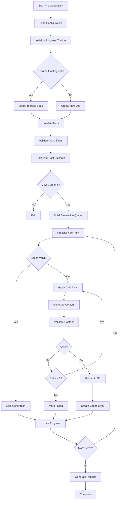
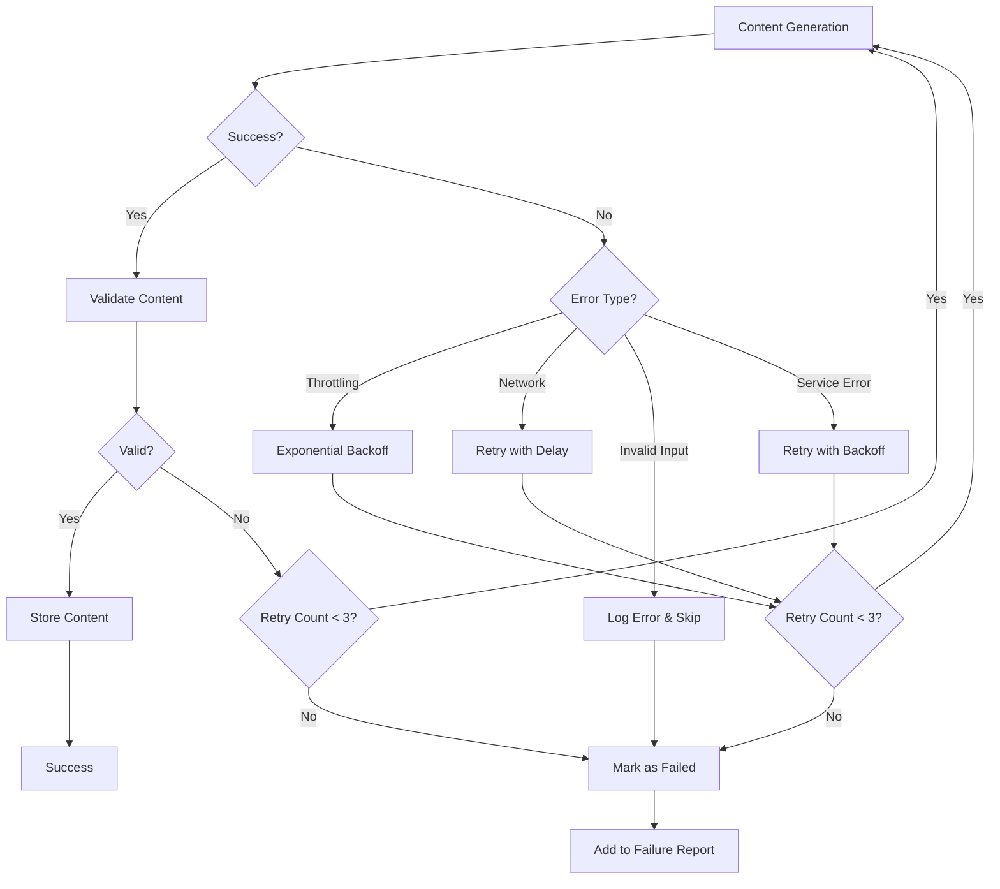
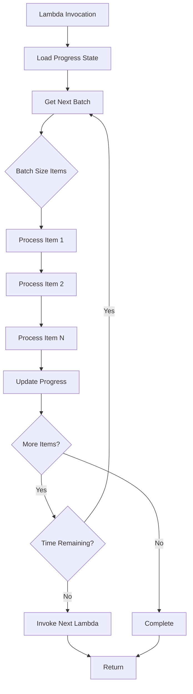

# Design Document: Content Pre-Generation System

## Overview

The Content Pre-Generation System is a batch processing tool that generates all multimedia content (audio guides, videos, infographics, and Q&A knowledge bases) for all 49 artifacts across 14 temple groups in 10 supported Indian languages before platform launch. This system eliminates on-demand generation costs during user interactions by pre-creating and caching all content, reducing ongoing AWS operational costs by 80-90%.

### Design Goals

1. **Cost Optimization**: Pre-generate all content to eliminate recurring Bedrock API costs during user interactions
2. **Reliability**: Implement robust error handling, retry logic, and progress tracking to ensure complete generation
3. **Flexibility**: Support both local execution and AWS Lambda deployment modes
4. **Resumability**: Enable interrupted jobs to resume from last checkpoint without data loss
5. **Validation**: Ensure all generated content meets quality standards before storage
6. **Observability**: Provide detailed progress tracking, cost estimation, and comprehensive reporting

### System Context

The pre-generation system integrates with existing platform services:
- **AWS Bedrock**: AI content generation using Claude 3 Sonnet model
- **AWS Polly**: Text-to-speech synthesis for audio guides
- **Amazon S3**: Content storage with versioning and encryption
- **Amazon DynamoDB**: Metadata cache and progress tracking
- **CloudFront CDN**: Content delivery (configured, not directly used by pre-generation)

### Execution Modes

1. **Local Script Mode**: Run from developer machine using AWS credentials
   - Suitable for initial generation and testing
   - Full control over execution and debugging
   - Can be interrupted and resumed

2. **AWS Lambda Mode**: Serverless batch processing
   - Handles Lambda timeout limits through batch processing
   - Automatic scaling and cost efficiency
   - Suitable for production updates and incremental generation

## Architecture

### High-Level Architecture

```
┌─────────────────────────────────────────────────────────────────┐
│                   Pre-Generation Orchestrator                    │
│  ┌──────────────┐  ┌──────────────┐  ┌──────────────┐          │
│  │   Config     │  │   Progress   │  │     Cost     │          │
│  │   Loader     │  │   Tracker    │  │  Estimator   │          │
│  └──────────────┘  └──────────────┘  └──────────────┘          │
└─────────────────────────────────────────────────────────────────┘
                              │
                              ↓
┌─────────────────────────────────────────────────────────────────┐
│                      Artifact Loader                             │
│  • Reads seed data configuration                                 │
│  • Validates 49 artifacts across 14 temple groups                │
│  • Extracts artifact metadata                                    │
└─────────────────────────────────────────────────────────────────┘
                              │
                              ↓
┌─────────────────────────────────────────────────────────────────┐
│                  Content Generator Orchestrator                  │
│  ┌──────────────┐  ┌──────────────┐  ┌──────────────┐          │
│  │     Rate     │  │   Content    │  │   Retry      │          │
│  │   Limiter    │  │  Validator   │  │   Handler    │          │
│  └──────────────┘  └──────────────┘  └──────────────┘          │
└─────────────────────────────────────────────────────────────────┘
                              │
                ┌─────────────┼─────────────┐
                ↓             ↓             ↓
┌──────────────────┐  ┌──────────────┐  ┌──────────────┐
│  AWS Bedrock     │  │  AWS Polly   │  │  Content     │
│  (AI Content)    │  │  (Audio TTS) │  │  Validator   │
└──────────────────┘  └──────────────┘  └──────────────┘
                              │
                              ↓
┌─────────────────────────────────────────────────────────────────┐
│                      Storage Layer                               │
│  ┌──────────────────────────┐  ┌──────────────────────────┐    │
│  │      Amazon S3           │  │     DynamoDB             │    │
│  │  • Content files         │  │  • Content metadata      │    │
│  │  • Versioning enabled    │  │  • Progress state        │    │
│  │  • Encryption at rest    │  │  • Generation history    │    │
│  └──────────────────────────┘  └──────────────────────────┘    │
└─────────────────────────────────────────────────────────────────┘
```

### Data Flow

```
1. Initialization
   ├─ Load configuration (YAML/JSON)
   ├─ Validate AWS credentials and permissions
   ├─ Check for existing progress state
   └─ Calculate cost estimates

2. Artifact Discovery
   ├─ Read seed data from scripts/seed-data.ts
   ├─ Extract 49 artifacts across 14 temple groups
   ├─ Validate artifact metadata completeness
   └─ Build generation queue

3. Content Generation Loop (per artifact, per language, per content type)
   ├─ Check cache for existing valid content
   ├─ Apply rate limiting
   ├─ Generate content via Bedrock/Polly
   ├─ Validate generated content
   ├─ Upload to S3 with structured key
   ├─ Create DynamoDB metadata entry
   ├─ Update progress tracker
   └─ Handle errors with retry logic

4. Verification & Reporting
   ├─ Round-trip verification of stored content
   ├─ Generate completion report
   ├─ Calculate actual costs incurred
   └─ Produce failure report (if any)
```

### Component Integration

The system leverages existing platform services:

```typescript
// Existing services used by pre-generation system
BedrockService          // src/services/bedrock-service.ts
ContentRepositoryService // src/services/content-repository-service.ts
PollyService           // To be created or use AWS SDK directly
DynamoDB Client        // AWS SDK for progress tracking
```

## Components and Interfaces

### 1. Artifact Loader

**Purpose**: Discovers and loads artifact definitions from seed data configuration.

**Interface**:
```typescript
interface ArtifactLoader {
  /**
   * Load all artifacts from seed data
   * @returns Array of artifact metadata
   * @throws Error if artifact count != 49
   */
  loadArtifacts(): Promise<ArtifactMetadata[]>;
  
  /**
   * Validate artifact completeness
   * @param artifacts - Artifacts to validate
   * @returns Validation result with warnings
   */
  validateArtifacts(artifacts: ArtifactMetadata[]): ValidationResult;
  
  /**
   * Filter artifacts by temple group, ID, or other criteria
   * @param filter - Filter criteria
   * @returns Filtered artifacts
   */
  filterArtifacts(filter: ArtifactFilter): ArtifactMetadata[];
}

interface ArtifactMetadata {
  artifactId: string;
  siteId: string;
  name: string;
  type: ArtifactType;
  description: string;
  historicalContext: string;
  culturalSignificance: string;
  templeGroup: string;
}

interface ArtifactFilter {
  templeGroups?: string[];
  artifactIds?: string[];
  siteIds?: string[];
}
```

**Implementation Notes**:
- Reads from `scripts/seed-data.ts` or exported JSON
- Validates exactly 49 artifacts across 14 temple groups
- Logs warnings if count mismatch
- Extracts all required metadata fields

### 2. Content Generator Orchestrator

**Purpose**: Coordinates content generation across all artifacts, languages, and content types.

**Interface**:
```typescript
interface ContentGeneratorOrchestrator {
  /**
   * Generate all content for all artifacts
   * @param artifacts - Artifacts to process
   * @param options - Generation options
   * @returns Generation results
   */
  generateAll(
    artifacts: ArtifactMetadata[],
    options: GenerationOptions
  ): Promise<GenerationResult>;
  
  /**
   * Generate content for specific artifact and language
   * @param artifact - Artifact metadata
   * @param language - Target language
   * @param contentTypes - Content types to generate
   * @returns Generation result for artifact
   */
  generateForArtifact(
    artifact: ArtifactMetadata,
    language: Language,
    contentTypes: ContentType[]
  ): Promise<ArtifactGenerationResult>;
}

interface GenerationOptions {
  languages: Language[];
  contentTypes: ContentType[];
  forceRegenerate: boolean;
  dryRun: boolean;
  batchSize: number;
  maxConcurrency: number;
}

interface GenerationResult {
  totalItems: number;
  succeeded: number;
  failed: number;
  skipped: number;
  duration: number;
  estimatedCost: number;
  actualCost: number;
  failures: GenerationFailure[];
}

interface ArtifactGenerationResult {
  artifactId: string;
  language: Language;
  contentType: ContentType;
  success: boolean;
  s3Key?: string;
  cdnUrl?: string;
  error?: string;
  retryCount: number;
  duration: number;
}

interface GenerationFailure {
  artifactId: string;
  language: Language;
  contentType: ContentType;
  error: string;
  retryCount: number;
  timestamp: string;
}
```

**Implementation Notes**:
- Processes artifacts in order: English, Hindi, Tamil, Telugu, Bengali, Marathi, Gujarati, Kannada, Malayalam, Punjabi
- Content types: audio_guide, video, infographic, qa_knowledge_base
- Checks cache before generation (skip if < 30 days old unless force mode)
- Applies rate limiting per AWS service
- Updates progress after each item

### 3. Progress Tracker

**Purpose**: Persists generation progress to enable resumption after interruption.

**Interface**:
```typescript
interface ProgressTracker {
  /**
   * Initialize or load existing progress state
   * @param jobId - Unique job identifier
   * @returns Progress state
   */
  initialize(jobId: string): Promise<ProgressState>;
  
  /**
   * Mark item as completed
   * @param item - Completed generation item
   */
  markCompleted(item: GenerationItem): Promise<void>;
  
  /**
   * Mark item as failed
   * @param item - Failed generation item
   * @param error - Error details
   */
  markFailed(item: GenerationItem, error: string): Promise<void>;
  
  /**
   * Get current progress statistics
   * @returns Progress statistics
   */
  getProgress(): ProgressStatistics;
  
  /**
   * Check if job can be resumed
   * @param jobId - Job identifier
   * @returns True if incomplete job exists
   */
  canResume(jobId: string): Promise<boolean>;
  
  /**
   * Get remaining items to process
   * @returns Array of pending items
   */
  getRemainingItems(): GenerationItem[];
}

interface ProgressState {
  jobId: string;
  startTime: string;
  lastUpdateTime: string;
  totalItems: number;
  completedItems: GenerationItem[];
  failedItems: GenerationItem[];
  remainingItems: GenerationItem[];
  status: 'in_progress' | 'completed' | 'failed' | 'paused';
}

interface GenerationItem {
  artifactId: string;
  siteId: string;
  language: Language;
  contentType: ContentType;
  status: 'pending' | 'in_progress' | 'completed' | 'failed' | 'skipped';
  s3Key?: string;
  error?: string;
  retryCount: number;
  timestamp: string;
}

interface ProgressStatistics {
  totalItems: number;
  completed: number;
  failed: number;
  skipped: number;
  remaining: number;
  percentComplete: number;
  elapsedTime: number;
  estimatedTimeRemaining: number;
  itemsPerMinute: number;
}
```

**Storage Options**:
1. **Local Mode**: JSON file in `.pre-generation/progress-{jobId}.json`
2. **Lambda Mode**: DynamoDB table `PreGenerationProgress`

**Implementation Notes**:
- Persists after each item completion
- Atomic updates to prevent corruption
- Includes timestamps for time estimation
- Stores error details for failure analysis

### 4. Cost Estimator

**Purpose**: Calculates expected AWS service costs before execution begins.

**Interface**:
```typescript
interface CostEstimator {
  /**
   * Estimate total cost for generation job
   * @param artifacts - Artifacts to process
   * @param options - Generation options
   * @returns Cost breakdown
   */
  estimateCost(
    artifacts: ArtifactMetadata[],
    options: GenerationOptions
  ): CostEstimate;
  
  /**
   * Calculate actual cost from generation results
   * @param results - Generation results
   * @returns Actual cost breakdown
   */
  calculateActualCost(results: GenerationResult): CostBreakdown;
}

interface CostEstimate {
  totalCostINR: number;
  totalCostUSD: number;
  breakdown: CostBreakdown;
  estimatedDuration: number;
  itemCount: number;
}

interface CostBreakdown {
  bedrockCost: number;
  pollyCost: number;
  s3StorageCost: number;
  s3RequestCost: number;
  dynamoDBCost: number;
  totalCost: number;
  currency: 'INR' | 'USD';
}
```

**Pricing Assumptions** (as of 2024):
- Bedrock Claude 3 Sonnet: $0.003 per 1K input tokens, $0.015 per 1K output tokens
- Polly Neural TTS: $16 per 1M characters
- S3 Storage: $0.023 per GB/month
- S3 PUT requests: $0.005 per 1K requests
- DynamoDB: $1.25 per million write requests

**Implementation Notes**:
- Estimates based on average content sizes
- Converts USD to INR using current exchange rate
- Displays breakdown by service and content type
- Requires user confirmation before proceeding

### 5. Rate Limiter

**Purpose**: Manages API request throttling to respect AWS service quotas.

**Interface**:
```typescript
interface RateLimiter {
  /**
   * Wait if necessary to respect rate limits
   * @param service - AWS service name
   * @returns Promise that resolves when request can proceed
   */
  waitForSlot(service: AWSService): Promise<void>;
  
  /**
   * Record successful request
   * @param service - AWS service name
   */
  recordRequest(service: AWSService): void;
  
  /**
   * Get current rate limit statistics
   * @param service - AWS service name
   * @returns Rate limit stats
   */
  getStats(service: AWSService): RateLimitStats;
}

type AWSService = 'bedrock' | 'polly' | 's3' | 'dynamodb';

interface RateLimitStats {
  service: AWSService;
  requestsInWindow: number;
  maxRequestsPerSecond: number;
  currentDelay: number;
  totalRequests: number;
}
```

**Rate Limits**:
- Bedrock: 10 requests/second
- Polly: 100 requests/second
- S3: 3500 requests/second (effectively unlimited for this use case)
- DynamoDB: 1000 write requests/second (on-demand mode)

**Implementation Notes**:
- Token bucket algorithm for smooth rate limiting
- Separate buckets per service
- Exponential backoff on throttling errors
- Jitter to prevent thundering herd

### 6. Content Validator

**Purpose**: Validates generated content meets quality standards before storage.

**Interface**:
```typescript
interface ContentValidator {
  /**
   * Validate audio content
   * @param content - Audio file buffer
   * @param metadata - Expected metadata
   * @returns Validation result
   */
  validateAudio(
    content: Buffer,
    metadata: AudioMetadata
  ): Promise<ValidationResult>;
  
  /**
   * Validate video content
   * @param content - Video file buffer
   * @param metadata - Expected metadata
   * @returns Validation result
   */
  validateVideo(
    content: Buffer,
    metadata: VideoMetadata
  ): Promise<ValidationResult>;
  
  /**
   * Validate infographic content
   * @param content - Image file buffer
   * @param metadata - Expected metadata
   * @returns Validation result
   */
  validateInfographic(
    content: Buffer,
    metadata: InfographicMetadata
  ): Promise<ValidationResult>;
  
  /**
   * Validate Q&A knowledge base
   * @param content - Q&A data
   * @param metadata - Expected metadata
   * @returns Validation result
   */
  validateQAKnowledgeBase(
    content: QAKnowledgeBase,
    metadata: QAMetadata
  ): Promise<ValidationResult>;
}

interface AudioMetadata {
  language: Language;
  expectedDuration?: number;
  minDuration: number;
  maxDuration: number;
}

interface VideoMetadata {
  language: Language;
  expectedDimensions?: { width: number; height: number };
  minDuration: number;
}

interface InfographicMetadata {
  language: Language;
  minResolution: { width: number; height: number };
}

interface QAMetadata {
  language: Language;
  minQuestionCount: number;
}

interface QAKnowledgeBase {
  artifactId: string;
  language: Language;
  questionAnswerPairs: QAPair[];
}

interface QAPair {
  question: string;
  answer: string;
  confidence: number;
  sources: string[];
}
```

**Validation Rules**:
- **Audio**: Valid format, non-zero duration, language detection
- **Video**: Valid format, expected dimensions, contains frames
- **Infographic**: Valid image, minimum resolution, contains visual elements
- **Q&A**: Minimum 5 question-answer pairs, valid JSON structure

**Implementation Notes**:
- Uses ffprobe for audio/video validation
- Uses sharp/jimp for image validation
- Language detection using AWS Comprehend or simple heuristics
- Fails fast on validation errors to trigger retry

## Data Models

### Progress Tracking Schema

**DynamoDB Table**: `PreGenerationProgress`

```typescript
interface ProgressRecord {
  // Partition key
  jobId: string;
  
  // Sort key
  itemKey: string; // Format: {artifactId}#{language}#{contentType}
  
  // Attributes
  artifactId: string;
  siteId: string;
  artifactName: string;
  language: Language;
  contentType: ContentType;
  status: 'pending' | 'in_progress' | 'completed' | 'failed' | 'skipped';
  s3Key?: string;
  cdnUrl?: string;
  contentHash?: string;
  fileSize?: number;
  error?: string;
  retryCount: number;
  startTime?: string;
  completionTime?: string;
  duration?: number;
  
  // Metadata
  createdAt: string;
  updatedAt: string;
  ttl?: number; // Auto-expire after 90 days
}

// GSI for querying by status
interface ProgressByStatusIndex {
  jobId: string; // Partition key
  status: string; // Sort key
}
```

### Content Cache Schema

**DynamoDB Table**: `ContentCache` (existing)

```typescript
interface ContentCacheEntry {
  // Partition key
  cacheKey: string; // Format: {siteId}#{artifactId}#{language}#{contentType}
  
  // Attributes
  siteId: string;
  artifactId: string;
  language: Language;
  contentType: ContentType;
  s3Key: string;
  s3Bucket: string;
  cdnUrl: string;
  contentHash: string;
  fileSize: number;
  mimeType: string;
  
  // Generation metadata
  generatedAt: string;
  generationJobId: string;
  generationDuration: number;
  bedrockModelId?: string;
  pollyVoiceId?: string;
  
  // Versioning
  version: string;
  previousVersions?: string[];
  
  // Cache control
  ttl: number; // 30 days default
  cacheControl: string;
  
  // Timestamps
  createdAt: string;
  updatedAt: string;
}
```

### S3 Key Structure

```
Format: {templeGroup}/{artifactId}/{language}/{contentType}/{timestamp}.{extension}

Examples:
- lepakshi-temple-andhra/hanging-pillar/en/audio_guide/1704067200000.mp3
- tirumala-tirupati-andhra/venkateswara-main-temple/hi/video/1704067200000.mp4
- halebidu-temple-karnataka/hoysaleswara-sculpture/ta/infographic/1704067200000.png
- thanjavur-temple-tamilnadu/brihadeeswarar-tower/te/qa_knowledge_base/1704067200000.json
```

### Configuration Schema

**File**: `config/pre-generation.yaml`

```yaml
aws:
  region: us-east-1
  s3:
    bucket: sanaathana-aalaya-charithra-content-${AWS_ACCOUNT_ID}-${AWS_REGION}
    encryption: AES256
  dynamodb:
    progressTable: PreGenerationProgress
    cacheTable: ContentCache
  bedrock:
    modelId: anthropic.claude-3-sonnet-20240229-v1:0
    maxTokens: 2048
    temperature: 0.7
  polly:
    engine: neural
    voiceMapping:
      en: Joanna
      hi: Aditi
      ta: null  # Use standard voice
      te: null
      bn: null
      mr: null
      gu: null
      kn: null
      ml: null
      pa: null

generation:
  languages:
    - en
    - hi
    - ta
    - te
    - bn
    - mr
    - gu
    - kn
    - ml
    - pa
  contentTypes:
    - audio_guide
    - video
    - infographic
    - qa_knowledge_base
  forceRegenerate: false
  skipExisting: true
  cacheMaxAge: 2592000  # 30 days in seconds

rateLimits:
  bedrock: 10  # requests per second
  polly: 100
  s3: 3500
  dynamodb: 1000

retry:
  maxAttempts: 3
  initialDelay: 1000  # milliseconds
  maxDelay: 30000
  backoffMultiplier: 2
  jitter: true

validation:
  audio:
    minDuration: 30  # seconds
    maxDuration: 300
  video:
    minDuration: 60
    maxDuration: 600
    expectedDimensions:
      width: 1920
      height: 1080
  infographic:
    minResolution:
      width: 1200
      height: 800
  qaKnowledgeBase:
    minQuestionCount: 5

execution:
  mode: local  # local | lambda
  batchSize: 10  # for Lambda mode
  maxConcurrency: 5
  timeout: 300000  # 5 minutes in milliseconds
  
reporting:
  outputDir: ./reports
  formats:
    - json
    - csv
    - html
```

## Workflow Diagrams

### Generation Process Flow



### Error Handling Flow



### Lambda Batch Processing



## Error Handling

### Error Categories

1. **Transient Errors** (Retry with backoff)
   - Network timeouts
   - Service throttling (429)
   - Temporary service unavailability (503)
   - Rate limit exceeded

2. **Validation Errors** (Retry up to 3 times)
   - Invalid content format
   - Content too short/long
   - Language mismatch
   - Missing required elements

3. **Permanent Errors** (Log and skip)
   - Invalid artifact metadata
   - Missing required fields
   - Unsupported language/content type
   - Authentication/authorization failures

4. **Critical Errors** (Abort job)
   - AWS credentials invalid
   - S3 bucket not accessible
   - DynamoDB table not found
   - Configuration file invalid

### Retry Strategy

```typescript
interface RetryConfig {
  maxAttempts: number;        // 3
  initialDelay: number;       // 1000ms
  maxDelay: number;           // 30000ms
  backoffMultiplier: number;  // 2
  jitter: boolean;            // true
}

function calculateDelay(attempt: number, config: RetryConfig): number {
  const baseDelay = Math.min(
    config.initialDelay * Math.pow(config.backoffMultiplier, attempt),
    config.maxDelay
  );
  
  if (config.jitter) {
    // Add random jitter ±25%
    const jitter = baseDelay * 0.25 * (Math.random() * 2 - 1);
    return baseDelay + jitter;
  }
  
  return baseDelay;
}
```

### Error Recovery

1. **Progress Persistence**: Save progress after each item to enable resumption
2. **Idempotent Operations**: Check cache before generation to avoid duplicates
3. **Partial Success**: Continue processing remaining items even if some fail
4. **Failure Reporting**: Generate detailed report of all failures with recommendations

### AWS Service Failure Handling

**Bedrock Failures**:
- Throttling: Exponential backoff with jitter
- Model unavailable: Retry with different model if configured
- Invalid request: Log error and skip (permanent failure)

**Polly Failures**:
- Throttling: Exponential backoff
- Voice not available: Fall back to standard voice
- Text too long: Split into chunks and concatenate

**S3 Failures**:
- Upload failure: Retry with exponential backoff
- Bucket not accessible: Critical error, abort job
- Verification failure: Retry upload

**DynamoDB Failures**:
- Throttling: Exponential backoff
- Item too large: Split metadata or use S3 for large data
- Table not found: Critical error, abort job

## Testing Strategy

### Unit Testing

Focus on individual component logic:

1. **Artifact Loader Tests**
   - Validates correct artifact count (49)
   - Handles missing metadata gracefully
   - Filters artifacts correctly

2. **Cost Estimator Tests**
   - Calculates costs accurately for known inputs
   - Handles currency conversion
   - Provides breakdown by service

3. **Rate Limiter Tests**
   - Enforces rate limits correctly
   - Handles concurrent requests
   - Applies exponential backoff

4. **Content Validator Tests**
   - Detects invalid audio/video/image formats
   - Validates content dimensions and duration
   - Checks language correctness

5. **Progress Tracker Tests**
   - Persists and loads state correctly
   - Handles concurrent updates
   - Calculates statistics accurately

### Property-Based Testing

Use `fast-check` library for property-based tests with minimum 100 iterations per test.


## Correctness Properties

*A property is a characteristic or behavior that should hold true across all valid executions of a system-essentially, a formal statement about what the system should do. Properties serve as the bridge between human-readable specifications and machine-verifiable correctness guarantees.*

### Property Reflection

After analyzing all acceptance criteria, I identified the following testable properties. Several criteria were combined to eliminate redundancy:

- Requirements 3.1-3.4 all test the same pattern (content generation for all artifact-language combinations) but for different content types. These are combined into Property 2.
- Requirements 4.1, 4.3, and 4.4 all relate to the storage round-trip and are combined into Property 3.
- Requirements 8.1-8.4 all test validation patterns and are combined into Property 6.
- Requirements 11.1-11.4 all test filtering behavior and are combined into Property 8.

### Property 1: Artifact Metadata Extraction Completeness

*For any* artifact loaded from seed data, the artifact loader must successfully extract all required fields: artifact ID, name, temple group, site ID, description, historical context, and cultural significance.

**Validates: Requirements 1.4**

### Property 2: Complete Content Generation Coverage

*For any* artifact and any supported language (English, Hindi, Tamil, Telugu, Bengali, Marathi, Gujarati, Kannada, Malayalam, Punjabi), the system must generate all four content types: audio guide, video, infographic, and Q&A knowledge base.

**Validates: Requirements 2.1, 3.1, 3.2, 3.3, 3.4**

### Property 3: Storage and Cache Consistency

*For any* successfully generated content, when uploaded to S3, a corresponding cache entry must be created in DynamoDB with matching artifact ID, language, content type, S3 URL, generation timestamp, file size, and content hash.

**Validates: Requirements 4.1, 4.3, 4.4**

### Property 4: S3 Key Format Compliance

*For any* content uploaded to S3, the key must follow the format `{temple_group}/{artifact_id}/{language}/{content_type}/{timestamp}.{extension}` where all components are non-empty and properly formatted.

**Validates: Requirements 4.2**

### Property 5: Language-Appropriate Content Generation

*For any* generated content in a specific language, the system must use language-appropriate AI models and voice profiles, and the generated content must validate as being in the correct target language.

**Validates: Requirements 2.3, 2.4**

### Property 6: Content Validation Requirements

*For any* generated content, the validator must verify type-specific requirements: audio has non-zero duration and valid format, video has expected dimensions and contains frames, infographics have minimum resolution, and Q&A knowledge bases contain at least 5 question-answer pairs.

**Validates: Requirements 8.1, 8.2, 8.3, 8.4**

### Property 7: Rate Limit Enforcement

*For any* AWS service (Bedrock, Polly, S3, DynamoDB), the rate limiter must ensure that requests do not exceed the configured maximum rate: Bedrock (10 req/sec), Polly (100 req/sec), S3 (3500 req/sec), DynamoDB (1000 req/sec).

**Validates: Requirements 7.1**

### Property 8: Filter Application Correctness

*For any* provided filter (temple group, artifact ID, language, or content type), the system must process only items matching the filter criteria, and all processed items must satisfy the filter predicate.

**Validates: Requirements 11.1, 11.2, 11.3, 11.4, 11.5**

### Property 9: Progress Persistence After Completion

*For any* artifact-language-content combination that completes (successfully or with failure), the progress tracker must persist the completion status with timestamp before processing the next item.

**Validates: Requirements 6.1**

### Property 10: Cache-Based Idempotency

*For any* artifact-language-content combination, if valid cached content exists that is less than 30 days old and force mode is not enabled, the system must skip regeneration and the cache entry must remain unchanged.

**Validates: Requirements 9.1, 9.2**

### Property 11: Cache Update on Regeneration

*For any* content that is regenerated (either due to cache expiry or force mode), the system must update the cache entry with a new generation timestamp and increment the version number.

**Validates: Requirements 9.4, 9.5**

### Property 12: Exponential Backoff on Throttling

*For any* throttling error from an AWS service, the retry delay must increase exponentially with each attempt: delay(n) = min(initialDelay * 2^n + jitter, maxDelay), where n is the attempt number.

**Validates: Requirements 7.2**

### Property 13: Storage Round-Trip Verification

*For any* content uploaded to S3, when immediately retrieved, the content hash of the retrieved data must match the content hash of the original data.

**Validates: Requirements 14.1, 14.2**

### Property 14: Cache TTL Configuration

*For any* cache entry created, the TTL value must be set to the configured cache max age (default 30 days) and the cache control header must be set for efficient retrieval.

**Validates: Requirements 4.5**

### Property 15: Progress Statistics Accuracy

*For any* point during execution, the progress statistics (total items, completed, failed, skipped, remaining, percent complete) must sum correctly: completed + failed + skipped + remaining = total items.

**Validates: Requirements 3.5, 6.5**

### Property 16: Filter Validation

*For any* invalid filter value (non-existent temple group, invalid language code, unsupported content type), the system must reject the filter and report a validation error before processing begins.

**Validates: Requirements 11.5**

### Property 17: Time Estimation Consistency

*For any* set of artifacts and rate limits, the estimated processing time must be calculated as: (total_items / min_rate_limit) where min_rate_limit is the slowest service rate limit.

**Validates: Requirements 5.4**

## Integration Testing

Integration tests verify component interactions:

1. **End-to-End Generation Test**
   - Generate content for 1 artifact in 1 language
   - Verify all 4 content types created
   - Verify S3 upload and DynamoDB cache entry
   - Verify round-trip retrieval

2. **Progress Resumption Test**
   - Start generation job
   - Interrupt after 50% completion
   - Resume job
   - Verify no duplicate generation
   - Verify all items eventually complete

3. **Rate Limiting Integration Test**
   - Generate content with low rate limits
   - Verify requests are throttled correctly
   - Verify no throttling errors from AWS

4. **Error Recovery Test**
   - Inject failures (network, validation, service errors)
   - Verify retry logic executes
   - Verify failures are logged
   - Verify system continues processing

5. **Cache Behavior Test**
   - Generate content
   - Re-run without force mode
   - Verify content is skipped
   - Re-run with force mode
   - Verify content is regenerated

### Test Configuration

All property-based tests must:
- Use `fast-check` library for TypeScript
- Run minimum 100 iterations per test
- Include test tag: `Feature: content-pre-generation, Property {number}: {property_text}`
- Generate random but valid test data
- Verify properties hold for all generated inputs

Example test structure:
```typescript
import fc from 'fast-check';

describe('Feature: content-pre-generation, Property 2: Complete Content Generation Coverage', () => {
  it('should generate all content types for any artifact and language', async () => {
    await fc.assert(
      fc.asyncProperty(
        fc.record({
          artifactId: fc.string({ minLength: 1 }),
          language: fc.constantFrom(...SUPPORTED_LANGUAGES),
        }),
        async ({ artifactId, language }) => {
          const results = await generateContent(artifactId, language);
          
          // Verify all 4 content types generated
          expect(results).toHaveLength(4);
          expect(results.map(r => r.contentType)).toContain('audio_guide');
          expect(results.map(r => r.contentType)).toContain('video');
          expect(results.map(r => r.contentType)).toContain('infographic');
          expect(results.map(r => r.contentType)).toContain('qa_knowledge_base');
        }
      ),
      { numRuns: 100 }
    );
  });
});
```

### Manual Testing

Manual tests for aspects not suitable for automation:

1. **Cost Estimation Accuracy**
   - Run generation for known set of artifacts
   - Compare estimated vs actual costs
   - Verify estimates are within 10% of actual

2. **User Confirmation Flow**
   - Start system
   - Verify cost estimate displayed
   - Verify system waits for confirmation
   - Test both accept and reject paths

3. **Progress Display**
   - Start long-running job
   - Verify real-time progress updates
   - Verify time estimates are reasonable
   - Verify completion percentage accurate

4. **Report Generation**
   - Complete generation with some failures
   - Verify summary report completeness
   - Verify failure report includes all failures
   - Verify cost report accuracy

5. **Lambda Deployment**
   - Deploy to AWS Lambda
   - Verify batch processing works
   - Verify Lambda timeout handling
   - Verify cross-invocation state persistence

### Performance Testing

Performance benchmarks:

1. **Throughput**: Process at least 10 items per minute (limited by Bedrock rate)
2. **Memory**: Use less than 512MB RAM in local mode, 1GB in Lambda mode
3. **Storage**: Generate approximately 100MB per artifact (all languages, all types)
4. **Duration**: Complete all 49 artifacts in under 8 hours

### Security Testing

Security considerations:

1. **Credential Management**: Verify AWS credentials never logged or exposed
2. **S3 Encryption**: Verify all uploaded content encrypted at rest
3. **DynamoDB Encryption**: Verify cache entries encrypted
4. **IAM Permissions**: Verify least-privilege access for Lambda role
5. **Content Validation**: Verify no injection attacks through artifact metadata

## Deployment Considerations

### Local Deployment

**Prerequisites**:
- Node.js 18+ with TypeScript
- AWS CLI configured with credentials
- Access to S3 bucket and DynamoDB tables

**Installation**:
```bash
npm install
npm run build
```

**Execution**:
```bash
# Full generation
npm run pre-generate

# With filters
npm run pre-generate -- --temple-groups lepakshi-temple-andhra
npm run pre-generate -- --languages en,hi --content-types audio_guide,video

# Force regeneration
npm run pre-generate -- --force

# Dry run (cost estimation only)
npm run pre-generate -- --dry-run
```

### Lambda Deployment

**Prerequisites**:
- AWS CDK installed
- IAM permissions to create Lambda functions
- S3 bucket and DynamoDB tables already deployed

**Deployment**:
```bash
# Package Lambda function
npm run bundle:pre-generation

# Deploy with CDK
cdk deploy PreGenerationStack

# Invoke Lambda
aws lambda invoke \
  --function-name PreGenerationFunction \
  --payload '{"mode": "batch", "batchSize": 10}' \
  response.json
```

**Lambda Configuration**:
- Runtime: Node.js 18.x
- Memory: 1024 MB
- Timeout: 5 minutes (15 minutes max)
- Environment Variables:
  - `S3_BUCKET`: Content bucket name
  - `DYNAMODB_PROGRESS_TABLE`: Progress tracking table
  - `DYNAMODB_CACHE_TABLE`: Content cache table
  - `BATCH_SIZE`: Items per invocation (default: 10)

**Lambda IAM Role**:
```json
{
  "Version": "2012-10-17",
  "Statement": [
    {
      "Effect": "Allow",
      "Action": [
        "bedrock:InvokeModel"
      ],
      "Resource": "arn:aws:bedrock:*:*:model/*"
    },
    {
      "Effect": "Allow",
      "Action": [
        "polly:SynthesizeSpeech"
      ],
      "Resource": "*"
    },
    {
      "Effect": "Allow",
      "Action": [
        "s3:PutObject",
        "s3:GetObject",
        "s3:HeadObject"
      ],
      "Resource": "arn:aws:s3:::${BUCKET_NAME}/*"
    },
    {
      "Effect": "Allow",
      "Action": [
        "dynamodb:PutItem",
        "dynamodb:GetItem",
        "dynamodb:UpdateItem",
        "dynamodb:Query",
        "dynamodb:Scan"
      ],
      "Resource": [
        "arn:aws:dynamodb:*:*:table/${PROGRESS_TABLE}",
        "arn:aws:dynamodb:*:*:table/${CACHE_TABLE}"
      ]
    },
    {
      "Effect": "Allow",
      "Action": [
        "lambda:InvokeFunction"
      ],
      "Resource": "arn:aws:lambda:*:*:function:PreGenerationFunction"
    }
  ]
}
```

### Monitoring and Observability

**CloudWatch Metrics**:
- `PreGeneration.ItemsProcessed`: Count of items processed
- `PreGeneration.ItemsSucceeded`: Count of successful items
- `PreGeneration.ItemsFailed`: Count of failed items
- `PreGeneration.ItemsSkipped`: Count of skipped items (cached)
- `PreGeneration.ProcessingDuration`: Time per item (milliseconds)
- `PreGeneration.BedrockCost`: Estimated Bedrock cost (USD)
- `PreGeneration.PollyCost`: Estimated Polly cost (USD)

**CloudWatch Logs**:
- Log group: `/aws/lambda/PreGenerationFunction` (Lambda mode)
- Log group: `/pre-generation/local` (local mode)
- Log level: INFO (configurable to DEBUG)
- Structured JSON logging for easy parsing

**Alarms**:
- High failure rate (>10% of items)
- Processing too slow (<5 items per minute)
- Lambda timeout approaching
- Cost exceeding estimate by >20%

### Operational Runbook

**Initial Generation** (before platform launch):
1. Review configuration in `config/pre-generation.yaml`
2. Run dry-run to estimate costs: `npm run pre-generate -- --dry-run`
3. Review and approve cost estimate
4. Start generation: `npm run pre-generate`
5. Monitor progress in real-time
6. Review completion report
7. Verify random sample of generated content
8. Run verification script to confirm all content retrievable

**Content Updates** (after platform launch):
1. Identify artifacts needing updates
2. Run with filters: `npm run pre-generate -- --artifact-ids artifact1,artifact2 --force`
3. Verify updated content
4. Monitor user impact (no downtime expected due to versioning)

**Troubleshooting**:

*Problem*: Generation fails with throttling errors
*Solution*: Reduce rate limits in configuration, retry will handle automatically

*Problem*: Content validation fails repeatedly
*Solution*: Check artifact metadata quality, may need manual review

*Problem*: Lambda timeout
*Solution*: Reduce batch size, increase Lambda timeout, or use local mode

*Problem*: S3 upload fails
*Solution*: Check IAM permissions, verify bucket exists and is accessible

*Problem*: Progress not persisting
*Solution*: Check DynamoDB table exists, verify IAM permissions

## Future Enhancements

1. **Parallel Processing**: Use worker threads or multiple Lambda invocations for faster generation
2. **Content Diffing**: Only regenerate content if artifact metadata changed
3. **Quality Scoring**: Use AI to score content quality and flag low-quality generations
4. **A/B Testing**: Generate multiple versions and test with users
5. **Incremental Updates**: Support adding new artifacts without full regeneration
6. **Multi-Region**: Replicate content to multiple S3 regions for global performance
7. **Content Optimization**: Compress images/videos, optimize audio bitrates
8. **Webhook Notifications**: Send notifications on completion or failures
9. **Web Dashboard**: Real-time progress visualization and control
10. **Cost Optimization**: Use Bedrock batch inference for lower costs

## Appendix

### Supported Languages

| Code | Language | Polly Voice | Script |
|------|----------|-------------|--------|
| en | English | Joanna (Neural) | Latin |
| hi | Hindi | Aditi (Neural) | Devanagari |
| ta | Tamil | Standard | Tamil |
| te | Telugu | Standard | Telugu |
| bn | Bengali | Standard | Bengali |
| mr | Marathi | Standard | Devanagari |
| gu | Gujarati | Standard | Gujarati |
| kn | Kannada | Standard | Kannada |
| ml | Malayalam | Standard | Malayalam |
| pa | Punjabi | Standard | Gurmukhi |

### Content Type Specifications

**Audio Guide**:
- Format: MP3, 128 kbps
- Duration: 60-180 seconds
- Sample rate: 44.1 kHz
- Channels: Mono

**Video**:
- Format: MP4 (H.264)
- Resolution: 1920x1080 (1080p)
- Frame rate: 30 fps
- Bitrate: 5 Mbps
- Duration: 120-300 seconds

**Infographic**:
- Format: PNG
- Resolution: 1920x1080 minimum
- Color depth: 24-bit
- Compression: Lossless

**Q&A Knowledge Base**:
- Format: JSON
- Structure: Array of {question, answer, confidence, sources}
- Minimum: 5 question-answer pairs
- Maximum: 20 question-answer pairs

### Cost Calculation Formulas

**Bedrock Cost**:
```
Input tokens = avg(artifact_metadata_length) * 1.2  # ~500 tokens
Output tokens = avg(content_length) * 1.2  # ~1500 tokens for audio guide
Cost per item = (input_tokens / 1000 * $0.003) + (output_tokens / 1000 * $0.015)
Total Bedrock = cost_per_item * artifacts * languages * content_types
```

**Polly Cost**:
```
Characters per audio = avg(audio_guide_length)  # ~1000 characters
Cost per audio = characters / 1000000 * $16
Total Polly = cost_per_audio * artifacts * languages
```

**S3 Cost**:
```
Storage per item = avg(file_size)  # ~2 MB
Total storage = storage_per_item * artifacts * languages * content_types
Monthly storage cost = total_storage_GB * $0.023
Request cost = total_items * $0.005 / 1000
```

**DynamoDB Cost**:
```
Writes per item = 2  # Cache entry + progress entry
Total writes = writes_per_item * artifacts * languages * content_types
Write cost = total_writes / 1000000 * $1.25
```

### Example Cost Calculation

For 49 artifacts, 10 languages, 4 content types:
- Total items: 49 * 10 * 4 = 1,960 items
- Bedrock: 1,960 * $0.03 = $58.80
- Polly: 490 * $0.016 = $7.84
- S3 Storage: 3.92 GB * $0.023 = $0.09/month
- S3 Requests: 1,960 * $0.005 / 1000 = $0.01
- DynamoDB: 3,920 * $1.25 / 1000000 = $0.005
- **Total: ~$66.74 USD (~₹5,560 INR)**

This is a one-time cost that eliminates ongoing generation costs of ~$0.03 per user interaction, saving 80-90% of operational costs.
