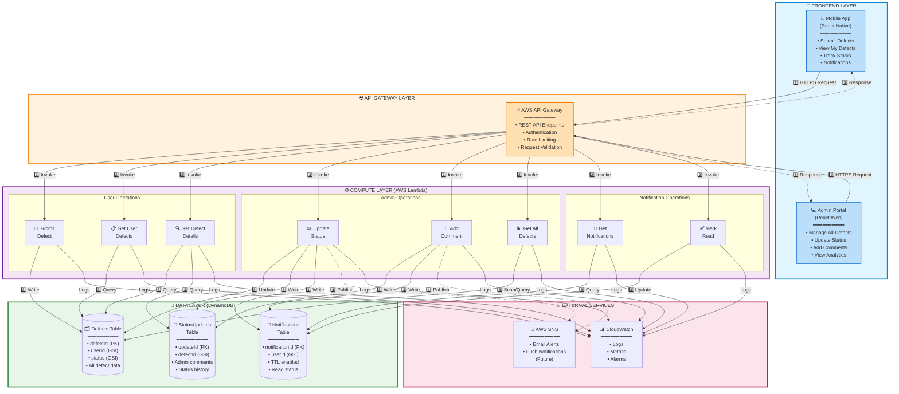
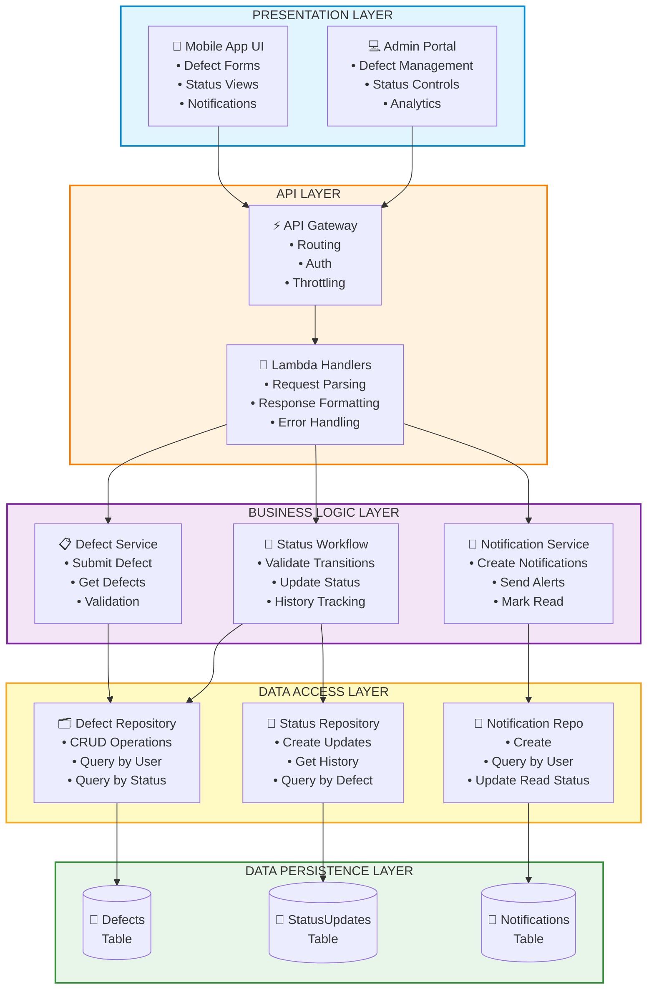
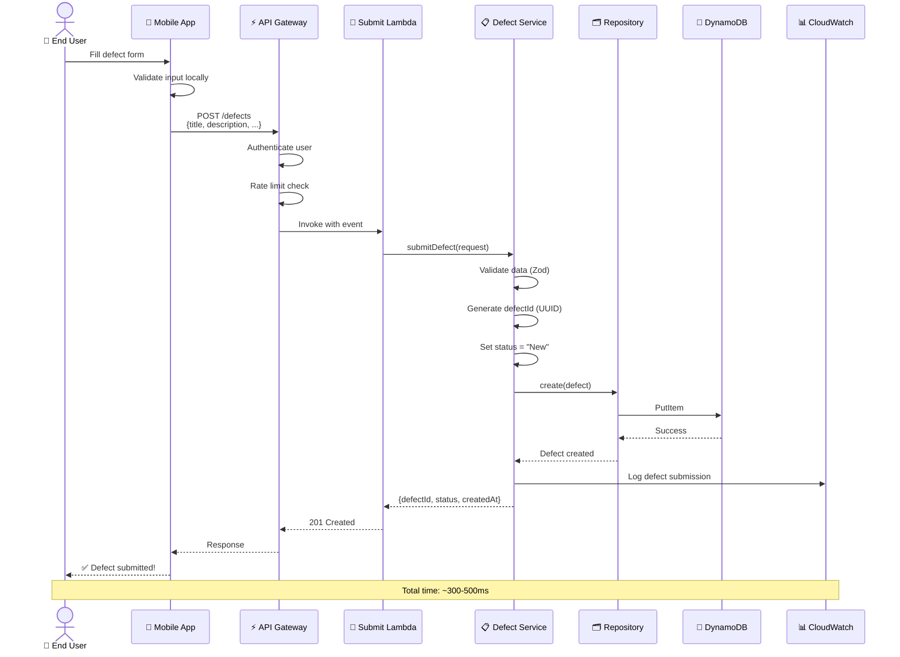
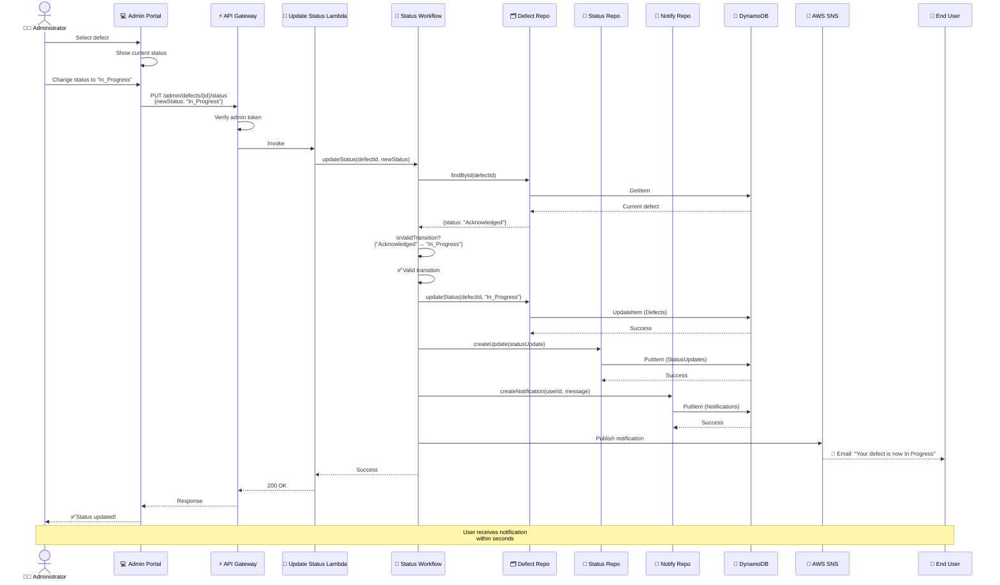
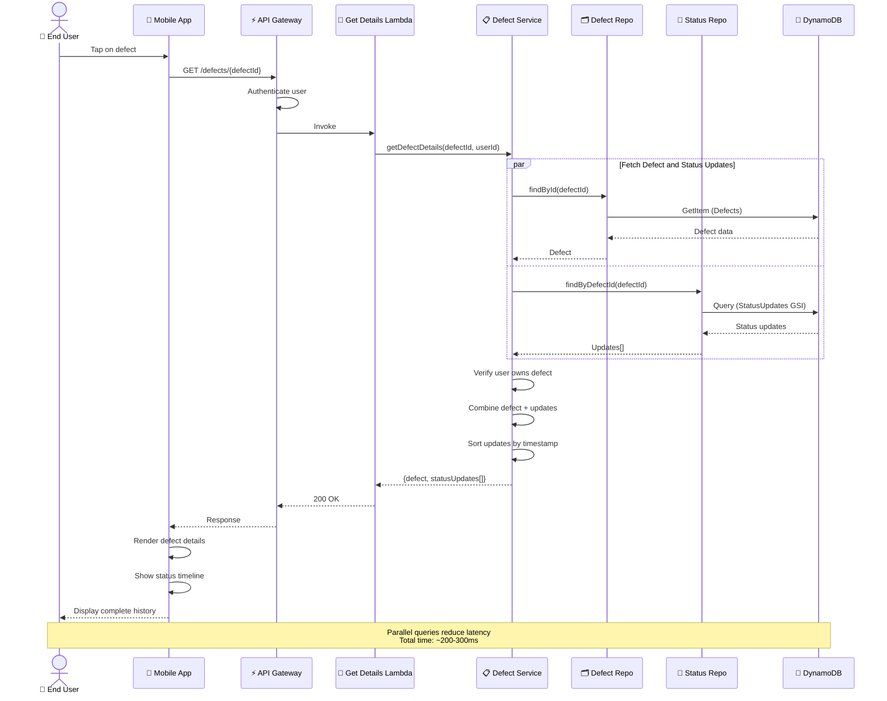
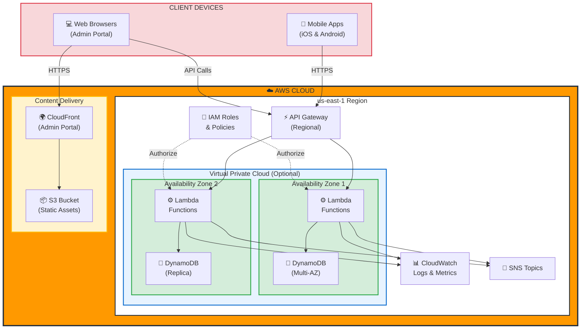
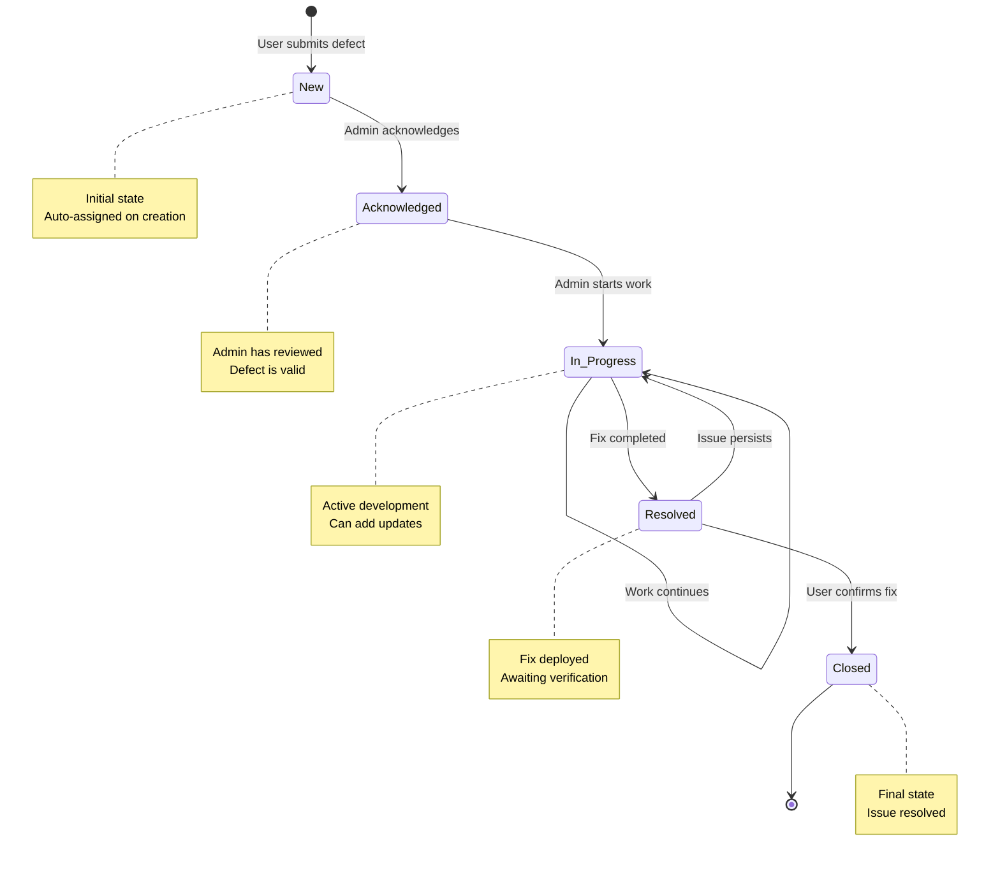

# Design Document: Defect Tracking System

## Overview

The Defect Tracking System provides a comprehensive solution for managing bug reports and defects in the Sanaathana-Aalaya-Charithra temple history application. The system enables end users to submit detailed defect reports through the mobile application, while administrators can manage, track, and communicate status updates through a dedicated admin interface.

### Key Design Goals

1. **Simplicity**: Intuitive defect submission for end users with minimal friction
2. **Transparency**: Clear visibility into defect status and resolution progress
3. **Workflow Enforcement**: State machine-based status transitions to maintain consistency
4. **Real-time Communication**: Notification system to keep users informed of updates
5. **Scalability**: Serverless architecture that scales automatically with usage
6. **Auditability**: Complete history tracking for all defect lifecycle events

### System Context

The defect tracking system integrates with the existing serverless AWS infrastructure:
- **Mobile App**: React Native application for end users to submit and view defects
- **Backend**: AWS Lambda functions for API endpoints
- **Storage**: DynamoDB for defect data persistence
- **Notifications**: Integration with existing notification mechanisms
- **Admin Interface**: Web-based dashboard for administrators

## High-Level Architecture

This section provides a comprehensive view of the system architecture, designed to be accessible to both technical and non-technical stakeholders.

### System Architecture Overview

The defect tracking system follows a serverless, event-driven architecture deployed on AWS. The system is organized into distinct layers, each with specific responsibilities:



**Legend:**
- **Solid arrows (→)**: Synchronous request/response flow
- **Dashed arrows (⇢)**: Asynchronous operations (notifications, logging)
- **Numbers (1️⃣-5️⃣)**: Request/response lifecycle sequence

### Component Architecture

The system follows a layered architecture pattern with clear separation of concerns:



### Data Flow Diagrams

#### Flow 1: User Submits Defect Report



#### Flow 2: Admin Updates Defect Status



#### Flow 3: User Views Defect Details with Updates



### Deployment Architecture



**Key Deployment Features:**
- **Multi-AZ Deployment**: Lambda functions and DynamoDB replicated across availability zones for high availability
- **Auto-Scaling**: Lambda automatically scales from 0 to 1000+ concurrent executions
- **Global Distribution**: CloudFront CDN for Admin Portal with low-latency access worldwide
- **Managed Services**: All components are fully managed by AWS (no server maintenance)
- **Security**: IAM roles with least-privilege access, encryption at rest and in transit

### Technology Stack Summary

| Layer | Technology | Purpose |
|-------|-----------|---------|
| **Frontend** | React Native | Cross-platform mobile app (iOS & Android) |
| **Frontend** | React | Admin web dashboard |
| **API Gateway** | AWS API Gateway | REST API endpoints, authentication, rate limiting |
| **Compute** | AWS Lambda (Node.js 18.x) | Serverless function execution |
| **Language** | TypeScript | Type-safe backend development |
| **Database** | Amazon DynamoDB | NoSQL database with auto-scaling |
| **Notifications** | Amazon SNS | Email and push notification delivery |
| **Monitoring** | CloudWatch | Logs, metrics, alarms, and tracing |
| **Validation** | Zod | Runtime schema validation |
| **Testing** | Jest + fast-check | Unit tests and property-based testing |
| **IaC** | AWS CDK | Infrastructure as Code (TypeScript) |

## Detailed API Specifications

## Components and Interfaces

### 1. API Endpoints

#### 1.1 Submit Defect Report

```typescript
POST /defects

Request Body:
{
  userId: string;
  title: string;
  description: string;
  stepsToReproduce?: string;
  expectedBehavior?: string;
  actualBehavior?: string;
  deviceInfo?: {
    platform: string;
    osVersion: string;
    appVersion: string;
  };
}

Response (201 Created):
{
  defectId: string;
  status: "New";
  createdAt: string;
}

Error Responses:
- 400: Validation error (missing required fields, field length violations)
- 401: Unauthorized (invalid user token)
- 500: Internal server error
```

#### 1.2 Get User Defects

```typescript
GET /defects/user/{userId}

Query Parameters:
- status?: string (filter by status)
- limit?: number (default: 20)
- lastEvaluatedKey?: string (pagination)

Response (200 OK):
{
  defects: Array<{
    defectId: string;
    title: string;
    description: string;
    status: DefectStatus;
    createdAt: string;
    updatedAt: string;
    updateCount: number;
  }>;
  lastEvaluatedKey?: string;
}
```

#### 1.3 Get Defect Details

```typescript
GET /defects/{defectId}

Response (200 OK):
{
  defectId: string;
  userId: string;
  title: string;
  description: string;
  stepsToReproduce?: string;
  expectedBehavior?: string;
  actualBehavior?: string;
  status: DefectStatus;
  createdAt: string;
  updatedAt: string;
  deviceInfo?: object;
  statusUpdates: Array<{
    updateId: string;
    message: string;
    adminId: string;
    adminName: string;
    timestamp: string;
    previousStatus?: DefectStatus;
    newStatus?: DefectStatus;
  }>;
}

Error Responses:
- 404: Defect not found
- 403: Forbidden (user can only view their own defects)
```

#### 1.4 Get All Defects (Admin)

```typescript
GET /admin/defects

Query Parameters:
- status?: string
- search?: string (search by defectId or title)
- limit?: number
- lastEvaluatedKey?: string

Headers:
- Authorization: Bearer <admin-token>

Response (200 OK):
{
  defects: Array<DefectSummary>;
  lastEvaluatedKey?: string;
  totalCount: number;
}
```

#### 1.5 Update Defect Status (Admin)

```typescript
PUT /admin/defects/{defectId}/status

Headers:
- Authorization: Bearer <admin-token>

Request Body:
{
  newStatus: DefectStatus;
  comment?: string;
}

Response (200 OK):
{
  defectId: string;
  previousStatus: DefectStatus;
  newStatus: DefectStatus;
  updatedAt: string;
}

Error Responses:
- 400: Invalid status transition
- 403: Forbidden (not an administrator)
- 404: Defect not found
```

#### 1.6 Add Status Update (Admin)

```typescript
POST /admin/defects/{defectId}/updates

Headers:
- Authorization: Bearer <admin-token>

Request Body:
{
  message: string;
}

Response (201 Created):
{
  updateId: string;
  defectId: string;
  message: string;
  timestamp: string;
}
```

#### 1.7 Get User Notifications

```typescript
GET /notifications/user/{userId}

Query Parameters:
- unreadOnly?: boolean (default: false)
- limit?: number

Response (200 OK):
{
  notifications: Array<{
    notificationId: string;
    defectId: string;
    defectTitle: string;
    message: string;
    type: "STATUS_CHANGE" | "COMMENT_ADDED";
    isRead: boolean;
    createdAt: string;
  }>;
}
```

#### 1.8 Mark Notification as Read

```typescript
PUT /notifications/{notificationId}/read

Response (200 OK):
{
  notificationId: string;
  isRead: true;
}
```

### 2. Core Services

#### 2.1 DefectService

```typescript
interface DefectService {
  // Create a new defect report
  submitDefect(request: SubmitDefectRequest): Promise<DefectCreationResult>;
  
  // Retrieve defects for a user
  getUserDefects(userId: string, filters?: DefectFilters): Promise<DefectList>;
  
  // Get detailed defect information
  getDefectDetails(defectId: string, requesterId: string): Promise<DefectDetails>;
  
  // Admin: Get all defects with filters
  getAllDefects(filters?: AdminDefectFilters): Promise<DefectList>;
  
  // Admin: Update defect status
  updateDefectStatus(
    defectId: string,
    adminId: string,
    newStatus: DefectStatus,
    comment?: string
  ): Promise<StatusUpdateResult>;
  
  // Admin: Add status update comment
  addStatusUpdate(
    defectId: string,
    adminId: string,
    message: string
  ): Promise<StatusUpdate>;
  
  // Validate defect submission
  validateDefectSubmission(request: SubmitDefectRequest): ValidationResult;
}
```

#### 2.2 StatusWorkflowService

```typescript
interface StatusWorkflowService {
  // Validate if a status transition is allowed
  isValidTransition(
    currentStatus: DefectStatus,
    newStatus: DefectStatus
  ): boolean;
  
  // Get allowed next statuses for current status
  getAllowedTransitions(currentStatus: DefectStatus): DefectStatus[];
  
  // Get status transition history
  getTransitionHistory(defectId: string): Promise<StatusTransition[]>;
}
```

#### 2.3 NotificationService

```typescript
interface NotificationService {
  // Create notification for status change
  notifyStatusChange(
    userId: string,
    defectId: string,
    defectTitle: string,
    oldStatus: DefectStatus,
    newStatus: DefectStatus
  ): Promise<void>;
  
  // Create notification for new comment
  notifyCommentAdded(
    userId: string,
    defectId: string,
    defectTitle: string,
    comment: string
  ): Promise<void>;
  
  // Get user notifications
  getUserNotifications(
    userId: string,
    unreadOnly?: boolean
  ): Promise<Notification[]>;
  
  // Mark notification as read
  markAsRead(notificationId: string): Promise<void>;
  
  // Send external notification (email/push)
  sendExternalNotification(
    userId: string,
    notification: Notification
  ): Promise<void>;
}
```

### 3. Repository Layer

#### 3.1 DefectRepository

```typescript
interface DefectRepository {
  create(defect: Defect): Promise<Defect>;
  findById(defectId: string): Promise<Defect | null>;
  findByUserId(userId: string, filters?: DefectFilters): Promise<Defect[]>;
  findAll(filters?: AdminDefectFilters): Promise<Defect[]>;
  updateStatus(defectId: string, newStatus: DefectStatus): Promise<void>;
  update(defect: Defect): Promise<Defect>;
}
```

#### 3.2 StatusUpdateRepository

```typescript
interface StatusUpdateRepository {
  create(update: StatusUpdate): Promise<StatusUpdate>;
  findByDefectId(defectId: string): Promise<StatusUpdate[]>;
  findById(updateId: string): Promise<StatusUpdate | null>;
}
```

#### 3.3 NotificationRepository

```typescript
interface NotificationRepository {
  create(notification: Notification): Promise<Notification>;
  findByUserId(userId: string, unreadOnly?: boolean): Promise<Notification[]>;
  markAsRead(notificationId: string): Promise<void>;
  deleteOldNotifications(olderThanDays: number): Promise<void>;
}
```

## Data Models

### Defect

```typescript
interface Defect {
  // Primary Key
  defectId: string;              // UUID
  
  // User Information
  userId: string;                // User who submitted the defect
  
  // Defect Details
  title: string;                 // Min 5 chars, max 200 chars
  description: string;           // Min 10 chars, max 5000 chars
  stepsToReproduce?: string;     // Optional, max 5000 chars
  expectedBehavior?: string;     // Optional, max 2000 chars
  actualBehavior?: string;       // Optional, max 2000 chars
  
  // Status
  status: DefectStatus;          // Current status
  
  // Timestamps
  createdAt: string;             // ISO 8601 timestamp
  updatedAt: string;             // ISO 8601 timestamp
  
  // Device Information
  deviceInfo?: {
    platform: string;            // "android" | "ios"
    osVersion: string;
    appVersion: string;
    deviceModel?: string;
  };
  
  // Metadata
  updateCount: number;           // Number of status updates
}

type DefectStatus = 
  | "New"
  | "Acknowledged"
  | "In_Progress"
  | "Resolved"
  | "Closed";
```

### StatusUpdate

```typescript
interface StatusUpdate {
  // Primary Key
  updateId: string;              // UUID
  
  // Foreign Key
  defectId: string;              // Reference to Defect
  
  // Update Details
  message: string;               // Update message/comment
  
  // Status Change (optional)
  previousStatus?: DefectStatus;
  newStatus?: DefectStatus;
  
  // Admin Information
  adminId: string;               // Admin who made the update
  adminName: string;             // Admin display name
  
  // Timestamp
  timestamp: string;             // ISO 8601 timestamp
}
```

### Notification

```typescript
interface Notification {
  // Primary Key
  notificationId: string;        // UUID
  
  // User Information
  userId: string;                // User to notify
  
  // Defect Reference
  defectId: string;
  defectTitle: string;
  
  // Notification Details
  message: string;
  type: NotificationType;
  
  // Status
  isRead: boolean;
  
  // Timestamp
  createdAt: string;             // ISO 8601 timestamp
  
  // TTL for auto-deletion
  ttl: number;                   // Unix timestamp (90 days)
}

type NotificationType = 
  | "STATUS_CHANGE"
  | "COMMENT_ADDED";
```

### DynamoDB Table Schemas

#### Defects Table

```
Table Name: Defects
Primary Key: defectId (String)
GSI-1: userId-createdAt-index
  - Partition Key: userId
  - Sort Key: createdAt
GSI-2: status-createdAt-index
  - Partition Key: status
  - Sort Key: createdAt

Attributes:
- defectId: String (PK)
- userId: String (GSI-1 PK)
- title: String
- description: String
- stepsToReproduce: String (optional)
- expectedBehavior: String (optional)
- actualBehavior: String (optional)
- status: String
- createdAt: String (GSI-1 SK, GSI-2 SK)
- updatedAt: String
- deviceInfo: Map (optional)
- updateCount: Number

Capacity: On-Demand
Encryption: AWS Managed
Point-in-Time Recovery: Enabled
```

#### StatusUpdates Table

```
Table Name: StatusUpdates
Primary Key: updateId (String)
GSI-1: defectId-timestamp-index
  - Partition Key: defectId
  - Sort Key: timestamp

Attributes:
- updateId: String (PK)
- defectId: String (GSI-1 PK)
- message: String
- previousStatus: String (optional)
- newStatus: String (optional)
- adminId: String
- adminName: String
- timestamp: String (GSI-1 SK)

Capacity: On-Demand
Encryption: AWS Managed
```

#### Notifications Table

```
Table Name: Notifications
Primary Key: notificationId (String)
GSI-1: userId-createdAt-index
  - Partition Key: userId
  - Sort Key: createdAt

Attributes:
- notificationId: String (PK)
- userId: String (GSI-1 PK)
- defectId: String
- defectTitle: String
- message: String
- type: String
- isRead: Boolean
- createdAt: String (GSI-1 SK)
- ttl: Number (TTL attribute)

Capacity: On-Demand
Encryption: AWS Managed
TTL: Enabled on 'ttl' attribute (90 days)
```

## Status Workflow State Machine

The defect lifecycle follows a strict state machine to ensure consistent workflow:



### Valid Status Transitions

```typescript
const STATUS_TRANSITIONS: Record<DefectStatus, DefectStatus[]> = {
  "New": ["Acknowledged"],
  "Acknowledged": ["In_Progress"],
  "In_Progress": ["Resolved"],
  "Resolved": ["Closed", "In_Progress"],
  "Closed": []  // Terminal state
};
```

### Transition Rules

1. **New → Acknowledged**: Admin reviews and confirms the defect is valid
2. **Acknowledged → In_Progress**: Admin begins working on the fix
3. **In_Progress → Resolved**: Fix is completed and deployed
4. **Resolved → Closed**: User confirms the issue is fixed (or auto-close after 30 days)
5. **Resolved → In_Progress**: User reports the issue still exists (reopening)

### Invalid Transitions

Any transition not explicitly defined in the state machine is invalid and will be rejected with an error. For example:
- New → Closed (cannot skip workflow steps)
- Acknowledged → Resolved (must go through In_Progress)
- Closed → any state (terminal state, cannot reopen)


## Integration Points

### 1. Mobile App Integration

The mobile app will integrate the defect tracking system through the following components:

#### 1.1 Defect Submission Screen

```typescript
// Mobile App Component Structure
screens/
  DefectReportScreen.tsx       // Form to submit new defects
  MyDefectsScreen.tsx          // List of user's defects
  DefectDetailsScreen.tsx      // Detailed view with updates
  NotificationsScreen.tsx      // Notification center
```

**Key Features**:
- Form validation with real-time feedback
- Auto-capture device information
- Offline support with local queue
- Image attachment support (future enhancement)

#### 1.2 API Client Integration

```typescript
// services/defectApi.ts
import { apiClient } from './apiClient';

export const defectApi = {
  submitDefect: (data: SubmitDefectRequest) => 
    apiClient.post('/defects', data),
  
  getUserDefects: (userId: string, filters?: DefectFilters) =>
    apiClient.get(`/defects/user/${userId}`, { params: filters }),
  
  getDefectDetails: (defectId: string) =>
    apiClient.get(`/defects/${defectId}`),
  
  getNotifications: (userId: string) =>
    apiClient.get(`/notifications/user/${userId}`),
  
  markNotificationRead: (notificationId: string) =>
    apiClient.put(`/notifications/${notificationId}/read`)
};
```

#### 1.3 State Management

```typescript
// Redux/Context for defect state management
interface DefectState {
  myDefects: Defect[];
  selectedDefect: DefectDetails | null;
  notifications: Notification[];
  unreadCount: number;
  loading: boolean;
  error: string | null;
}
```

### 2. Admin Portal Integration

The Admin Portal will be a separate web application with the following structure:

#### 2.1 Dashboard Components

```
admin-portal/
  src/
    pages/
      DefectListPage.tsx       // Main defect list with filters
      DefectDetailPage.tsx     // Detailed defect view
      AnalyticsPage.tsx        // Defect analytics and reports
    components/
      DefectTable.tsx          // Sortable, filterable table
      StatusBadge.tsx          // Visual status indicator
      StatusUpdateForm.tsx     // Form to add updates
      StatusTransitionButton.tsx // Status change controls
```

#### 2.2 Admin Authentication

Integration with existing admin authentication system:

```typescript
// Middleware for admin routes
const requireAdmin = async (req, res, next) => {
  const token = req.headers.authorization?.replace('Bearer ', '');
  
  try {
    const decoded = await verifyAdminToken(token);
    req.admin = decoded;
    next();
  } catch (error) {
    res.status(403).json({ error: 'Forbidden: Admin access required' });
  }
};
```

### 3. Notification System Integration

#### 3.1 In-App Notifications

```typescript
// Real-time notification polling (or WebSocket in future)
const useNotifications = (userId: string) => {
  const [notifications, setNotifications] = useState<Notification[]>([]);
  
  useEffect(() => {
    const pollInterval = setInterval(async () => {
      const data = await defectApi.getNotifications(userId);
      setNotifications(data.notifications);
    }, 30000); // Poll every 30 seconds
    
    return () => clearInterval(pollInterval);
  }, [userId]);
  
  return notifications;
};
```

#### 3.2 Push Notifications (Future Enhancement)

```typescript
// Integration with SNS for push notifications
interface PushNotificationConfig {
  platform: 'FCM' | 'APNS';
  deviceToken: string;
  userId: string;
}

// Lambda function to send push notifications
const sendPushNotification = async (
  userId: string,
  notification: Notification
) => {
  const deviceTokens = await getDeviceTokens(userId);
  
  for (const token of deviceTokens) {
    await sns.publish({
      TargetArn: token.endpointArn,
      Message: JSON.stringify({
        title: 'Defect Update',
        body: notification.message,
        data: {
          defectId: notification.defectId,
          type: notification.type
        }
      })
    });
  }
};
```

#### 3.3 Email Notifications (Optional)

```typescript
// Integration with SES for email notifications
const sendEmailNotification = async (
  userId: string,
  notification: Notification
) => {
  const user = await getUserById(userId);
  
  if (user.email && user.emailNotificationsEnabled) {
    await ses.sendEmail({
      Source: 'noreply@sanaathana-aalaya-charithra.com',
      Destination: { ToAddresses: [user.email] },
      Message: {
        Subject: { Data: `Defect Update: ${notification.defectTitle}` },
        Body: {
          Text: { Data: notification.message },
          Html: { Data: renderEmailTemplate(notification) }
        }
      }
    });
  }
};
```

### 4. Existing Infrastructure Integration

#### 4.1 DynamoDB Integration

The defect tracking tables will be added to the existing DynamoDB infrastructure:

```typescript
// infrastructure/stacks/database-stack.ts
export class DatabaseStack extends Stack {
  constructor(scope: Construct, id: string, props?: StackProps) {
    super(scope, id, props);
    
    // Existing tables...
    
    // New defect tracking tables
    const defectsTable = new Table(this, 'DefectsTable', {
      tableName: 'Defects',
      partitionKey: { name: 'defectId', type: AttributeType.STRING },
      billingMode: BillingMode.PAY_PER_REQUEST,
      encryption: TableEncryption.AWS_MANAGED,
      pointInTimeRecovery: true,
      removalPolicy: RemovalPolicy.RETAIN
    });
    
    defectsTable.addGlobalSecondaryIndex({
      indexName: 'userId-createdAt-index',
      partitionKey: { name: 'userId', type: AttributeType.STRING },
      sortKey: { name: 'createdAt', type: AttributeType.STRING }
    });
    
    defectsTable.addGlobalSecondaryIndex({
      indexName: 'status-createdAt-index',
      partitionKey: { name: 'status', type: AttributeType.STRING },
      sortKey: { name: 'createdAt', type: AttributeType.STRING }
    });
    
    // StatusUpdates table...
    // Notifications table...
  }
}
```

#### 4.2 API Gateway Integration

New routes will be added to the existing API Gateway:

```typescript
// infrastructure/stacks/api-stack.ts
export class ApiStack extends Stack {
  constructor(scope: Construct, id: string, props?: StackProps) {
    super(scope, id, props);
    
    const api = new RestApi(this, 'SanaathanaApi', {
      // Existing configuration...
    });
    
    // Defect tracking routes
    const defects = api.root.addResource('defects');
    defects.addMethod('POST', submitDefectIntegration);
    
    const userDefects = defects.addResource('user').addResource('{userId}');
    userDefects.addMethod('GET', getUserDefectsIntegration);
    
    const defectById = defects.addResource('{defectId}');
    defectById.addMethod('GET', getDefectDetailsIntegration);
    
    // Admin routes
    const admin = api.root.addResource('admin');
    const adminDefects = admin.addResource('defects');
    adminDefects.addMethod('GET', getAllDefectsIntegration);
    
    // ... more routes
  }
}
```

#### 4.3 Lambda Function Integration

```typescript
// src/lambdas/defect-tracking/
submit-defect.ts           // POST /defects
get-user-defects.ts        // GET /defects/user/{userId}
get-defect-details.ts      // GET /defects/{defectId}
get-all-defects.ts         // GET /admin/defects (admin)
update-defect-status.ts    // PUT /admin/defects/{defectId}/status (admin)
add-status-update.ts       // POST /admin/defects/{defectId}/updates (admin)
get-notifications.ts       // GET /notifications/user/{userId}
mark-notification-read.ts  // PUT /notifications/{notificationId}/read
```

### 5. Analytics Integration

Defect tracking metrics will be integrated with the existing analytics system:

```typescript
// Track defect submission
await analyticsService.trackEvent({
  eventType: 'DEFECT_SUBMITTED',
  userId: userId,
  metadata: {
    defectId: defect.defectId,
    title: defect.title
  }
});

// Track status changes
await analyticsService.trackEvent({
  eventType: 'DEFECT_STATUS_CHANGED',
  userId: adminId,
  metadata: {
    defectId: defectId,
    previousStatus: oldStatus,
    newStatus: newStatus
  }
});
```

## Validation and Error Handling

### Input Validation

All API inputs will be validated using Zod schemas:

```typescript
import { z } from 'zod';

// Defect submission validation
const SubmitDefectSchema = z.object({
  userId: z.string().uuid(),
  title: z.string().min(5).max(200),
  description: z.string().min(10).max(5000),
  stepsToReproduce: z.string().max(5000).optional(),
  expectedBehavior: z.string().max(2000).optional(),
  actualBehavior: z.string().max(2000).optional(),
  deviceInfo: z.object({
    platform: z.enum(['android', 'ios']),
    osVersion: z.string(),
    appVersion: z.string(),
    deviceModel: z.string().optional()
  }).optional()
});

// Status update validation
const UpdateStatusSchema = z.object({
  newStatus: z.enum(['New', 'Acknowledged', 'In_Progress', 'Resolved', 'Closed']),
  comment: z.string().max(2000).optional()
});

// Validation function
const validateDefectSubmission = (data: unknown): ValidationResult => {
  try {
    const validated = SubmitDefectSchema.parse(data);
    return { valid: true, data: validated };
  } catch (error) {
    if (error instanceof z.ZodError) {
      return {
        valid: false,
        errors: error.errors.map(e => ({
          field: e.path.join('.'),
          message: e.message
        }))
      };
    }
    throw error;
  }
};
```

### Error Handling Strategy

#### 1. Validation Errors (400 Bad Request)

```typescript
{
  error: 'VALIDATION_ERROR',
  message: 'Invalid input data',
  details: [
    {
      field: 'title',
      message: 'Title must be at least 5 characters'
    },
    {
      field: 'description',
      message: 'Description must be at least 10 characters'
    }
  ]
}
```

#### 2. Authorization Errors (401/403)

```typescript
{
  error: 'UNAUTHORIZED',
  message: 'Invalid or expired authentication token'
}

{
  error: 'FORBIDDEN',
  message: 'Admin privileges required for this operation'
}
```

#### 3. Not Found Errors (404)

```typescript
{
  error: 'NOT_FOUND',
  message: 'Defect not found',
  defectId: 'abc-123'
}
```

#### 4. Business Logic Errors (400)

```typescript
{
  error: 'INVALID_STATUS_TRANSITION',
  message: 'Cannot transition from Resolved to Acknowledged',
  currentStatus: 'Resolved',
  attemptedStatus: 'Acknowledged',
  allowedTransitions: ['Closed', 'In_Progress']
}
```

#### 5. Server Errors (500)

```typescript
{
  error: 'INTERNAL_SERVER_ERROR',
  message: 'An unexpected error occurred',
  requestId: 'req-xyz-789'  // For debugging
}
```

### Error Handling Implementation

```typescript
// Lambda error handler wrapper
export const withErrorHandling = (handler: LambdaHandler) => {
  return async (event: APIGatewayProxyEvent): Promise<APIGatewayProxyResult> => {
    try {
      return await handler(event);
    } catch (error) {
      console.error('Lambda error:', error);
      
      if (error instanceof ValidationError) {
        return {
          statusCode: 400,
          body: JSON.stringify({
            error: 'VALIDATION_ERROR',
            message: error.message,
            details: error.details
          })
        };
      }
      
      if (error instanceof UnauthorizedError) {
        return {
          statusCode: 401,
          body: JSON.stringify({
            error: 'UNAUTHORIZED',
            message: error.message
          })
        };
      }
      
      if (error instanceof ForbiddenError) {
        return {
          statusCode: 403,
          body: JSON.stringify({
            error: 'FORBIDDEN',
            message: error.message
          })
        };
      }
      
      if (error instanceof NotFoundError) {
        return {
          statusCode: 404,
          body: JSON.stringify({
            error: 'NOT_FOUND',
            message: error.message
          })
        };
      }
      
      if (error instanceof InvalidTransitionError) {
        return {
          statusCode: 400,
          body: JSON.stringify({
            error: 'INVALID_STATUS_TRANSITION',
            message: error.message,
            currentStatus: error.currentStatus,
            attemptedStatus: error.attemptedStatus,
            allowedTransitions: error.allowedTransitions
          })
        };
      }
      
      // Unknown error
      return {
        statusCode: 500,
        body: JSON.stringify({
          error: 'INTERNAL_SERVER_ERROR',
          message: 'An unexpected error occurred',
          requestId: event.requestContext.requestId
        })
      };
    }
  };
};
```

### Retry Logic

For transient failures (DynamoDB throttling, network issues):

```typescript
const withRetry = async <T>(
  operation: () => Promise<T>,
  maxRetries: number = 3,
  backoffMs: number = 100
): Promise<T> => {
  let lastError: Error;
  
  for (let attempt = 0; attempt < maxRetries; attempt++) {
    try {
      return await operation();
    } catch (error) {
      lastError = error as Error;
      
      // Only retry on transient errors
      if (isTransientError(error)) {
        const delay = backoffMs * Math.pow(2, attempt);
        await sleep(delay);
        continue;
      }
      
      throw error;
    }
  }
  
  throw lastError!;
};

const isTransientError = (error: any): boolean => {
  return (
    error.name === 'ProvisionedThroughputExceededException' ||
    error.name === 'ThrottlingException' ||
    error.code === 'ECONNRESET' ||
    error.code === 'ETIMEDOUT'
  );
};
```


## Correctness Properties

A property is a characteristic or behavior that should hold true across all valid executions of a system—essentially, a formal statement about what the system should do. Properties serve as the bridge between human-readable specifications and machine-verifiable correctness guarantees.

### Property Reflection

After analyzing all acceptance criteria, I identified several areas where properties can be consolidated:

1. **Field Capture Properties (1.2-1.8)**: All these test that submitted data is captured. These can be combined into a single round-trip property.

2. **Status Change Recording (4.2-4.5)**: All test that status changes are recorded. These are redundant and can be combined into one property about status persistence.

3. **Status Update Recording (5.2-5.4)**: All test that status update fields are captured. These can be combined into one property.

4. **Authorization Properties (10.1-10.4)**: Properties 10.3 and 10.4 are redundant with 10.1 and 10.2. We only need the general properties.

5. **Persistence Properties (9.1-9.3)**: These are all round-trip properties that can be consolidated.

### Property 1: Defect Submission Round Trip

*For any* valid defect submission data (title, description, optional fields, userId), when a defect is created and then retrieved, the retrieved defect should contain all the submitted data with matching values.

**Validates: Requirements 1.2, 1.3, 1.4, 1.5, 1.6, 1.8, 9.1**

### Property 2: New Defect Initial Status

*For any* newly created defect, the defect status should be "New".

**Validates: Requirements 1.9**

### Property 3: Defect ID Uniqueness

*For any* two defects created in the system, their defect IDs should be different.

**Validates: Requirements 1.10**

### Property 4: Defect Timestamp Validity

*For any* created defect, the createdAt timestamp should be a valid ISO 8601 timestamp and should be less than or equal to the current time.

**Validates: Requirements 1.7**

### Property 5: Status Updates Chronological Order

*For any* defect with multiple status updates, when the status updates are retrieved, they should be ordered by timestamp in ascending order (oldest first).

**Validates: Requirements 2.4**

### Property 6: Filter by Status Correctness

*For any* status value, when filtering defects by that status, all returned defects should have that exact status value.

**Validates: Requirements 3.2**

### Property 7: Search by ID Correctness

*For any* existing defect ID, when searching for that defect by ID, the returned defect should have that exact ID.

**Validates: Requirements 3.3**

### Property 8: Defect Retrieval Completeness

*For any* defect, when retrieved by ID, the response should include all defect fields (title, description, status, timestamps, optional fields if present) and all associated status updates.

**Validates: Requirements 2.2, 2.3, 3.4, 3.5**

### Property 9: Status Change Persistence

*For any* defect and any valid status transition, when the status is changed and the defect is retrieved, the retrieved defect should have the new status.

**Validates: Requirements 4.2, 4.3, 4.4, 4.5, 9.2**

### Property 10: Status Change Metadata Recording

*For any* status change, when a status update is created for that change, the status update should include the timestamp, admin ID, previous status, and new status.

**Validates: Requirements 4.6, 4.7**

### Property 11: Status Update Persistence

*For any* defect and any status update message, when a status update is added and the defect is retrieved, the defect's status updates should include the new update with the correct message, timestamp, and admin ID.

**Validates: Requirements 5.2, 5.3, 5.4, 5.5, 9.3**

### Property 12: Invalid Status Transition Rejection

*For any* defect with a given status, when attempting to transition to a status that is not in the allowed transitions list for that status, the system should reject the transition and return an error.

**Validates: Requirements 6.6**

### Property 13: Title Length Validation

*For any* defect submission with a title shorter than 5 characters, the system should reject the submission and return a validation error.

**Validates: Requirements 7.3**

### Property 14: Description Length Validation

*For any* defect submission with a description shorter than 10 characters, the system should reject the submission and return a validation error.

**Validates: Requirements 7.4**

### Property 15: Status Change Notification Creation

*For any* status change on a defect, a notification should be created for the user who submitted the defect, containing the defect ID, defect title, and status change information.

**Validates: Requirements 8.1**

### Property 16: Status Update Notification Creation

*For any* status update added to a defect, a notification should be created for the user who submitted the defect, containing the defect ID, defect title, and update message.

**Validates: Requirements 8.2**

### Property 17: Notification Read Status Update

*For any* notification, when marked as read, subsequent retrieval of that notification should show isRead as true.

**Validates: Requirements 8.4**

### Property 18: Referential Integrity

*For any* status update, the referenced defect ID should correspond to an existing defect in the system.

**Validates: Requirements 9.4**

### Property 19: End User Delete Prevention

*For any* end user (non-admin), when attempting to delete a defect, the system should reject the request and return an authorization error.

**Validates: Requirements 9.5**

### Property 20: Admin Authorization for Status Changes

*For any* non-admin user, when attempting to change a defect status, the system should reject the request and return an authorization error.

**Validates: Requirements 10.1, 10.3**

### Property 21: Admin Authorization for Status Updates

*For any* non-admin user, when attempting to add a status update, the system should reject the request and return an authorization error.

**Validates: Requirements 10.2, 10.4**

### Property 22: User Defect Access Control

*For any* end user, when retrieving defects, the system should only return defects where the userId matches the requesting user's ID.

**Validates: Requirements 10.5**

### Property 23: Admin Full Access

*For any* administrator, when retrieving defects, the system should return all defects regardless of the submitter.

**Validates: Requirements 10.6**

## Error Handling

### Error Categories

The system handles errors in the following categories:

1. **Validation Errors**: Input data fails validation rules
2. **Authorization Errors**: User lacks required permissions
3. **Business Logic Errors**: Operation violates business rules (e.g., invalid status transition)
4. **Not Found Errors**: Requested resource doesn't exist
5. **System Errors**: Infrastructure or unexpected failures

### Error Response Format

All errors follow a consistent JSON structure:

```typescript
interface ErrorResponse {
  error: string;           // Error code/type
  message: string;         // Human-readable message
  details?: any;           // Additional error details
  requestId?: string;      // For debugging server errors
}
```

### Specific Error Scenarios

#### 1. Missing Required Fields

```typescript
// Request: POST /defects with missing title
{
  statusCode: 400,
  body: {
    error: 'VALIDATION_ERROR',
    message: 'Invalid input data',
    details: [
      {
        field: 'title',
        message: 'Title is required'
      }
    ]
  }
}
```

#### 2. Field Length Violations

```typescript
// Request: POST /defects with title = "Bug"
{
  statusCode: 400,
  body: {
    error: 'VALIDATION_ERROR',
    message: 'Invalid input data',
    details: [
      {
        field: 'title',
        message: 'Title must be at least 5 characters'
      }
    ]
  }
}
```

#### 3. Invalid Status Transition

```typescript
// Request: PUT /admin/defects/{id}/status with invalid transition
{
  statusCode: 400,
  body: {
    error: 'INVALID_STATUS_TRANSITION',
    message: 'Cannot transition from Resolved to Acknowledged',
    currentStatus: 'Resolved',
    attemptedStatus: 'Acknowledged',
    allowedTransitions: ['Closed', 'In_Progress']
  }
}
```

#### 4. Unauthorized Access

```typescript
// Request: PUT /admin/defects/{id}/status without admin token
{
  statusCode: 403,
  body: {
    error: 'FORBIDDEN',
    message: 'Admin privileges required for this operation'
  }
}
```

#### 5. Defect Not Found

```typescript
// Request: GET /defects/{invalid-id}
{
  statusCode: 404,
  body: {
    error: 'NOT_FOUND',
    message: 'Defect not found',
    defectId: 'invalid-id'
  }
}
```

#### 6. Access Control Violation

```typescript
// Request: GET /defects/{id} by user who didn't create it
{
  statusCode: 403,
  body: {
    error: 'FORBIDDEN',
    message: 'You can only view your own defects'
  }
}
```

### Error Logging

All errors are logged to CloudWatch with appropriate context:

```typescript
const logError = (error: Error, context: ErrorContext) => {
  console.error('Error occurred:', {
    errorType: error.name,
    errorMessage: error.message,
    stack: error.stack,
    requestId: context.requestId,
    userId: context.userId,
    operation: context.operation,
    timestamp: new Date().toISOString()
  });
};
```

### Graceful Degradation

For non-critical failures (e.g., notification delivery), the system continues operation:

```typescript
try {
  await notificationService.sendNotification(userId, notification);
} catch (error) {
  // Log error but don't fail the main operation
  console.error('Failed to send notification:', error);
  // Notification will still be available in-app
}
```

## Testing Strategy

### Dual Testing Approach

The defect tracking system will employ both unit testing and property-based testing to ensure comprehensive coverage:

#### Unit Testing

Unit tests focus on:
- **Specific examples**: Testing concrete scenarios with known inputs and outputs
- **Edge cases**: Boundary conditions like empty strings, maximum lengths, missing optional fields
- **Error conditions**: Specific error scenarios like missing required fields
- **Integration points**: Mocking external dependencies (DynamoDB, SNS)

Example unit tests:
```typescript
describe('DefectService', () => {
  it('should reject defect with title shorter than 5 characters', async () => {
    const result = await defectService.submitDefect({
      userId: 'user-123',
      title: 'Bug',
      description: 'This is a bug description'
    });
    
    expect(result.success).toBe(false);
    expect(result.error).toBe('VALIDATION_ERROR');
  });
  
  it('should create defect with status "New"', async () => {
    const result = await defectService.submitDefect({
      userId: 'user-123',
      title: 'Valid Bug Title',
      description: 'This is a valid bug description'
    });
    
    expect(result.success).toBe(true);
    expect(result.defect.status).toBe('New');
  });
});
```

#### Property-Based Testing

Property tests verify universal properties across many randomly generated inputs using **fast-check** library:

**Configuration**:
- Minimum 100 iterations per property test
- Each test references its design document property
- Tag format: `Feature: defect-tracking, Property {number}: {property_text}`

Example property tests:
```typescript
import fc from 'fast-check';

describe('Defect Tracking Properties', () => {
  /**
   * Feature: defect-tracking, Property 1: Defect Submission Round Trip
   * For any valid defect submission data, when a defect is created and then
   * retrieved, the retrieved defect should contain all the submitted data.
   */
  it('Property 1: Defect submission round trip', async () => {
    await fc.assert(
      fc.asyncProperty(
        fc.record({
          userId: fc.uuid(),
          title: fc.string({ minLength: 5, maxLength: 200 }),
          description: fc.string({ minLength: 10, maxLength: 5000 }),
          stepsToReproduce: fc.option(fc.string({ maxLength: 5000 })),
          expectedBehavior: fc.option(fc.string({ maxLength: 2000 })),
          actualBehavior: fc.option(fc.string({ maxLength: 2000 }))
        }),
        async (defectData) => {
          // Create defect
          const created = await defectService.submitDefect(defectData);
          expect(created.success).toBe(true);
          
          // Retrieve defect
          const retrieved = await defectService.getDefectDetails(
            created.defectId,
            defectData.userId
          );
          
          // Verify round trip
          expect(retrieved.title).toBe(defectData.title);
          expect(retrieved.description).toBe(defectData.description);
          expect(retrieved.userId).toBe(defectData.userId);
          
          if (defectData.stepsToReproduce) {
            expect(retrieved.stepsToReproduce).toBe(defectData.stepsToReproduce);
          }
          if (defectData.expectedBehavior) {
            expect(retrieved.expectedBehavior).toBe(defectData.expectedBehavior);
          }
          if (defectData.actualBehavior) {
            expect(retrieved.actualBehavior).toBe(defectData.actualBehavior);
          }
        }
      ),
      { numRuns: 100 }
    );
  });
  
  /**
   * Feature: defect-tracking, Property 12: Invalid Status Transition Rejection
   * For any defect with a given status, when attempting to transition to a
   * status that is not allowed, the system should reject the transition.
   */
  it('Property 12: Invalid status transition rejection', async () => {
    await fc.assert(
      fc.asyncProperty(
        fc.constantFrom('New', 'Acknowledged', 'In_Progress', 'Resolved', 'Closed'),
        fc.constantFrom('New', 'Acknowledged', 'In_Progress', 'Resolved', 'Closed'),
        async (currentStatus, attemptedStatus) => {
          // Create defect with current status
          const defect = await createDefectWithStatus(currentStatus);
          
          // Check if transition is valid
          const isValid = statusWorkflowService.isValidTransition(
            currentStatus,
            attemptedStatus
          );
          
          // Attempt transition
          const result = await defectService.updateDefectStatus(
            defect.defectId,
            'admin-123',
            attemptedStatus
          );
          
          if (isValid) {
            expect(result.success).toBe(true);
          } else {
            expect(result.success).toBe(false);
            expect(result.error).toBe('INVALID_STATUS_TRANSITION');
          }
        }
      ),
      { numRuns: 100 }
    );
  });
  
  /**
   * Feature: defect-tracking, Property 13: Title Length Validation
   * For any defect submission with a title shorter than 5 characters,
   * the system should reject the submission.
   */
  it('Property 13: Title length validation', async () => {
    await fc.assert(
      fc.asyncProperty(
        fc.string({ maxLength: 4 }),  // Generate strings 0-4 chars
        fc.string({ minLength: 10, maxLength: 5000 }),
        async (shortTitle, validDescription) => {
          const result = await defectService.submitDefect({
            userId: 'user-123',
            title: shortTitle,
            description: validDescription
          });
          
          expect(result.success).toBe(false);
          expect(result.error).toBe('VALIDATION_ERROR');
          expect(result.details).toContainEqual(
            expect.objectContaining({
              field: 'title',
              message: expect.stringContaining('at least 5 characters')
            })
          );
        }
      ),
      { numRuns: 100 }
    );
  });
});
```

### Test Coverage Goals

- **Unit Test Coverage**: Minimum 80% code coverage
- **Property Test Coverage**: All 23 correctness properties implemented
- **Integration Tests**: End-to-end API tests for critical workflows
- **Performance Tests**: Load testing for concurrent defect submissions

### Testing Tools

- **Jest**: Test runner and assertion library
- **fast-check**: Property-based testing library
- **AWS SDK Mocks**: Mocking DynamoDB and SNS calls
- **Supertest**: API endpoint testing (for integration tests)

### Continuous Integration

All tests run automatically on:
- Pull request creation
- Merge to main branch
- Pre-deployment validation

```yaml
# .github/workflows/test.yml
name: Test
on: [push, pull_request]
jobs:
  test:
    runs-on: ubuntu-latest
    steps:
      - uses: actions/checkout@v2
      - uses: actions/setup-node@v2
      - run: npm install
      - run: npm run test
      - run: npm run test:coverage
```

## Security Considerations

### Authentication and Authorization

1. **User Authentication**: JWT tokens validated on every request
2. **Admin Authorization**: Separate admin role verification for privileged operations
3. **Token Expiration**: Short-lived tokens (1 hour) with refresh mechanism
4. **Rate Limiting**: API Gateway throttling to prevent abuse

### Data Protection

1. **Encryption at Rest**: DynamoDB tables encrypted with AWS managed keys
2. **Encryption in Transit**: All API calls over HTTPS only
3. **PII Handling**: User data (email, device info) treated as sensitive
4. **Data Retention**: Notifications auto-expire after 90 days (TTL)

### Input Sanitization

1. **SQL Injection**: Not applicable (NoSQL database)
2. **XSS Prevention**: All user input sanitized before display
3. **Length Limits**: Maximum field lengths enforced
4. **Character Validation**: Only allowed characters in text fields

### Access Control

1. **Principle of Least Privilege**: Lambda functions have minimal IAM permissions
2. **Resource-Level Permissions**: Users can only access their own defects
3. **Admin Audit Trail**: All admin actions logged with admin ID and timestamp

## Performance Considerations

### Scalability

- **Lambda Auto-Scaling**: Handles 1 to 10,000+ concurrent requests
- **DynamoDB On-Demand**: Automatically scales with traffic
- **API Gateway**: Handles millions of requests per day

### Latency Targets

- **Defect Submission**: < 500ms (p95)
- **Defect Retrieval**: < 300ms (p95)
- **Status Update**: < 400ms (p95)
- **Notification Retrieval**: < 200ms (p95)

### Optimization Strategies

1. **DynamoDB GSI**: Efficient queries by userId and status
2. **Pagination**: Limit result sets to 20 items by default
3. **Caching**: Consider ElastiCache for frequently accessed defects (future)
4. **Connection Pooling**: Reuse DynamoDB connections across Lambda invocations

### Cost Optimization

- **On-Demand Pricing**: Pay only for actual usage
- **TTL on Notifications**: Auto-delete old data to reduce storage costs
- **Lambda Memory Tuning**: Right-size memory allocation for optimal cost/performance
- **CloudWatch Log Retention**: 7-day retention to control costs

## Deployment Strategy

### Infrastructure as Code

All infrastructure defined in AWS CDK:

```typescript
// infrastructure/stacks/defect-tracking-stack.ts
export class DefectTrackingStack extends Stack {
  constructor(scope: Construct, id: string, props?: StackProps) {
    super(scope, id, props);
    
    // DynamoDB Tables
    const defectsTable = this.createDefectsTable();
    const statusUpdatesTable = this.createStatusUpdatesTable();
    const notificationsTable = this.createNotificationsTable();
    
    // Lambda Functions
    const submitDefectLambda = this.createSubmitDefectLambda(defectsTable);
    const updateStatusLambda = this.createUpdateStatusLambda(
      defectsTable,
      statusUpdatesTable,
      notificationsTable
    );
    // ... more lambdas
    
    // API Gateway
    this.createApiEndpoints([
      submitDefectLambda,
      updateStatusLambda,
      // ... more lambdas
    ]);
  }
}
```

### Deployment Pipeline

1. **Development**: Local testing with mocked AWS services
2. **Staging**: Deploy to staging environment for integration testing
3. **Production**: Blue-green deployment with automatic rollback

### Monitoring and Alerting

- **CloudWatch Metrics**: Lambda duration, error rate, throttles
- **CloudWatch Alarms**: Alert on error rate > 5%, latency > 1s
- **X-Ray Tracing**: Distributed tracing for debugging
- **Custom Metrics**: Defect submission rate, status transition counts

## Future Enhancements

### Phase 2 Features

1. **Image Attachments**: Allow users to attach screenshots to defect reports
2. **Real-time Notifications**: WebSocket support for instant updates
3. **Defect Priority**: Add priority levels (Low, Medium, High, Critical)
4. **Defect Assignment**: Assign defects to specific developers
5. **Bulk Operations**: Admin ability to update multiple defects at once

### Phase 3 Features

1. **Analytics Dashboard**: Visualize defect trends, resolution times
2. **Email Notifications**: Optional email alerts for status changes
3. **Defect Templates**: Pre-defined templates for common issues
4. **Search Enhancement**: Full-text search across defect descriptions
5. **Export Functionality**: Export defect reports to CSV/PDF

### Technical Debt

1. **Caching Layer**: Add ElastiCache for frequently accessed data
2. **GraphQL API**: Consider GraphQL for more flexible queries
3. **Event Sourcing**: Store complete event history for audit trail
4. **Microservices**: Split into separate services if complexity grows

## Conclusion

This design provides a comprehensive, scalable, and maintainable defect tracking system for the Sanaathana-Aalaya-Charithra application. The serverless architecture ensures cost-effectiveness and automatic scaling, while the property-based testing approach guarantees correctness across all scenarios. The system integrates seamlessly with the existing infrastructure and provides a solid foundation for future enhancements.

