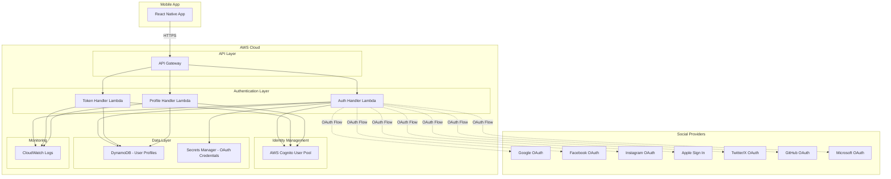
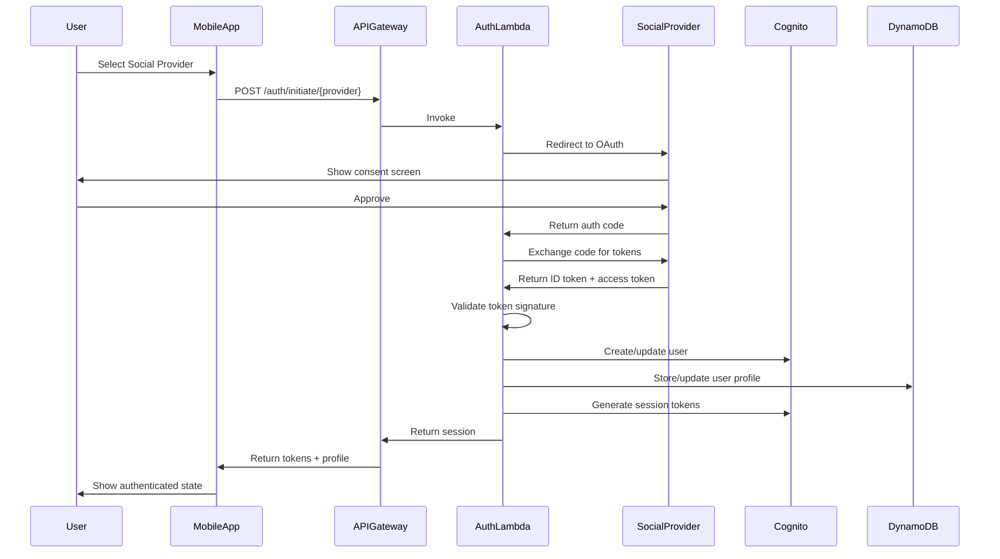

# Design Document: Social Media Authentication

## Overview

The social media authentication feature provides a secure, scalable authentication system that enables users to sign in to the Sanaathana-Aalaya-Charithra mobile application using their existing social media accounts. The system supports seven major social providers (Google, Facebook, Instagram, Apple, Twitter/X, GitHub, and Microsoft) and integrates with AWS Cognito for centralized user pool management.

### Key Design Goals

1. **Seamless User Experience**: Enable one-tap authentication across multiple social providers
2. **Security First**: Implement industry-standard OAuth 2.0 flows with token validation and encryption
3. **Scalability**: Leverage AWS serverless architecture for automatic scaling
4. **Flexibility**: Support account linking to allow users to authenticate through multiple providers
5. **Compliance**: Ensure GDPR compliance and data privacy protection

### Technology Stack

- **Backend Runtime**: Python 3.11 (AWS Lambda)
- **User Pool Management**: AWS Cognito
- **API Layer**: AWS API Gateway (REST API)
- **Data Storage**: AWS DynamoDB
- **Secrets Management**: AWS Secrets Manager
- **Infrastructure**: AWS CDK (Python)
- **Mobile Client**: React Native

## Architecture

### High-Level Architecture



### Authentication Flow



### Component Architecture

The system follows a layered architecture pattern:

1. **API Layer**: API Gateway handles routing, CORS, and request validation
2. **Handler Layer**: Python Lambda functions process authentication logic
3. **Service Layer**: Reusable Python modules for OAuth, token management, and validation
4. **Integration Layer**: AWS SDK clients for Cognito, DynamoDB, and Secrets Manager
5. **Data Layer**: DynamoDB for user profiles, Cognito for identity management

## Components and Interfaces

### 1. Authentication Handler Lambda

**Purpose**: Orchestrates OAuth flows for all social providers

**Python Module Structure**:
```
src/auth/
├── lambdas/
│   ├── auth_handler.py          # Main Lambda handler
│   ├── token_handler.py         # Token refresh handler
│   └── profile_handler.py       # Profile management handler
├── services/
│   ├── oauth_service.py         # OAuth flow orchestration
│   ├── token_service.py         # Token generation/validation
│   ├── profile_service.py       # User profile management
│   └── provider_factory.py      # Provider-specific implementations
├── providers/
│   ├── base_provider.py         # Abstract base class
│   ├── google_provider.py
│   ├── facebook_provider.py
│   ├── instagram_provider.py
│   ├── apple_provider.py
│   ├── twitter_provider.py
│   ├── github_provider.py
│   └── microsoft_provider.py
├── models/
│   ├── user_profile.py
│   ├── session.py
│   └── oauth_tokens.py
├── utils/
│   ├── crypto.py                # Encryption utilities
│   ├── validators.py            # Token validation
│   └── rate_limiter.py          # Rate limiting logic
└── config.py                    # Configuration management
```

**Key Responsibilities**:
- Initiate OAuth flows with social providers
- Validate identity tokens using provider public keys
- Create or retrieve user profiles
- Generate session tokens via Cognito
- Handle account linking operations
- Implement rate limiting and security measures

### 2. OAuth Service

**Interface**:
```python
class OAuthService:
    """Orchestrates OAuth 2.0 authentication flows"""
    
    def initiate_auth(self, provider: str, redirect_uri: str) -> dict:
        """
        Initiates OAuth flow for specified provider
        
        Args:
            provider: Social provider name (google, facebook, etc.)
            redirect_uri: Callback URL for OAuth redirect
            
        Returns:
            dict: Authorization URL and state parameter
        """
        pass
    
    def handle_callback(self, provider: str, code: str, state: str) -> dict:
        """
        Handles OAuth callback and exchanges code for tokens
        
        Args:
            provider: Social provider name
            code: Authorization code from provider
            state: State parameter for CSRF protection
            
        Returns:
            dict: User identity and tokens
        """
        pass
    
    def validate_token(self, provider: str, id_token: str) -> dict:
        """
        Validates identity token signature and claims
        
        Args:
            provider: Social provider name
            id_token: JWT identity token
            
        Returns:
            dict: Validated user claims
        """
        pass
```

### 3. Provider Implementations

**Base Provider Interface**:
```python
from abc import ABC, abstractmethod
from typing import Dict, Optional

class BaseOAuthProvider(ABC):
    """Abstract base class for OAuth providers"""
    
    @abstractmethod
    def get_authorization_url(self, state: str, redirect_uri: str) -> str:
        """Generate provider-specific authorization URL"""
        pass
    
    @abstractmethod
    def exchange_code_for_tokens(self, code: str, redirect_uri: str) -> Dict:
        """Exchange authorization code for access and ID tokens"""
        pass
    
    @abstractmethod
    def validate_id_token(self, id_token: str) -> Dict:
        """Validate ID token signature and extract claims"""
        pass
    
    @abstractmethod
    def get_user_info(self, access_token: str) -> Dict:
        """Fetch user profile information from provider"""
        pass
    
    @abstractmethod
    def get_jwks_uri(self) -> str:
        """Get JSON Web Key Set URI for token validation"""
        pass
```

**Provider-Specific Implementations**:
Each provider (Google, Facebook, Instagram, Apple, Twitter/X, GitHub, Microsoft) implements the base interface with provider-specific OAuth endpoints, scopes, and token validation logic.

### 4. Token Service

**Interface**:
```python
class TokenService:
    """Manages session tokens and refresh operations"""
    
    def generate_session_tokens(self, user_id: str, provider: str) -> dict:
        """
        Generates access and refresh tokens via Cognito
        
        Args:
            user_id: Unique user identifier
            provider: Social provider used for authentication
            
        Returns:
            dict: Access token (1h), refresh token (30d), expiration
        """
        pass
    
    def refresh_access_token(self, refresh_token: str) -> dict:
        """
        Generates new access token using refresh token
        
        Args:
            refresh_token: Valid refresh token
            
        Returns:
            dict: New access token and expiration
        """
        pass
    
    def revoke_session(self, user_id: str, session_id: str) -> bool:
        """
        Revokes user session and invalidates tokens
        
        Args:
            user_id: User identifier
            session_id: Session identifier
            
        Returns:
            bool: Success status
        """
        pass
```

### 5. Profile Service

**Interface**:
```python
class ProfileService:
    """Manages user profile operations"""
    
    def create_profile(self, provider_data: dict, provider: str) -> dict:
        """
        Creates new user profile from provider data
        
        Args:
            provider_data: User information from social provider
            provider: Social provider name
            
        Returns:
            dict: Created user profile
        """
        pass
    
    def get_profile(self, user_id: str) -> Optional[dict]:
        """
        Retrieves user profile by ID
        
        Args:
            user_id: Unique user identifier
            
        Returns:
            Optional[dict]: User profile or None
        """
        pass
    
    def link_provider(self, user_id: str, provider: str, provider_user_id: str) -> bool:
        """
        Links additional social provider to existing profile
        
        Args:
            user_id: User identifier
            provider: Social provider name
            provider_user_id: User ID from social provider
            
        Returns:
            bool: Success status
        """
        pass
    
    def unlink_provider(self, user_id: str, provider: str) -> bool:
        """
        Unlinks social provider from profile
        
        Args:
            user_id: User identifier
            provider: Social provider to unlink
            
        Returns:
            bool: Success status
        """
        pass
    
    def update_profile_from_provider(self, user_id: str, provider_data: dict) -> dict:
        """
        Updates profile with latest data from social provider
        
        Args:
            user_id: User identifier
            provider_data: Latest user information from provider
            
        Returns:
            dict: Updated user profile
        """
        pass
```

### 6. API Gateway Endpoints

**REST API Specification**:

```
POST /auth/initiate/{provider}
- Initiates OAuth flow for specified provider
- Request: { "redirect_uri": "string" }
- Response: { "authorization_url": "string", "state": "string" }

POST /auth/callback/{provider}
- Handles OAuth callback and completes authentication
- Request: { "code": "string", "state": "string" }
- Response: { "access_token": "string", "refresh_token": "string", "expires_in": number, "user_profile": object }

POST /auth/refresh
- Refreshes access token using refresh token
- Request: { "refresh_token": "string" }
- Response: { "access_token": "string", "expires_in": number }

POST /auth/signout
- Signs out user and revokes session
- Headers: Authorization: Bearer {access_token}
- Response: { "success": boolean }

POST /profile/link/{provider}
- Links additional social provider to user profile
- Headers: Authorization: Bearer {access_token}
- Request: { "code": "string", "state": "string" }
- Response: { "success": boolean, "linked_providers": array }

DELETE /profile/unlink/{provider}
- Unlinks social provider from user profile
- Headers: Authorization: Bearer {access_token}
- Response: { "success": boolean, "linked_providers": array }

GET /profile/me
- Retrieves current user profile
- Headers: Authorization: Bearer {access_token}
- Response: { "user_profile": object }
```

## Data Models

### User Profile (DynamoDB)

**Table Name**: `UserProfiles`

**Primary Key**: `user_id` (String, Partition Key)

**Attributes**:
```python
{
    "user_id": "string",              # UUID v4
    "email": "string",                # Primary email
    "email_verified": "boolean",      # Email verification status
    "name": "string",                 # Full name
    "profile_picture_url": "string",  # Profile image URL
    "linked_providers": [             # Array of linked social accounts
        {
            "provider": "string",     # Provider name (google, facebook, etc.)
            "provider_user_id": "string",  # User ID from provider
            "linked_at": "string",    # ISO 8601 timestamp
            "email": "string"         # Email from this provider
        }
    ],
    "created_at": "string",           # ISO 8601 timestamp
    "updated_at": "string",           # ISO 8601 timestamp
    "last_sign_in": "string",         # ISO 8601 timestamp
    "last_sign_in_provider": "string" # Last used provider
}
```

**Global Secondary Indexes**:
1. `ProviderUserIdIndex`: Partition key: `provider_user_id`, Sort key: `provider`
   - Enables lookup by social provider user ID

### Session Tokens (AWS Cognito)

AWS Cognito manages session tokens internally. The system uses Cognito's built-in token management:

- **Access Token**: JWT with 1-hour expiration, contains user claims
- **ID Token**: JWT with user identity information
- **Refresh Token**: Encrypted token with 30-day expiration

### OAuth Credentials (AWS Secrets Manager)

**Secret Name Pattern**: `social-auth/{provider}/credentials`

**Secret Structure**:
```python
{
    "client_id": "string",
    "client_secret": "string",
    "redirect_uris": ["string"],
    "scopes": ["string"]
}
```

### Rate Limiting (DynamoDB)

**Table Name**: `AuthRateLimits`

**Primary Key**: `device_id` (String, Partition Key)

**Attributes**:
```python
{
    "device_id": "string",            # Device identifier
    "attempt_count": "number",        # Number of attempts
    "window_start": "string",         # ISO 8601 timestamp
    "blocked_until": "string",        # ISO 8601 timestamp (optional)
    "ttl": "number"                   # DynamoDB TTL (15 minutes)
}
```

### Python Data Models

```python
from dataclasses import dataclass
from typing import List, Optional
from datetime import datetime

@dataclass
class LinkedProvider:
    """Represents a linked social provider"""
    provider: str
    provider_user_id: str
    linked_at: datetime
    email: str

@dataclass
class UserProfile:
    """User profile data model"""
    user_id: str
    email: str
    email_verified: bool
    name: str
    profile_picture_url: Optional[str]
    linked_providers: List[LinkedProvider]
    created_at: datetime
    updated_at: datetime
    last_sign_in: datetime
    last_sign_in_provider: str

@dataclass
class SessionTokens:
    """Session token data model"""
    access_token: str
    refresh_token: str
    id_token: str
    expires_in: int
    token_type: str = "Bearer"

@dataclass
class OAuthTokens:
    """OAuth tokens from social provider"""
    access_token: str
    id_token: str
    refresh_token: Optional[str]
    expires_in: int
    scope: str

@dataclass
class UserClaims:
    """Validated user claims from ID token"""
    sub: str  # Subject (user ID from provider)
    email: str
    email_verified: bool
    name: str
    picture: Optional[str]
    provider: str
```


## Correctness Properties

*A property is a characteristic or behavior that should hold true across all valid executions of a system—essentially, a formal statement about what the system should do. Properties serve as the bridge between human-readable specifications and machine-verifiable correctness guarantees.*

### Property Reflection

After analyzing all acceptance criteria, I identified the following redundancies:

1. **Provider-specific OAuth flows (Requirements 1.1-7.6)**: All seven providers follow the same OAuth pattern. Rather than having separate properties for each provider, we can create general properties that apply to all providers.

2. **Token validation across providers (Requirements 1.2, 2.2, 3.2, etc.)**: All providers require token validation. This can be a single property that applies to any provider.

3. **Profile creation/retrieval (Requirements 1.3, 2.3, 3.3, etc.)**: The logic is identical across providers, so one property suffices.

4. **Session generation (Requirements 1.4, 2.4, 3.4, etc.)**: Same logic for all providers, one property needed.

5. **Profile field extraction (Requirements 11.1-11.3)**: These three separate requirements can be combined into one comprehensive property about extracting all required fields.

6. **Token expiration times (Requirements 8.1-8.2)**: These can be combined into one property about session token generation with correct expiration times.

The following properties represent the unique, non-redundant correctness requirements:

### Property 1: OAuth Flow Initiation

*For any* supported social provider (Google, Facebook, Instagram, Apple, Twitter/X, GitHub, Microsoft) and any valid redirect URI, initiating the OAuth flow should return an authorization URL and a state parameter for CSRF protection.

**Validates: Requirements 1.1, 2.1, 3.1, 4.1, 5.1, 6.1, 7.1**

### Property 2: Token Signature Validation

*For any* social provider and any ID token, the token validation function should return success for tokens with valid signatures and fail for tokens with invalid signatures.

**Validates: Requirements 1.2, 2.2, 3.2, 4.2, 5.2, 6.2, 7.2**

### Property 3: Profile Creation or Retrieval

*For any* valid ID token from any social provider, the authentication flow should either create a new user profile (if the provider user ID doesn't exist) or retrieve the existing user profile (if it does exist), and the result should contain a valid user profile.

**Validates: Requirements 1.3, 2.3, 3.3, 4.3, 5.3, 6.3, 7.3**

### Property 4: Session Token Generation

*For any* user profile, the system should generate a session containing an access token with 1-hour expiration, a refresh token with 30-day expiration, and an ID token.

**Validates: Requirements 1.4, 2.4, 3.4, 4.4, 5.4, 6.4, 7.4, 8.1, 8.2**

### Property 5: Invalid Token Error Handling

*For any* invalid or malformed ID token from any social provider, the authentication flow should return an error response with error code AUTH_INVALID_TOKEN.

**Validates: Requirements 1.5, 2.5, 3.5, 4.5, 5.5, 6.5, 7.5**

### Property 6: Apple Private Relay Email Storage

*For any* Apple authentication that provides a private relay email address, the user profile should store and use the private relay email as the user's email address.

**Validates: Requirements 4.6**

### Property 7: Token Refresh Round Trip

*For any* valid refresh token, using it to obtain a new access token should succeed and return a new access token with 1-hour expiration, and the new access token should be valid for authenticated requests.

**Validates: Requirements 8.3, 8.4, 8.5**

### Property 8: Invalid Refresh Token Error Handling

*For any* invalid or expired refresh token, attempting to refresh the access token should return an error response with error code AUTH_SESSION_EXPIRED.

**Validates: Requirements 8.6**

### Property 9: Session Revocation

*For any* valid user session, after signing out, all tokens associated with that session (access token, refresh token, ID token) should be invalidated and should fail authentication checks.

**Validates: Requirements 8.7**

### Property 10: Provider Linking

*For any* authenticated user and any social provider not currently linked to their profile, successfully authenticating with that provider should add it to the user's linked providers list.

**Validates: Requirements 9.1, 9.2**

### Property 11: Duplicate Provider Linking Prevention

*For any* social provider identity (provider + provider_user_id) that is already linked to a user profile, attempting to link it to a different user profile should return an error response with error code AUTH_ACCOUNT_ALREADY_LINKED.

**Validates: Requirements 9.3**

### Property 12: Multi-Provider Authentication

*For any* user profile with multiple linked social providers, authenticating through any of the linked providers should successfully create a session for that user.

**Validates: Requirements 9.4**

### Property 13: Provider Unlinking

*For any* user profile with at least two linked social providers, unlinking one provider should remove it from the linked providers list while preserving the other linked providers.

**Validates: Requirements 9.5**

### Property 14: Rate Limiting Enforcement

*For any* device identifier, after making 5 failed authentication attempts within a 15-minute window, the 6th attempt should be blocked and return an error response with error code AUTH_RATE_LIMITED.

**Validates: Requirements 10.3, 10.4**

### Property 15: Refresh Token Encryption Round Trip

*For any* refresh token, when stored in the database, it should be encrypted using AES-256, and when retrieved, it should be decrypted back to the original value.

**Validates: Requirements 10.5**

### Property 16: Redirect URL Whitelist Validation

*For any* redirect URL, the OAuth flow initiation should succeed if the URL is in the approved whitelist and fail if the URL is not in the whitelist.

**Validates: Requirements 10.6**

### Property 17: Profile Field Extraction

*For any* new user profile created from social provider data, the profile should contain the user's name, email, and profile picture URL extracted from the provider's user information.

**Validates: Requirements 11.1, 11.2, 11.3, 11.4**

### Property 18: Profile Update on Sign-In

*For any* existing user profile, when the user signs in through a linked social provider, the profile should be updated with the latest name, email, and profile picture URL from that provider.

**Validates: Requirements 11.5**

### Property 19: JSON Response Format

*For any* API request to the authentication service, the response should be valid JSON that can be parsed without errors.

**Validates: Requirements 12.5**

### Property 20: Standardized Error Response Format

*For any* error condition in the authentication service, the error response should be valid JSON containing an error_code field and a message field.

**Validates: Requirements 12.6**

## Error Handling

### Error Code Taxonomy

The system uses a standardized error code system for consistent error handling:

```python
class AuthErrorCode:
    """Authentication error codes"""
    AUTH_INVALID_TOKEN = "AUTH_INVALID_TOKEN"
    AUTH_SESSION_EXPIRED = "AUTH_SESSION_EXPIRED"
    AUTH_ACCOUNT_ALREADY_LINKED = "AUTH_ACCOUNT_ALREADY_LINKED"
    AUTH_CANNOT_UNLINK_LAST_PROVIDER = "AUTH_CANNOT_UNLINK_LAST_PROVIDER"
    AUTH_RATE_LIMITED = "AUTH_RATE_LIMITED"
    AUTH_INVALID_REDIRECT_URI = "AUTH_INVALID_REDIRECT_URI"
    AUTH_PROVIDER_ERROR = "AUTH_PROVIDER_ERROR"
    AUTH_INVALID_STATE = "AUTH_INVALID_STATE"
    AUTH_USER_NOT_FOUND = "AUTH_USER_NOT_FOUND"
    AUTH_INTERNAL_ERROR = "AUTH_INTERNAL_ERROR"
```

### Error Response Structure

All error responses follow this structure:

```python
{
    "error": {
        "code": "AUTH_ERROR_CODE",
        "message": "Human-readable error description",
        "details": {  # Optional additional context
            "provider": "google",
            "timestamp": "2024-01-15T10:30:00Z"
        }
    }
}
```

### Error Handling Strategies

**1. OAuth Provider Errors**:
- Catch provider-specific errors during OAuth flow
- Log error details to CloudWatch
- Return AUTH_PROVIDER_ERROR with provider name
- Implement exponential backoff for provider API calls

**2. Token Validation Errors**:
- Validate token structure before signature verification
- Check token expiration before processing
- Verify token issuer matches expected provider
- Return AUTH_INVALID_TOKEN for any validation failure

**3. Rate Limiting**:
- Track attempts per device ID in DynamoDB with TTL
- Implement sliding window rate limiting
- Return AUTH_RATE_LIMITED with retry-after header
- Clear rate limit counter on successful authentication

**4. Database Errors**:
- Implement retry logic with exponential backoff for DynamoDB operations
- Use DynamoDB transactions for atomic operations (e.g., account linking)
- Log all database errors to CloudWatch
- Return AUTH_INTERNAL_ERROR for unrecoverable database errors

**5. Secrets Manager Errors**:
- Cache OAuth credentials in Lambda memory (with TTL)
- Implement fallback to cached credentials if Secrets Manager is unavailable
- Log secrets retrieval failures
- Return AUTH_INTERNAL_ERROR if credentials cannot be retrieved

**6. Network Errors**:
- Set timeouts for all external API calls (5 seconds for OAuth providers)
- Implement circuit breaker pattern for provider APIs
- Retry transient network errors (3 attempts with exponential backoff)
- Return AUTH_PROVIDER_ERROR for persistent network failures

### Logging Strategy

All errors are logged to CloudWatch with structured logging:

```python
{
    "timestamp": "ISO 8601 timestamp",
    "level": "ERROR",
    "error_code": "AUTH_ERROR_CODE",
    "message": "Error description",
    "context": {
        "user_id": "user_id (if available)",
        "provider": "social_provider",
        "request_id": "API Gateway request ID",
        "device_id": "device_id (if available)"
    },
    "stack_trace": "Full stack trace for debugging"
}
```

## Testing Strategy

### Dual Testing Approach

The authentication system requires both unit tests and property-based tests for comprehensive coverage:

**Unit Tests**: Focus on specific examples, edge cases, and integration points
- Specific OAuth flow examples for each provider
- Edge cases (missing email, private relay email, etc.)
- Error conditions (invalid tokens, rate limiting, etc.)
- Integration with AWS services (Cognito, DynamoDB, Secrets Manager)

**Property-Based Tests**: Verify universal properties across all inputs
- OAuth flow properties that hold for all providers
- Token validation properties across all token types
- Profile management properties for all user scenarios
- Session management properties for all token operations

### Property-Based Testing Configuration

**Library**: `hypothesis` (Python property-based testing library)

**Configuration**:
- Minimum 100 iterations per property test
- Each test tagged with feature name and property number
- Custom generators for OAuth tokens, user profiles, and session data

**Test Organization**:
```
tests/auth/
├── unit/
│   ├── test_google_provider.py
│   ├── test_facebook_provider.py
│   ├── test_apple_provider.py
│   ├── test_token_service.py
│   ├── test_profile_service.py
│   └── test_rate_limiter.py
├── properties/
│   ├── test_oauth_properties.py
│   ├── test_token_properties.py
│   ├── test_profile_properties.py
│   └── test_session_properties.py
├── integration/
│   ├── test_cognito_integration.py
│   ├── test_dynamodb_integration.py
│   └── test_api_gateway_integration.py
└── fixtures/
    ├── arbitraries.py          # Hypothesis generators
    ├── mock_providers.py       # Mock OAuth providers
    └── test_data.py            # Test data fixtures
```

### Property Test Examples

**Example 1: OAuth Flow Initiation (Property 1)**
```python
from hypothesis import given, settings
from hypothesis import strategies as st
from tests.fixtures.arbitraries import provider_name, redirect_uri

@settings(max_examples=100)
@given(provider=provider_name(), redirect_uri=redirect_uri())
def test_oauth_flow_initiation(provider, redirect_uri):
    """
    Feature: social-media-authentication, Property 1: OAuth Flow Initiation
    For any supported social provider and valid redirect URI, 
    initiating OAuth should return authorization URL and state parameter.
    """
    oauth_service = OAuthService()
    result = oauth_service.initiate_auth(provider, redirect_uri)
    
    assert "authorization_url" in result
    assert "state" in result
    assert result["authorization_url"].startswith("https://")
    assert len(result["state"]) >= 32  # CSRF token should be sufficiently long
```

**Example 2: Token Refresh Round Trip (Property 7)**
```python
from hypothesis import given, settings
from tests.fixtures.arbitraries import valid_refresh_token

@settings(max_examples=100)
@given(refresh_token=valid_refresh_token())
def test_token_refresh_round_trip(refresh_token):
    """
    Feature: social-media-authentication, Property 7: Token Refresh Round Trip
    For any valid refresh token, refreshing should return a new valid access token.
    """
    token_service = TokenService()
    
    # Refresh the token
    result = token_service.refresh_access_token(refresh_token)
    
    assert "access_token" in result
    assert "expires_in" in result
    assert result["expires_in"] == 3600  # 1 hour
    
    # Verify new access token is valid
    is_valid = token_service.validate_access_token(result["access_token"])
    assert is_valid is True
```

**Example 3: Profile Field Extraction (Property 17)**
```python
from hypothesis import given, settings
from tests.fixtures.arbitraries import provider_user_data

@settings(max_examples=100)
@given(provider_data=provider_user_data())
def test_profile_field_extraction(provider_data):
    """
    Feature: social-media-authentication, Property 17: Profile Field Extraction
    For any new user profile from provider data, 
    profile should contain name, email, and picture URL.
    """
    profile_service = ProfileService()
    profile = profile_service.create_profile(provider_data, "google")
    
    assert profile["name"] == provider_data["name"]
    assert profile["email"] == provider_data["email"]
    assert profile["profile_picture_url"] == provider_data["picture"]
```

### Unit Test Focus Areas

**1. Provider-Specific Behavior**:
- Test each provider's OAuth endpoints and scopes
- Test provider-specific token validation (e.g., Apple's public key rotation)
- Test provider-specific user info extraction

**2. Edge Cases**:
- Missing email from provider (Requirement 11.6)
- Last provider unlinking prevention (Requirement 9.6)
- Empty or malformed provider responses
- Token expiration edge cases

**3. Integration Points**:
- Cognito user pool operations
- DynamoDB read/write operations
- Secrets Manager credential retrieval
- CloudWatch logging

**4. Security**:
- CSRF state parameter validation
- Redirect URI whitelist enforcement
- Token encryption/decryption
- Rate limiting logic

### Test Data Generators (Hypothesis Arbitraries)

```python
# tests/fixtures/arbitraries.py
from hypothesis import strategies as st

def provider_name():
    """Generate valid provider names"""
    return st.sampled_from([
        "google", "facebook", "instagram", 
        "apple", "twitter", "github", "microsoft"
    ])

def redirect_uri():
    """Generate valid redirect URIs"""
    return st.from_regex(r"https://[a-z0-9-]+\.example\.com/callback", fullmatch=True)

def user_email():
    """Generate valid email addresses"""
    return st.emails()

def provider_user_data():
    """Generate provider user data"""
    return st.fixed_dictionaries({
        "sub": st.uuids().map(str),
        "email": user_email(),
        "email_verified": st.booleans(),
        "name": st.text(min_size=1, max_size=100),
        "picture": st.from_regex(r"https://[a-z0-9-]+\.example\.com/avatar/[a-z0-9]+\.jpg")
    })

def valid_refresh_token():
    """Generate valid refresh tokens"""
    # Implementation would generate properly signed JWT tokens
    pass

def invalid_token():
    """Generate invalid tokens for negative testing"""
    return st.one_of(
        st.just(""),
        st.just("invalid.token.format"),
        st.text(min_size=1, max_size=50),
        st.just("eyJhbGciOiJIUzI1NiIsInR5cCI6IkpXVCJ9.invalid.signature")
    )
```

### Continuous Integration

**Test Execution**:
- Run all unit tests on every commit
- Run property-based tests on every pull request
- Run integration tests in staging environment before deployment
- Generate code coverage reports (target: 80% coverage)

**Performance Testing**:
- Load test OAuth flows (target: 100 requests/second)
- Measure end-to-end authentication latency (target: <3 seconds)
- Test rate limiting under load
- Monitor Lambda cold start times

## Security Considerations

### 1. Token Security

**Access Token Protection**:
- Short-lived tokens (1 hour) minimize exposure window
- JWT tokens signed with RS256 algorithm
- Tokens include audience claim to prevent token reuse
- Tokens transmitted only over HTTPS

**Refresh Token Protection**:
- Encrypted at rest using AES-256
- Stored in DynamoDB with encryption at rest enabled
- Long expiration (30 days) balanced with security
- Rotation on use (optional enhancement)

**ID Token Validation**:
- Verify signature using provider's public keys
- Check token expiration (exp claim)
- Verify issuer (iss claim) matches expected provider
- Verify audience (aud claim) matches client ID
- Check nonce for replay attack prevention

### 2. OAuth Security

**CSRF Protection**:
- Generate cryptographically random state parameter (32+ bytes)
- Store state in session or encrypted cookie
- Validate state parameter on callback
- Reject requests with missing or mismatched state

**Redirect URI Validation**:
- Maintain whitelist of approved redirect URIs
- Exact match validation (no wildcards)
- Reject requests with non-whitelisted URIs
- Log rejected redirect attempts

**Authorization Code Security**:
- Single-use authorization codes
- Short expiration (10 minutes)
- Bound to client ID and redirect URI
- PKCE (Proof Key for Code Exchange) for mobile apps

### 3. Rate Limiting and Abuse Prevention

**Rate Limiting Strategy**:
- 5 attempts per 15 minutes per device
- Sliding window implementation
- Exponential backoff on repeated failures
- IP-based rate limiting as secondary measure

**Suspicious Activity Detection**:
- Monitor for unusual authentication patterns
- Track failed attempts per user/device
- Alert on brute force attempts
- Temporary account lockout after threshold

### 4. Data Privacy

**GDPR Compliance**:
- Minimal data collection (only necessary fields)
- User consent for data processing
- Right to access user data (export functionality)
- Right to deletion (account deletion endpoint)
- Data retention policies (delete inactive accounts after 2 years)

**Data Encryption**:
- Encryption at rest for all user data (DynamoDB encryption)
- Encryption in transit (TLS 1.3)
- Encrypted refresh tokens (AES-256)
- Secure key management (AWS KMS)

**PII Handling**:
- Email addresses stored with encryption
- Profile pictures stored as URLs (not downloaded)
- No storage of social media passwords
- Audit logging for all data access

### 5. AWS Security Best Practices

**IAM Policies**:
- Least privilege principle for Lambda execution roles
- Separate roles for each Lambda function
- No wildcard permissions
- Regular policy audits

**Network Security**:
- Lambda functions in VPC (optional for DynamoDB access)
- Security groups restrict outbound traffic
- VPC endpoints for AWS service access
- No public internet access for sensitive functions

**Secrets Management**:
- OAuth credentials in Secrets Manager
- Automatic secret rotation (90 days)
- No hardcoded credentials in code
- Secrets encrypted with KMS

**Monitoring and Alerting**:
- CloudWatch alarms for failed authentications
- CloudWatch alarms for rate limiting triggers
- CloudWatch alarms for Lambda errors
- AWS CloudTrail for audit logging

### 6. Mobile App Security

**Token Storage**:
- Access tokens in memory only (not persisted)
- Refresh tokens in secure storage (iOS Keychain, Android Keystore)
- No tokens in shared preferences or local storage
- Clear tokens on app logout

**Communication Security**:
- Certificate pinning for API Gateway
- TLS 1.3 for all API calls
- Validate server certificates
- No cleartext traffic

**App Security**:
- Code obfuscation for production builds
- Root/jailbreak detection
- Secure random number generation
- No sensitive data in logs

## Infrastructure as Code

### AWS CDK Stack (Python)

```python
# infrastructure/stacks/AuthenticationStack.py
from aws_cdk import (
    Stack,
    aws_lambda as lambda_,
    aws_apigateway as apigw,
    aws_dynamodb as dynamodb,
    aws_cognito as cognito,
    aws_secretsmanager as secretsmanager,
    aws_iam as iam,
    Duration,
    RemovalPolicy
)
from constructs import Construct

class AuthenticationStack(Stack):
    def __init__(self, scope: Construct, construct_id: str, **kwargs) -> None:
        super().__init__(scope, construct_id, **kwargs)
        
        # Cognito User Pool
        user_pool = cognito.UserPool(
            self, "UserPool",
            user_pool_name="temple-app-users",
            self_sign_up_enabled=False,
            sign_in_aliases=cognito.SignInAliases(email=True),
            password_policy=cognito.PasswordPolicy(
                min_length=12,
                require_lowercase=True,
                require_uppercase=True,
                require_digits=True,
                require_symbols=True
            ),
            account_recovery=cognito.AccountRecovery.EMAIL_ONLY,
            removal_policy=RemovalPolicy.RETAIN
        )
        
        # DynamoDB Tables
        user_profiles_table = dynamodb.Table(
            self, "UserProfiles",
            table_name="UserProfiles",
            partition_key=dynamodb.Attribute(
                name="user_id",
                type=dynamodb.AttributeType.STRING
            ),
            billing_mode=dynamodb.BillingMode.PAY_PER_REQUEST,
            encryption=dynamodb.TableEncryption.AWS_MANAGED,
            point_in_time_recovery=True,
            removal_policy=RemovalPolicy.RETAIN
        )
        
        # GSI for provider lookup
        user_profiles_table.add_global_secondary_index(
            index_name="ProviderUserIdIndex",
            partition_key=dynamodb.Attribute(
                name="provider_user_id",
                type=dynamodb.AttributeType.STRING
            ),
            sort_key=dynamodb.Attribute(
                name="provider",
                type=dynamodb.AttributeType.STRING
            )
        )
        
        rate_limits_table = dynamodb.Table(
            self, "AuthRateLimits",
            table_name="AuthRateLimits",
            partition_key=dynamodb.Attribute(
                name="device_id",
                type=dynamodb.AttributeType.STRING
            ),
            billing_mode=dynamodb.BillingMode.PAY_PER_REQUEST,
            time_to_live_attribute="ttl",
            removal_policy=RemovalPolicy.DESTROY
        )
        
        # Lambda Layer for shared dependencies
        dependencies_layer = lambda_.LayerVersion(
            self, "DependenciesLayer",
            code=lambda_.Code.from_asset("src/auth/layers/dependencies"),
            compatible_runtimes=[lambda_.Runtime.PYTHON_3_11],
            description="Shared dependencies for auth lambdas"
        )
        
        # Auth Handler Lambda
        auth_handler = lambda_.Function(
            self, "AuthHandler",
            runtime=lambda_.Runtime.PYTHON_3_11,
            handler="auth_handler.handler",
            code=lambda_.Code.from_asset("src/auth/lambdas"),
            layers=[dependencies_layer],
            timeout=Duration.seconds(30),
            memory_size=512,
            environment={
                "USER_POOL_ID": user_pool.user_pool_id,
                "USER_PROFILES_TABLE": user_profiles_table.table_name,
                "RATE_LIMITS_TABLE": rate_limits_table.table_name
            }
        )
        
        # Grant permissions
        user_profiles_table.grant_read_write_data(auth_handler)
        rate_limits_table.grant_read_write_data(auth_handler)
        
        # Grant Secrets Manager access
        auth_handler.add_to_role_policy(
            iam.PolicyStatement(
                actions=["secretsmanager:GetSecretValue"],
                resources=[f"arn:aws:secretsmanager:{self.region}:{self.account}:secret:social-auth/*"]
            )
        )
        
        # Grant Cognito access
        auth_handler.add_to_role_policy(
            iam.PolicyStatement(
                actions=[
                    "cognito-idp:AdminCreateUser",
                    "cognito-idp:AdminUpdateUserAttributes",
                    "cognito-idp:AdminInitiateAuth",
                    "cognito-idp:AdminGetUser"
                ],
                resources=[user_pool.user_pool_arn]
            )
        )
        
        # API Gateway
        api = apigw.RestApi(
            self, "AuthAPI",
            rest_api_name="temple-auth-api",
            description="Authentication API for temple app",
            default_cors_preflight_options=apigw.CorsOptions(
                allow_origins=["https://app.example.com"],
                allow_methods=["GET", "POST", "DELETE", "OPTIONS"],
                allow_headers=["Content-Type", "Authorization"]
            )
        )
        
        # API Resources
        auth_resource = api.root.add_resource("auth")
        initiate_resource = auth_resource.add_resource("initiate")
        provider_resource = initiate_resource.add_resource("{provider}")
        
        # API Integration
        auth_integration = apigw.LambdaIntegration(auth_handler)
        provider_resource.add_method("POST", auth_integration)
```

### Deployment Configuration

**Environment Variables**:
- `USER_POOL_ID`: Cognito User Pool ID
- `USER_PROFILES_TABLE`: DynamoDB table name for user profiles
- `RATE_LIMITS_TABLE`: DynamoDB table name for rate limiting
- `ENVIRONMENT`: dev/staging/prod
- `LOG_LEVEL`: DEBUG/INFO/WARNING/ERROR

**Secrets Configuration**:
Each provider requires secrets in AWS Secrets Manager:
- `social-auth/google/credentials`
- `social-auth/facebook/credentials`
- `social-auth/instagram/credentials`
- `social-auth/apple/credentials`
- `social-auth/twitter/credentials`
- `social-auth/github/credentials`
- `social-auth/microsoft/credentials`

**Deployment Pipeline**:
1. Run unit tests and property-based tests
2. Build Lambda deployment packages
3. Deploy to staging environment
4. Run integration tests in staging
5. Manual approval gate
6. Deploy to production
7. Monitor CloudWatch metrics

## Conclusion

This design provides a secure, scalable, and maintainable social media authentication system for the Sanaathana-Aalaya-Charithra mobile application. The Python-based serverless architecture leverages AWS managed services for reliability and automatic scaling, while the comprehensive testing strategy ensures correctness through both unit tests and property-based tests.

Key design decisions:
- **Python for all backend code**: Consistent with project direction
- **AWS Cognito for user management**: Reduces custom authentication code
- **Serverless architecture**: Automatic scaling and cost efficiency
- **Property-based testing**: Ensures correctness across all input scenarios
- **Security-first approach**: OAuth best practices, encryption, rate limiting
- **Modular provider design**: Easy to add new social providers in the future
