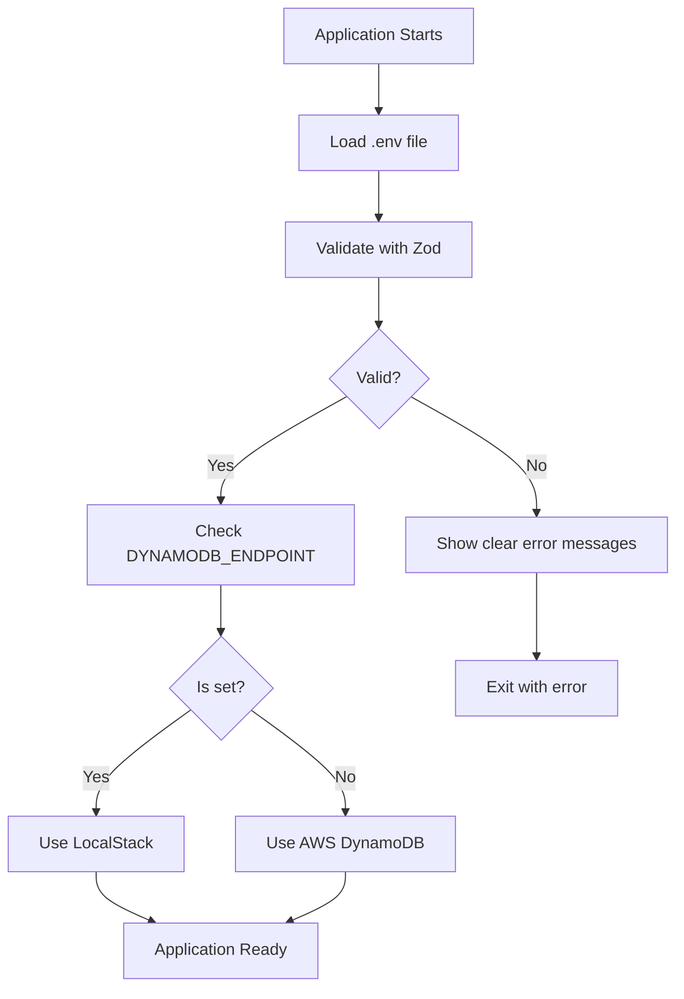

# Enterprise Best Practices Implementation

This document describes how we've implemented enterprise-level best practices for environment configuration management.

## ✅ Implementation Checklist

| Practice | Status | Implementation |
|----------|--------|----------------|
| Infrastructure as Code (IaC) | ✅ Implemented | Environment-specific .env files + GitHub Actions |
| Secrets Management | ✅ Implemented | GitHub Secrets + AWS Secrets Manager ready |
| Validation at Startup | ✅ Implemented | Zod validation in `src/utils/env-validation.ts` |
| CI/CD Injection | ✅ Implemented | GitHub Actions workflows inject environment variables |

## 1. Infrastructure as Code (IaC)

### Environment Configuration Files

We use separate configuration files for each environment:

```
.env.example              # Template with all variables
.env.development          # Local development (committed)
.env.staging.example      # Staging template (committed)
.env.production.example   # Production template (committed)
```

**Key Points:**
- `.env.development` is committed (no secrets, only LocalStack config)
- `.env.staging` and `.env.production` are NOT committed (contain real AWS resources)
- Templates (`.example` files) are committed for documentation

### PowerShell Scripts

Scripts now use environment variables with fallbacks:

```powershell
# Best practice: Use environment variable with local fallback
$ENDPOINT = if ($env:DYNAMODB_ENDPOINT) { $env:DYNAMODB_ENDPOINT } else { "http://localhost:4566" }
```

**Benefits:**
- No hardcoded endpoints
- CI/CD can override with real AWS endpoints
- Local development still works with defaults

## 2. Secrets Management

### GitHub Secrets

Store sensitive data in GitHub repository secrets:

```yaml
# Required secrets for CI/CD
AWS_ACCESS_KEY_ID_STAGING
AWS_SECRET_ACCESS_KEY_STAGING
AWS_ACCESS_KEY_ID_PRODUCTION
AWS_SECRET_ACCESS_KEY_PRODUCTION
EXPO_TOKEN
CLOUDFRONT_DISTRIBUTION_ID_STAGING
CLOUDFRONT_DISTRIBUTION_ID_PRODUCTION
```

### AWS Secrets Manager (Future)

For production, migrate to AWS Secrets Manager:

```typescript
import { SecretsManagerClient, GetSecretValueCommand } from '@aws-sdk/client-secrets-manager';

async function getSecret(secretName: string) {
  const client = new SecretsManagerClient({ region: 'ap-south-1' });
  const response = await client.send(
    new GetSecretValueCommand({ SecretId: secretName })
  );
  return JSON.parse(response.SecretString!);
}
```

**Benefits:**
- Automatic rotation
- Audit logging
- Fine-grained access control
- No secrets in code or environment variables

## 3. Validation at Startup

### Zod Schema Validation

File: `src/utils/env-validation.ts`

```typescript
import { z } from 'zod';

const envSchema = z.object({
  NODE_ENV: z.enum(['development', 'staging', 'production', 'test']),
  AWS_REGION: z.string().min(1),
  DYNAMODB_ENDPOINT: z.string().url().optional(),
  TEMPLES_TABLE: z.string().min(1),
  // ... all required variables
});

export function validateEnv(): Env {
  try {
    return envSchema.parse(process.env);
  } catch (error) {
    // Clear error messages for missing variables
    console.error('❌ Environment validation failed!');
    throw new Error('Environment validation failed');
  }
}
```

### Usage in Application

```typescript
// src/utils/aws-clients.ts
import { getEnv, getDynamoDBConfig } from './env-validation';

// Validate at startup - fails fast if misconfigured
const env = getEnv();

// Get DynamoDB config (automatically handles LocalStack vs AWS)
const dynamoDBConfig = getDynamoDBConfig(env);

export const dynamoDBClient = new DynamoDBClient(dynamoDBConfig);
```

**Benefits:**
- Catches missing variables before any database calls
- Clear error messages guide developers
- Prevents runtime errors in production
- Type-safe environment variables

### Error Messages

```
❌ Environment validation failed!
❌ Missing or invalid environment variables:
   - TEMPLES_TABLE: Required
   - AWS_REGION: Required
   - API_URL: Must be a valid URL

💡 Tip: Copy .env.example to .env.development and fill in the values
```

## 4. CI/CD Injection

### GitHub Actions Workflow

File: `.github/workflows/deploy-staging.yml`

```yaml
- name: Deploy to AWS Lambda
  run: |
    aws lambda update-function-configuration \
      --function-name staging-temple-management \
      --environment "Variables={
        NODE_ENV=staging,
        AWS_REGION=ap-south-1,
        TEMPLES_TABLE=Staging-Temples,
        # NO DYNAMODB_ENDPOINT - uses real AWS DynamoDB
        API_URL=https://api-staging.sanaathana.org
      }"
```

### Environment-Specific Builds

**Admin Portal:**
```yaml
- name: Create .env.staging file
  run: |
    echo "VITE_API_URL=https://api-staging.sanaathana.org" > .env.staging

- name: Build for staging
  run: npm run build -- --mode staging
```

**Mobile App:**
```yaml
- name: Create .env.staging file
  run: |
    echo "EXPO_PUBLIC_API_URL=https://api-staging.sanaathana.org" > .env.staging

- name: Build for staging
  run: eas build --platform android --profile staging
```

**Benefits:**
- Zero manual intervention
- Consistent deployments
- Environment-specific configurations
- Automatic validation before deployment

## Environment Detection Flow



## Migration Guide

### From Current Setup to Enterprise Setup

1. **Install Zod** (if not already installed):
   ```bash
   npm install zod
   ```

2. **Update aws-clients.ts**:
   ```typescript
   import { getEnv, getDynamoDBConfig } from './env-validation';
   const env = getEnv();
   const dynamoDBConfig = getDynamoDBConfig(env);
   ```

3. **Update local-server/server.ts**:
   ```typescript
   import { getEnv } from '../utils/env-validation';
   const env = getEnv();
   // Use env.TEMPLES_TABLE instead of process.env.TEMPLES_TABLE
   ```

4. **Create .env.development**:
   ```bash
   cp .env.example .env.development
   # Edit with local values
   ```

5. **Update .gitignore**:
   ```
   # Environment files (except development and examples)
   .env
   .env.local
   .env.staging
   .env.production
   
   # Keep these
   !.env.example
   !.env.development
   !.env.*.example
   ```

6. **Test locally**:
   ```bash
   npm run dev
   # Should see: ✅ Environment validation passed
   ```

7. **Set up GitHub Secrets**:
   - Go to repository Settings → Secrets and variables → Actions
   - Add all required secrets

8. **Deploy to staging**:
   ```bash
   git push origin develop
   # GitHub Actions will automatically deploy
   ```

## Troubleshooting

### Error: "Environment validation failed"

**Cause**: Missing or invalid environment variables

**Solution**:
1. Check the error messages for specific missing variables
2. Copy `.env.example` to `.env.development`
3. Fill in all required values
4. Restart the application

### Error: "DYNAMODB_ENDPOINT is set in production"

**Cause**: LocalStack endpoint configured in production environment

**Solution**:
1. Remove `DYNAMODB_ENDPOINT` from production environment variables
2. Verify Lambda configuration: `aws lambda get-function-configuration --function-name prod-temple-management`
3. Should NOT see `DYNAMODB_ENDPOINT` in output

### Error: "Connection refused" in Lambda

**Cause**: `DYNAMODB_ENDPOINT` is set in Lambda environment

**Solution**:
1. Update Lambda configuration to remove `DYNAMODB_ENDPOINT`
2. Redeploy using GitHub Actions or AWS CLI

## Best Practices Summary

### ✅ DO

- Use environment variables for all configuration
- Validate environment variables at startup
- Use different table names per environment
- Store secrets in GitHub Secrets or AWS Secrets Manager
- Let CI/CD inject environment-specific values
- Commit `.env.example` and `.env.development`
- Use Zod for runtime validation

### ❌ DON'T

- Hardcode endpoints in code
- Commit `.env.staging` or `.env.production`
- Set `DYNAMODB_ENDPOINT` in staging/production
- Use same table names across environments
- Store secrets in code or version control
- Skip environment validation

## References

- [Zod Documentation](https://zod.dev/)
- [AWS SDK Environment Variables](https://docs.aws.amazon.com/sdk-for-javascript/v3/developer-guide/setting-credentials-node.html)
- [GitHub Actions Secrets](https://docs.github.com/en/actions/security-guides/encrypted-secrets)
- [AWS Secrets Manager](https://docs.aws.amazon.com/secretsmanager/)
- [12-Factor App Methodology](https://12factor.net/config)
